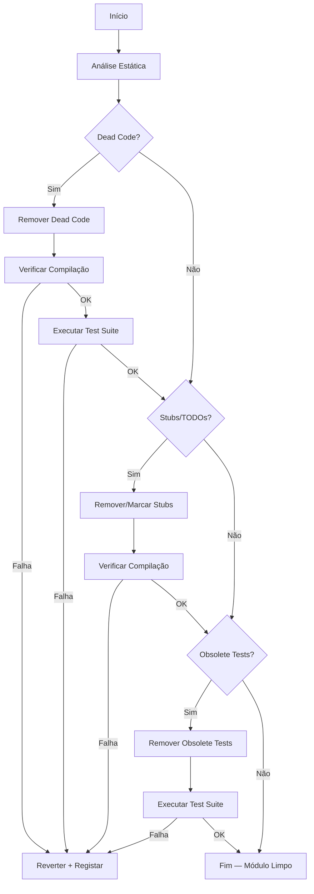

# Design Document — Code Cleanup

## Overview

O projeto MotoGuard IoT acumulou, ao longo do desenvolvimento iterativo, código que já não serve propósito ativo. Esta limpeza abrange três módulos distintos:

- **Frontend** — React/TypeScript em `app/frontend/src/`
- **Backend** — Node.js/TypeScript em `app/backend/src/`
- **ML Module** — Python em `ml/` e `ml/tests/`

O objetivo é remover dead code, stubs não implementados e testes obsoletos ou duplicados, sem introduzir regressões. A abordagem é conservadora: cada passo de remoção é seguido de verificação de compilação e execução da test suite. Se qualquer verificação falhar, as alterações do passo são revertidas.

A limpeza é executada manualmente por um developer (o Cleanup_Tool), seguindo um checklist estruturado por módulo e categoria.

---

## Architecture

A limpeza segue um pipeline sequencial por módulo, com verificação de integridade após cada fase:



O pipeline é executado independentemente para cada módulo (Frontend → Backend → ML). A verificação final executa a test suite completa dos três módulos em conjunto.

---

## Components and Interfaces

### Ferramentas de Análise Estática

**Frontend e Backend (TypeScript)**

- `tsc --noEmit` — verifica compilação sem emitir ficheiros
- `ts-prune` ou análise manual com `grep`/`ripgrep` — identifica exports não referenciados
- `eslint` com regra `no-unused-vars` e `@typescript-eslint/no-unused-imports` — identifica imports e variáveis não utilizadas
- `grep -r "TODO\|FIXME\|placeholder\|not implemented"` — localiza stubs

**ML Module (Python)**

- `python -c "import features; import infer"` — verifica importações
- `grep -r "TODO\|FIXME\|pass\|NotImplementedError"` — localiza stubs
- `pytest ml/tests/` — executa test suite

### Verificação de Integridade

Após cada fase de remoção:

| Módulo | Compilação | Test Suite |
|--------|-----------|------------|
| Frontend | `cd app/frontend && npx tsc --noEmit` | `cd app/frontend && npx vitest --run` |
| Backend | `cd app/backend && npx tsc --noEmit` | `cd app && npx vitest --run` |
| ML | `python -c "import features; import infer"` | `cd ml && pytest tests/` |

### Categorias de Limpeza

**Dead Code** — código que existe mas nunca é executado:
- Funções/variáveis exportadas não referenciadas por nenhum ficheiro ativo
- Imports não utilizados em qualquer ficheiro

**Stubs** — implementações pendentes:
- TypeScript: `throw new Error("not implemented")`, `// TODO`, `// FIXME`, `/* placeholder */`
- Python: `pass` (em funções não triviais), `raise NotImplementedError`, `# TODO`, `# FIXME`
- Decisão: remover se não planeado; substituir por `// PLANNED: <descrição>` se planeado

**Obsolete Tests** — testes que não verificam comportamento atual:
- Testes que importam símbolos removidos (causam erro de compilação/importação)
- Testes cujo `describe` + `it` descreve funcionalidade inexistente
- Testes duplicados (mesmo `describe` + `it` + asserção central)
- Salvaguarda: testes de caminhos críticos (autenticação, pipeline ML, notificações, alertas) não são removidos mesmo que pareçam redundantes

---

## Data Models

### Registo de Limpeza

Cada item removido ou modificado é registado num log interno durante a execução:

```typescript
interface CleanupEntry {
  module: "frontend" | "backend" | "ml";
  category: "dead_code" | "stub" | "obsolete_test";
  file: string;
  symbol?: string;        // nome da função/variável/teste
  action: "removed" | "marked_planned" | "kept_critical_path";
  reason: string;
}
```

Este registo é mantido em memória durante a sessão de limpeza e pode ser consultado para auditoria.

### Caminhos Críticos Protegidos

Os seguintes caminhos são considerados críticos e os seus testes nunca são removidos:

```
Frontend:
  - app/frontend/src/components/auth/          (autenticação)
  - app/frontend/src/hooks/useNotifications.ts (notificações)
  - app/frontend/src/components/NotificationCenter.tsx
  - app/frontend/src/utils/alerts.ts
  - app/frontend/src/utils/tripComparison.property.test.ts (property-based)
  - app/frontend/src/demo/__tests__/           (demo mode)

Backend:
  - app/tests/auth-profile.controller.test.ts  (autenticação)
  - app/tests/alerts-controller.test.ts        (alertas)
  - app/tests/trip-ml-pipeline.service.test.ts (pipeline ML)
  - app/tests/email.service.test.ts            (email/crash alert)

ML:
  - ml/tests/test_features.py
  - ml/tests/test_infer.py
```

---

## Correctness Properties

*A property is a characteristic or behavior that should hold true across all valid executions of a system — essentially, a formal statement about what the system should do. Properties serve as the bridge between human-readable specifications and machine-verifiable correctness guarantees.*

### Property 1: Compilação sem erros após limpeza

*Para qualquer* módulo (Frontend, Backend, ML) e *para qualquer* combinação de remoções de dead code, stubs ou testes obsoletos, o módulo deve compilar/importar sem erros após a limpeza.

**Validates: Requirements 1.5, 2.5, 3.4, 4.4, 5.4, 10.1, 10.2, 10.3**

### Property 2: Test suite passa sem regressões após limpeza

*Para qualquer* conjunto de remoções de dead code, stubs ou testes obsoletos, a execução da test suite completa (Frontend + Backend + ML) após a limpeza deve produzir o mesmo conjunto de resultados de testes que antes da limpeza — todos os testes preservados devem continuar a passar.

**Validates: Requirements 1.2, 2.2, 9.3, 9.4, 10.4**

### Property 3: Testes property-based são preservados

*Para qualquer* ficheiro de testes que contenha chamadas a `fc.assert` (fast-check) ou `@given` (hypothesis), esse ficheiro deve existir e todos os seus testes devem passar após a limpeza, a menos que a função testada tenha sido explicitamente removida.

**Validates: Requirements 9.1, 9.2**

### Property 4: Round-trip de resultados da test suite

*Para qualquer* teste preservado após a limpeza, executar a test suite antes e depois da limpeza deve produzir o mesmo resultado (pass/fail) para esse teste — a limpeza não deve alterar o comportamento dos testes que permanecem.

**Validates: Requirements 9.4**

---

## Error Handling

### Falha de Compilação após Remoção

Se `tsc --noEmit` falhar após uma remoção:
1. Registar o erro completo (ficheiro, linha, mensagem)
2. Reverter as alterações do passo atual (git checkout ou desfazer manualmente)
3. Marcar o símbolo como "não removível sem refactoring adicional"
4. Continuar para o próximo item da lista

### Falha da Test Suite após Remoção

Se a test suite falhar após uma remoção:
1. Identificar quais testes falharam
2. Determinar se a falha é causada pela remoção ou era pré-existente
3. Se causada pela remoção: reverter e registar
4. Se pré-existente: registar como aviso e continuar

### Remoção de Teste de Caminho Crítico

Se um teste identificado como obsoleto pertencer a um caminho crítico:
1. Registar aviso: "Teste em caminho crítico — não removido"
2. Manter o teste
3. Continuar para o próximo item

### Stub com Funcionalidade Planeada

Se um stub corresponder a funcionalidade planeada no roadmap:
1. Substituir `// TODO` / `// FIXME` por `// PLANNED: <descrição>`
2. Manter o corpo do stub
3. Verificar compilação

---

## Testing Strategy

### Abordagem Dual

A verificação da limpeza usa duas camadas complementares:

**Testes de exemplo (unit tests)** — verificam casos concretos e pontuais:
- Compilação TypeScript sem erros (`tsc --noEmit`)
- Importação Python sem erros (`python -c "import features; import infer"`)
- Ausência de `// TODO` / `// FIXME` não substituídos após limpeza de stubs
- Ausência de testes duplicados (mesmo `describe` + `it`)
- Execução da test suite de cada módulo individualmente

**Testes de propriedade (property-based tests)** — verificam invariantes universais:
- A test suite completa passa após qualquer combinação de remoções
- Os testes property-based existentes continuam a existir e a passar
- O round-trip de resultados é preservado

### Configuração dos Testes de Propriedade

Os testes de propriedade existentes no projeto usam:
- **Frontend/Backend**: `fast-check` (vitest) — mínimo 100 iterações por propriedade
- **ML**: `hypothesis` (pytest) — mínimo 100 exemplos por propriedade

Cada teste de propriedade deve referenciar a propriedade do design com o formato:
```
// Feature: code-cleanup, Property N: <texto da propriedade>
```

### Verificação Pós-Limpeza (Checklist)

Após completar a limpeza de cada módulo:

```bash
# Frontend
cd app/frontend && npx tsc --noEmit
cd app/frontend && npx vitest --run

# Backend
cd app/backend && npx tsc --noEmit
cd app && npx vitest --run

# ML
python -c "import sys; sys.path.insert(0, 'ml'); import features; import infer; print('OK')"
cd ml && pytest tests/ -v

# Verificação final — ausência de TODOs/FIXMEs não substituídos
grep -r "// TODO\|// FIXME" app/frontend/src app/backend/src --include="*.ts" --include="*.tsx"
grep -r "# TODO\|# FIXME" ml --include="*.py"
```

### Testes de Propriedade Existentes a Preservar

Os seguintes ficheiros contêm property-based tests e são não-removíveis:

| Ficheiro | Framework | Propriedades |
|----------|-----------|-------------|
| `app/frontend/src/utils/tripComparison.property.test.ts` | fast-check | Properties 1–13 (trip-comparison) |
| `app/frontend/src/demo/__tests__/demoData.test.ts` | fast-check | Properties 3, 4, 11, 12 (demo-mode) |
| `ml/tests/test_infer.py` | pytest (direto) | Round-trip de serialização do modelo |

Estes ficheiros devem passar integralmente após a limpeza.
