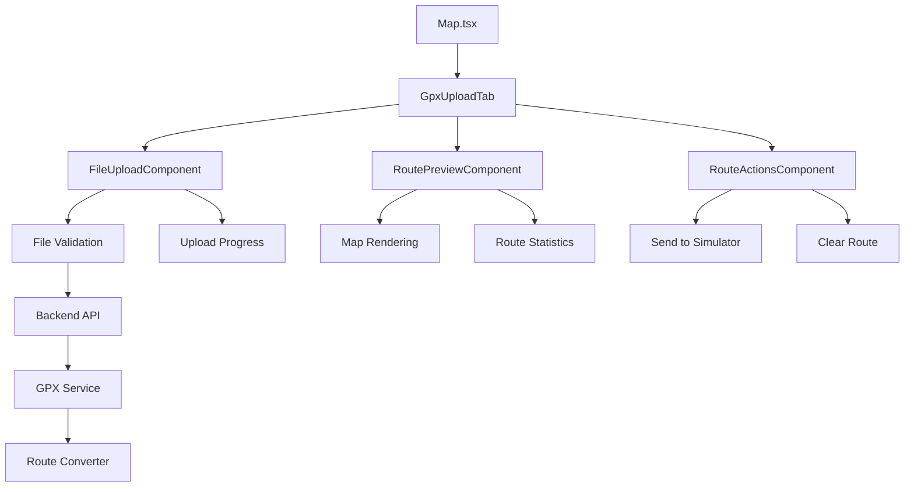
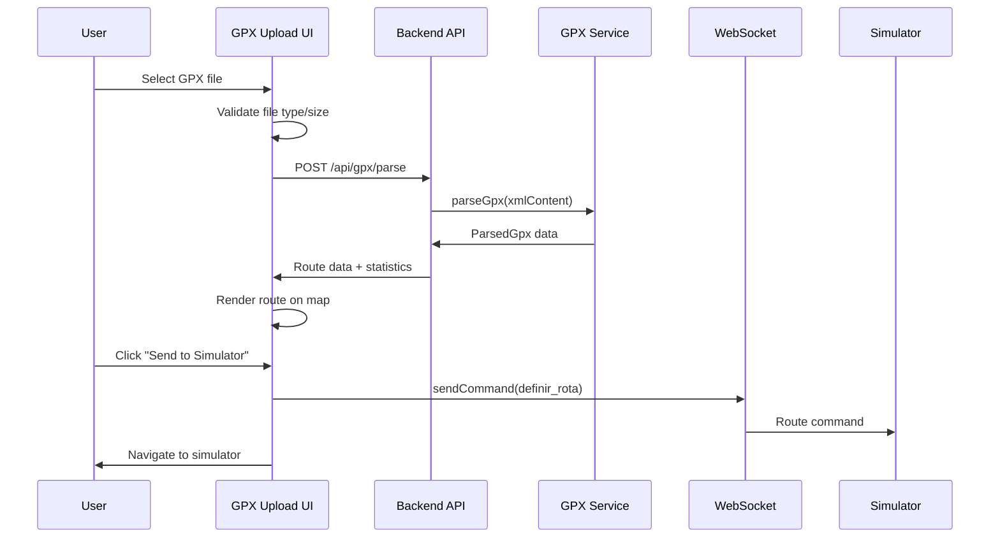

# Design Document: GPX Upload UI

## Overview

The GPX Upload UI feature extends the existing Map page with a new tab that allows users to upload GPX files, preview routes, and send them directly to the simulator. This feature integrates with the existing `gpx-import.service.ts` backend service and follows the established UI patterns in the Map component.

The design leverages the existing architecture:
- **Frontend**: React component integrated into the Map page's tab system
- **Backend**: Existing GPX parsing service with new endpoint for route conversion
- **Communication**: WebSocket commands via the existing `useSocket` hook
- **UI Framework**: Consistent styling with existing map interface components

Key design principles:
- **Seamless Integration**: New GPX tab follows existing UI patterns and styling
- **Progressive Enhancement**: Builds on existing route management functionality
- **Error Resilience**: Comprehensive error handling for file uploads and processing
- **User Feedback**: Clear visual indicators for upload progress and processing states

## Architecture

### Component Architecture



### Data Flow



### Integration Points

1. **Map Component Integration**
   - New "GPX Upload" tab alongside "Preset Routes" and "Custom Route"
   - Shared map instance and preview rendering system
   - Consistent state management and cleanup

2. **Backend Service Integration**
   - New `/api/gpx/parse` endpoint for route parsing without database storage
   - Reuses existing `parseGpx` function from `gpx-import.service.ts`
   - Returns route data in simulator-compatible format

3. **WebSocket Communication**
   - Uses existing `sendCommand` function from `useSocket` hook
   - Sends `definir_rota` command with converted GPX coordinates
   - Maintains compatibility with existing simulator protocol

## Components and Interfaces

### GpxUploadTab Component

**Purpose**: Main container component for GPX upload functionality within the Map page.

**Props**:
```typescript
interface GpxUploadTabProps {
  isActive: boolean;
  onRoutePreview: (route: RoutePreview) => void;
  onRouteClear: () => void;
}
```

**State**:
```typescript
interface GpxUploadState {
  uploadedFile: File | null;
  uploadProgress: number;
  uploadError: string | null;
  parsedRoute: ParsedGpxRoute | null;
  isProcessing: boolean;
  processingError: string | null;
  routeSent: boolean;
}
```

### FileUploadComponent

**Purpose**: Handles file selection, validation, and upload progress.

**Features**:
- Drag-and-drop file selection
- File type validation (.gpx only)
- File size validation (max 10MB)
- Upload progress indicator
- Error state display

**Interface**:
```typescript
interface FileUploadProps {
  onFileSelect: (file: File) => void;
  onUploadComplete: (result: GpxParseResult) => void;
  onError: (error: string) => void;
  isUploading: boolean;
  progress: number;
}
```

### RoutePreviewComponent

**Purpose**: Displays parsed GPX route information and statistics.

**Features**:
- Route statistics (distance, duration, waypoints)
- Start/end coordinates display
- Route type detection (if available)
- Map preview integration

**Interface**:
```typescript
interface RoutePreviewProps {
  route: ParsedGpxRoute;
  onMapRender: (waypoints: GpxWaypoint[]) => void;
}
```

### RouteActionsComponent

**Purpose**: Provides actions for route management (send to simulator, clear).

**Interface**:
```typescript
interface RouteActionsProps {
  route: ParsedGpxRoute | null;
  onSendToSimulator: () => void;
  onClearRoute: () => void;
  isSending: boolean;
  routeSent: boolean;
}
```

## Data Models

### ParsedGpxRoute

Extends the existing `ParsedGpx` type with simulator-specific fields:

```typescript
interface ParsedGpxRoute extends ParsedGpx {
  simulatorRoute: {
    start: { latitude: number; longitude: number };
    end: { latitude: number; longitude: number };
    loop: boolean;
  };
  metadata: {
    filename: string;
    fileSize: number;
    uploadedAt: Date;
  };
}
```

### GpxParseResult

API response format for GPX parsing:

```typescript
interface GpxParseResult {
  success: boolean;
  route?: ParsedGpxRoute;
  error?: string;
  validationErrors?: string[];
}
```

### FileValidationResult

Client-side file validation result:

```typescript
interface FileValidationResult {
  isValid: boolean;
  errors: string[];
  warnings: string[];
}
```

## API Endpoints

### POST /api/gpx/parse

**Purpose**: Parse GPX file content and return route data without database storage.

**Request**:
```typescript
// Multipart form data
{
  file: File; // GPX file
}
```

**Response**:
```typescript
{
  success: boolean;
  route?: {
    waypoints: GpxWaypoint[];
    bounds: GpxBounds;
    startedAt: Date | null;
    endedAt: Date | null;
    totalTimeSec: number | null;
    distanceKm: number;
    avgSpeedKmh: number | null;
    maxSpeedKmh: number | null;
    simulatorRoute: {
      start: { latitude: number; longitude: number };
      end: { latitude: number; longitude: number };
      loop: boolean;
    };
  };
  error?: string;
  validationErrors?: string[];
}
```

**Error Responses**:
- `400`: Invalid file format, missing file, or parsing errors
- `413`: File too large (>10MB)
- `500`: Internal server error

## Map Integration

### Route Rendering

The GPX upload tab integrates with the existing map rendering system:

1. **Preview Rendering**: Uses the same `previewLineRef` and marker system as custom routes
2. **Route Visualization**: 
   - Green circle marker for start point
   - Red circle marker for end point
   - Blue polyline connecting all waypoints
3. **Map Bounds**: Automatically fits map view to show entire route
4. **Cleanup**: Clears previous routes when switching tabs or uploading new files

### State Management

Follows the existing Map component patterns:

```typescript
// New state additions to Map component
const [mode, setMode] = useState<"preset" | "custom" | "gpx">("preset");
const [gpxRoute, setGpxRoute] = useState<ParsedGpxRoute | null>(null);
const [gpxUploading, setGpxUploading] = useState(false);
const [gpxError, setGpxError] = useState<string | null>(null);
```

### Tab System Extension

Extends the existing mode toggle to include GPX upload:

```typescript
// Updated mode toggle with three options
<div className="map-mode-toggle">
  <button className={`map-mode-btn${mode === "preset" ? " active" : ""}`}>
    Rotas Pré-definidas
  </button>
  <button className={`map-mode-btn${mode === "custom" ? " active" : ""}`}>
    Rota Personalizada
  </button>
  <button className={`map-mode-btn${mode === "gpx" ? " active" : ""}`}>
    GPX Upload
  </button>
</div>
```

## Correctness Properties

*A property is a characteristic or behavior that should hold true across all valid executions of a system-essentially, a formal statement about what the system should do. Properties serve as the bridge between human-readable specifications and machine-verifiable correctness guarantees.*

### Property 1: File Type Validation

*For any* file selected in the upload component, the system should only accept files with .gpx extension and reject all other file types with appropriate error messages.

**Validates: Requirements 1.2, 1.3**

### Property 2: File Size and Content Validation

*For any* uploaded file, the system should validate that the file size is under 10MB and that the content is valid GPX format before processing.

**Validates: Requirements 6.1, 6.2**

### Property 3: GPX Parsing Completeness

*For any* valid GPX file, the parsing service should extract all available waypoints, distance, and timing information without data loss.

**Validates: Requirements 2.1, 2.2**

### Property 4: Route Conversion Consistency

*For any* set of GPX waypoints with at least 2 points, the route converter should create a simulator route with the first waypoint as start, last waypoint as end, and loop setting as false.

**Validates: Requirements 3.1, 3.2, 3.3, 3.5**

### Property 5: Minimum Waypoint Validation

*For any* GPX file containing fewer than 2 waypoints, the route converter should return an error and prevent route creation.

**Validates: Requirements 3.4**

### Property 6: UI State Management

*For any* tab switch or file selection operation, the interface should preserve map view, clear previous route previews, and reset upload state appropriately.

**Validates: Requirements 5.3, 6.3, 6.4**

### Property 7: WebSocket Communication Protocol

*For any* successfully processed GPX route, the system should send route commands to the simulator using the same message format as existing preset and custom routes.

**Validates: Requirements 4.2, 4.3**

### Property 8: UI Feedback Consistency

*For any* upload, processing, or sending operation, the interface should display appropriate loading states, success confirmations, or error messages based on the operation outcome.

**Validates: Requirements 1.4, 1.5, 4.4, 5.4, 5.5**

### Property 9: Error Handling Robustness

*For any* invalid GPX file, network error, or processing failure, the system should return descriptive error messages and handle the failure gracefully without crashing.

**Validates: Requirements 2.3, 6.5**

### Property 10: Navigation Behavior

*For any* successful route transmission to the simulator, the interface should navigate to the simulator contexts page.

**Validates: Requirements 4.5**

## Error Handling

### Client-Side Error Handling

**File Validation Errors**:
- Invalid file extension: "Please select a .gpx file"
- File too large: "File size must be under 10MB"
- Empty file: "Selected file is empty"
- Unreadable file: "Unable to read the selected file"

**Upload Errors**:
- Network timeout: "Upload timed out. Please check your connection and try again"
- Server unavailable: "Server is temporarily unavailable. Please try again later"
- Request failed: "Upload failed. Please try again"

**Processing Errors**:
- Invalid GPX format: Display server-provided error message
- Insufficient waypoints: "GPX file must contain at least 2 waypoints"
- Parsing failure: "Unable to process GPX file. Please check the file format"

### Server-Side Error Handling

**Input Validation**:
- Missing file: HTTP 400 with "GPX file is required"
- Invalid file type: HTTP 400 with "Only .gpx files are supported"
- File too large: HTTP 413 with "File size exceeds 10MB limit"

**Processing Errors**:
- XML parsing failure: HTTP 400 with specific parsing error
- No waypoints found: HTTP 400 with "GPX file contains no valid waypoints"
- Corrupted data: HTTP 400 with "GPX file appears to be corrupted"

**System Errors**:
- Internal server error: HTTP 500 with generic error message
- Service unavailable: HTTP 503 with retry guidance

### Error Recovery Strategies

1. **Automatic Retry**: Network errors trigger automatic retry with exponential backoff
2. **Graceful Degradation**: Partial GPX data is processed when possible
3. **State Preservation**: Upload errors don't clear valid form data
4. **User Guidance**: Error messages include actionable next steps

## Testing Strategy

### Dual Testing Approach

The testing strategy employs both unit tests and property-based tests to ensure comprehensive coverage:

**Unit Tests** focus on:
- Specific file upload scenarios and edge cases
- UI component rendering and interaction
- API endpoint integration
- Error boundary behavior
- Navigation flow verification

**Property-Based Tests** focus on:
- File validation across diverse input types
- GPX parsing with generated route data
- Route conversion with various waypoint configurations
- UI state management across different operation sequences
- Error handling with randomized failure scenarios

### Property-Based Testing Configuration

**Testing Library**: fast-check (JavaScript/TypeScript property-based testing)

**Test Configuration**:
- Minimum 100 iterations per property test
- Custom generators for GPX data, file objects, and route configurations
- Shrinking enabled for minimal counterexample discovery

**Property Test Tags**:
Each property-based test must include a comment referencing its design document property:

```typescript
// Feature: gpx-upload-ui, Property 1: File Type Validation
// Feature: gpx-upload-ui, Property 2: File Size and Content Validation
// Feature: gpx-upload-ui, Property 3: GPX Parsing Completeness
// Feature: gpx-upload-ui, Property 4: Route Conversion Consistency
// Feature: gpx-upload-ui, Property 5: Minimum Waypoint Validation
// Feature: gpx-upload-ui, Property 6: UI State Management
// Feature: gpx-upload-ui, Property 7: WebSocket Communication Protocol
// Feature: gpx-upload-ui, Property 8: UI Feedback Consistency
// Feature: gpx-upload-ui, Property 9: Error Handling Robustness
// Feature: gpx-upload-ui, Property 10: Navigation Behavior
```

### Test Data Generation

**GPX File Generators**:
- Valid GPX files with varying waypoint counts
- Invalid XML structures and malformed GPX
- Files with missing required elements
- Large files approaching size limits

**Route Data Generators**:
- Waypoint arrays of different sizes and coordinate ranges
- Routes with and without timing information
- Routes with elevation data variations

**Error Scenario Generators**:
- Network failure simulations
- Server response variations
- File system access errors

### Integration Testing

**End-to-End Scenarios**:
1. Complete upload-to-simulator workflow
2. Error recovery and retry mechanisms
3. Tab switching and state preservation
4. Map rendering and route visualization

**API Integration**:
- GPX parsing endpoint testing
- WebSocket command transmission
- Error response handling

**UI Integration**:
- Component interaction testing
- State synchronization verification
- Event handling validation