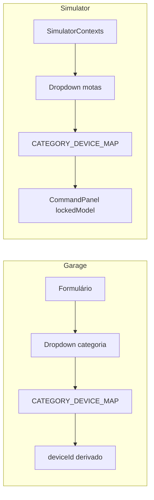

# Design Document — motorcycle-onboarding-simulator

## Overview

Esta feature introduz um fluxo de onboarding obrigatório no MotoGuard IoT. Após registo, o utilizador é forçado a registar pelo menos uma mota na Garagem antes de aceder a qualquer outra rota protegida. A criação de mota passa a ser guiada por seleção de categoria (8 opções fixas), com derivação automática do Device ID. O simulador adapta-se ao perfil do utilizador: Regular_User vê um dropdown das suas motas; Admin mantém o seletor livre atual.

As alterações são exclusivamente no frontend. Não são necessárias migrações de base de dados nem novos endpoints — o campo `category` já existe no tipo `Motorcycle` (a adicionar ao tipo TypeScript) e o endpoint `GET /api/motorcycles` já existe.

---

## Architecture

```mermaid
flowchart TD
    A[Utilizador acede a rota protegida] --> B{ProtectedRoute}
    B -- não autenticado --> C[/login]
    B -- autenticado --> D{OnboardingGuard}
    D -- admin@admin.com --> E[Rota destino]
    D -- rota = /garage --> E
    D -- a verificar --> F[Loading spinner]
    F --> G{GET /api/motorcycles}
    G -- erro --> H[Ecrã de erro + retry]
    G -- 0 motas --> I[/garage]
    G -- ≥1 mota --> E
```



### Decisões de design

- `OnboardingGuard` é um componente separado de `ProtectedRoute` para manter separação de responsabilidades: `ProtectedRoute` verifica autenticação; `OnboardingGuard` verifica onboarding.
- O `CATEGORY_DEVICE_MAP` é um ficheiro utilitário partilhado (`src/utils/categoryDeviceMap.ts`) para evitar duplicação entre `Garage`, `SimulatorContexts` e `CommandPanel`.
- A verificação de admin é feita por `user.email === 'admin@admin.com'` em linha com o requisito e o padrão já existente no projeto.
- O `OnboardingGuard` faz a chamada à API internamente (não depende de contexto global) para manter o estado de verificação local e evitar race conditions com o `AuthProvider`.

---

## Components and Interfaces

### `src/utils/categoryDeviceMap.ts` (novo)

```ts
export const CATEGORY_DEVICE_MAP: Record<string, string> = {
  "Scooter":             "MOTOGUARD-SIM-SCOOTER",
  "Naked":               "MOTOGUARD-SIM-NAKED",
  "Desportiva":          "MOTOGUARD-SIM-SPORT",
  "Trail / Adventure":   "MOTOGUARD-SIM-TRAIL",
  "Custom / Cruiser":    "MOTOGUARD-SIM-CUSTOM",
  "Motocross / Enduro":  "MOTOGUARD-SIM-MOTO",
  "Touring":             "MOTOGUARD-SIM-TOURING",
  "Supermotard":         "MOTOGUARD-SIM-SUPERMOTO",
};

export const CATEGORIES = Object.keys(CATEGORY_DEVICE_MAP) as string[];

export function deviceIdFromCategory(category: string): string | undefined {
  return CATEGORY_DEVICE_MAP[category];
}
```

---

### `src/components/auth/OnboardingGuard.tsx` (novo)

```ts
interface OnboardingGuardProps {
  children: React.ReactNode;
}
```

Comportamento:
1. Lê `user` do `useAuth()`.
2. Se `user.email === 'admin@admin.com'` → renderiza `children` diretamente.
3. Se `location.pathname === '/garage'` → renderiza `children` diretamente.
4. Caso contrário, chama `motorcyclesAPI.getAll()`:
   - Loading → spinner (reutiliza o estilo de `ProtectedRoute`).
   - Erro → ecrã de erro com botão "Tentar novamente".
   - `data.length === 0` → `<Navigate to="/garage" replace />`.
   - `data.length >= 1` → renderiza `children`.

Estado interno: `{ status: 'loading' | 'ok' | 'redirect' | 'error' }`.

---

### `CommandPanel.tsx` — alterações

Nova prop opcional:

```ts
interface CommandPanelProps {
  sendCommand: (cmd: SimulatorCommand) => void;
  addLog: (msg: string, color?: string) => void;
  logs: LogEntry[];
  running: boolean;
  onStop?: () => void;
  lockedModel?: string; // novo — quando definido, oculta o seletor livre
}
```

Lógica:
- Se `lockedModel` está definido: oculta o `<select>` de MODELOS e usa `lockedModel` como modelo fixo em `handleSendModel`.
- Se `lockedModel` é `undefined`: comportamento atual (seletor livre).

---

### `SimulatorContexts.tsx` — alterações

- Importa `useAuth` para detetar admin.
- Se `Regular_User`: chama `motorcyclesAPI.getAll()` no mount; apresenta dropdown de motas; ao selecionar, deriva `lockedModel` via `CATEGORY_DEVICE_MAP[moto.category]`; passa `lockedModel` ao `CommandPanel`; desativa dropdown durante `running`.
- Se `Admin`: não apresenta dropdown de motas; não passa `lockedModel` ao `CommandPanel`.

---

### `Garage.tsx` — alterações

- `FormState`: substituir `deviceId: string` por `category: string`.
- Formulário: substituir `<input id="g-device">` por `<select id="g-category">` com as 8 opções de `CATEGORIES`.
- `handleSubmit`: derivar `deviceId` via `deviceIdFromCategory(form.category)` antes de enviar ao backend.
- Validação: se `form.category` estiver vazio, impedir submissão e mostrar mensagem.
- Após criar primeira mota com sucesso (quando `motos.length === 0` antes da criação): mostrar toast/mensagem de boas-vindas.
- Remover badge Online/Offline dos cards.

---

### `App.tsx` — alterações

- Importar `OnboardingGuard`.
- Envolver todas as rotas protegidas (exceto `/garage`) com `<OnboardingGuard>` dentro de `<ProtectedRoute>`.
- Estrutura resultante para rotas não-garage:
  ```tsx
  <ProtectedRoute>
    <OnboardingGuard>
      <Dashboard />
    </OnboardingGuard>
  </ProtectedRoute>
  ```
- A rota `/garage` mantém apenas `<ProtectedRoute>`.

---

### `LoginSidebar.tsx` — alterações

- No fluxo de registo (`!isLogin`), após `register()` com sucesso, o `onSuccess` callback deve navegar para `/garage`.
- A página `Login.tsx` (se usar `useNavigate` diretamente) deve igualmente redirecionar para `/garage` após registo.

---

## Data Models

### Tipo `Motorcycle` (frontend — `src/types/index.ts`)

Adicionar campos em falta:

```ts
export interface Motorcycle {
  id: string;
  userId: string;
  profileId?: string | null;
  name: string;
  brand?: string;
  model?: string;       // já existe no form, adicionar ao tipo
  year?: number;
  plate?: string;       // já existe no form, adicionar ao tipo
  deviceId?: string;
  category?: string;    // novo campo
  odometer?: number;
  lastSeenAt?: string;
  createdAt: string;
  updatedAt?: string;
  profile?: { id: string; name: string } | null;
}
```

O backend já persiste `category` (campo existente no schema Prisma `Motorcycle`). Não são necessárias migrações.

### Estado local `OnboardingGuard`

```ts
type GuardStatus = 'loading' | 'ok' | 'redirect' | 'error';

interface GuardState {
  status: GuardStatus;
  errorMessage?: string;
}
```

### Estado local `SimulatorContexts` (adições)

```ts
interface MotorcycleOption {
  id: string;
  name: string;
  category: string;
}

// estado adicional no componente:
const [userMotos, setUserMotos] = useState<MotorcycleOption[]>([]);
const [selectedMotoId, setSelectedMotoId] = useState<string>('');
const lockedModel = useMemo(() => {
  const moto = userMotos.find(m => m.id === selectedMotoId);
  return moto ? CATEGORY_DEVICE_MAP[moto.category] : undefined;
}, [userMotos, selectedMotoId]);
```

### Estado local `Garage` (alterações)

```ts
interface FormState {
  name: string;
  brand: string;
  model: string;
  year: string;
  plate: string;
  category: string; // substitui deviceId
}
```

---

## Correctness Properties

*A property is a characteristic or behavior that should hold true across all valid executions of a system — essentially, a formal statement about what the system should do. Properties serve as the bridge between human-readable specifications and machine-verifiable correctness guarantees.*

### Property 1: Onboarding redirect para qualquer rota sem motas

*For any* rota protegida (diferente de `/garage`) e qualquer utilizador Regular_User sem motas registadas, o `OnboardingGuard` deve redirecionar para `/garage` e não renderizar os children.

**Validates: Requirements 1.2**

---

### Property 2: Acesso livre com pelo menos uma mota

*For any* utilizador Regular_User com pelo menos uma mota registada, o `OnboardingGuard` deve renderizar os children sem redirecionar, independentemente da rota protegida acedida.

**Validates: Requirements 1.3**

---

### Property 3: Mapeamento categoria → Device ID é total e correto

*For any* categoria pertencente ao conjunto das 8 categorias definidas, `deviceIdFromCategory(category)` deve retornar um valor não-nulo e esse valor deve ser exatamente o Device ID fixo especificado no `CATEGORY_DEVICE_MAP`. Esta propriedade aplica-se tanto na criação como na edição de motas.

**Validates: Requirements 2.2, 2.6**

---

### Property 4: Dropdown do simulador reflete as motas do utilizador

*For any* lista de motas retornada pela API para um Regular_User, o dropdown de seleção no `SimulatorContexts` deve conter exatamente as mesmas motas (mesmo número, mesmos IDs e nomes), sem omissões nem adições.

**Validates: Requirements 3.1**

---

### Property 5: lockedModel derivado da mota selecionada

*For any* mota selecionada no dropdown do simulador com uma categoria válida, o valor de `lockedModel` passado ao `CommandPanel` deve ser igual a `CATEGORY_DEVICE_MAP[moto.category]`.

**Validates: Requirements 3.2, 3.3**

---

### Property 6: Dropdown desativado durante simulação ativa

*For any* estado em que `running === true`, o dropdown de seleção de mota no `SimulatorContexts` deve ter o atributo `disabled`, impedindo alteração durante a simulação.

**Validates: Requirements 3.6**

---

## Error Handling

### OnboardingGuard — falha na API

- Se `GET /api/motorcycles` retornar erro (rede, 5xx, timeout): mostrar ecrã de erro com mensagem "Não foi possível verificar as tuas motas." e botão "Tentar novamente" que re-executa a chamada.
- Não redirecionar nem renderizar children em estado de erro — bloquear acesso por segurança.
- O erro 401 é tratado pelo interceptor axios existente (dispara `auth:unauthorized` → logout automático).

### Garage — falha ao guardar mota

- Comportamento existente mantido: `saveError` apresentado inline no formulário.
- Validação de categoria vazia: mensagem "Seleciona uma categoria" antes de chamar a API.

### SimulatorContexts — falha ao carregar motas

- Se `motorcyclesAPI.getAll()` falhar no mount: mostrar mensagem de erro inline no dropdown ("Erro ao carregar motas") com botão de retry.
- Não bloquear o resto da página — o simulador pode continuar a receber telemetria.

### CommandPanel — lockedModel inválido

- Se `lockedModel` for uma string não presente no `CATEGORY_DEVICE_MAP` (situação anómala): `addLog("Modelo inválido", "#ef4444")` e não enviar comando.

---

## Testing Strategy

### Abordagem dual

Utilizar **testes unitários** para exemplos concretos e casos de erro, e **testes de propriedade** para as 6 propriedades universais identificadas. Os dois tipos são complementares.

### Biblioteca de property-based testing

**[fast-check](https://github.com/dubzzz/fast-check)** — biblioteca TypeScript/JavaScript madura, compatível com Vitest e Jest, sem dependências externas.

```bash
npm install --save-dev fast-check
```

### Testes unitários (exemplos e edge cases)

Ficheiros sugeridos em `src/__tests__/`:

- `categoryDeviceMap.test.ts` — verificar os 8 mapeamentos fixos (Req 2.4), verificar que categorias inválidas retornam `undefined` (edge case 2.5)
- `OnboardingGuard.test.tsx` — admin bypassa guard sem chamar API (Req 1.6), rota `/garage` bypassa guard (Req 1.2), falha de API mostra ecrã de erro com retry (edge case 1.5), chamada à API é feita no mount (Req 1.4)
- `Garage.test.tsx` — formulário tem select com 8 opções (Req 2.1), campo deviceId não está presente (Req 2.3), badge Online/Offline não está presente (Req 2.7), submissão sem categoria mostra erro (edge case 2.5)
- `SimulatorContexts.test.tsx` — admin não vê dropdown de motas (Req 4.4), admin vê seletor livre com 8 opções (Req 4.1), dropdown habilitado quando running=false (Req 3.4), seletor livre oculto para Regular_User (Req 3.7)
- `CommandPanel.test.tsx` — com `lockedModel` definido, select de MODELOS não está no DOM (Req 3.7)
- `LoginSidebar.test.tsx` — após registo, navega para `/garage` (Req 1.1)

### Testes de propriedade (fast-check)

Cada teste de propriedade deve correr **mínimo 100 iterações** (configuração padrão do fast-check).

Tag de referência: `// Feature: motorcycle-onboarding-simulator, Property N: <texto>`

```ts
// Feature: motorcycle-onboarding-simulator, Property 1: Onboarding redirect para qualquer rota sem motas
it('redireciona para /garage para qualquer rota protegida sem motas', () => {
  fc.assert(fc.property(
    fc.webPath().filter(p => p !== '/garage' && p.startsWith('/')),
    (route) => {
      // render OnboardingGuard com lista de motas vazia e rota = route
      // verificar que renderiza <Navigate to="/garage" />
    }
  ), { numRuns: 100 });
});

// Feature: motorcycle-onboarding-simulator, Property 2: Acesso livre com pelo menos uma mota
it('renderiza children para qualquer utilizador com ≥1 mota', () => {
  fc.assert(fc.property(
    fc.array(fc.record({ id: fc.uuid(), name: fc.string() }), { minLength: 1 }),
    (motas) => {
      // render OnboardingGuard com lista de motas não-vazia
      // verificar que children são renderizados
    }
  ), { numRuns: 100 });
});

// Feature: motorcycle-onboarding-simulator, Property 3: Mapeamento categoria → Device ID é total e correto
it('deviceIdFromCategory retorna valor correto para qualquer categoria válida', () => {
  fc.assert(fc.property(
    fc.constantFrom(...CATEGORIES),
    (category) => {
      const deviceId = deviceIdFromCategory(category);
      return deviceId !== undefined && deviceId === CATEGORY_DEVICE_MAP[category];
    }
  ), { numRuns: 100 });
});

// Feature: motorcycle-onboarding-simulator, Property 4: Dropdown do simulador reflete as motas do utilizador
it('dropdown contém exatamente as motas retornadas pela API', () => {
  fc.assert(fc.property(
    fc.array(fc.record({ id: fc.uuid(), name: fc.string(), category: fc.constantFrom(...CATEGORIES) }), { minLength: 1, maxLength: 20 }),
    (motas) => {
      // render SimulatorContexts com mock da API retornando motas
      // verificar que o número de opções no dropdown === motas.length
      // e que cada moto.id está presente
    }
  ), { numRuns: 100 });
});

// Feature: motorcycle-onboarding-simulator, Property 5: lockedModel derivado da mota selecionada
it('lockedModel é sempre CATEGORY_DEVICE_MAP[moto.category] para qualquer mota selecionada', () => {
  fc.assert(fc.property(
    fc.constantFrom(...CATEGORIES),
    (category) => {
      const moto = { id: '1', name: 'Test', category };
      const lockedModel = CATEGORY_DEVICE_MAP[moto.category];
      return lockedModel === CATEGORY_DEVICE_MAP[category];
    }
  ), { numRuns: 100 });
});

// Feature: motorcycle-onboarding-simulator, Property 6: Dropdown desativado durante simulação ativa
it('dropdown de motas está disabled quando running=true', () => {
  fc.assert(fc.property(
    fc.array(fc.record({ id: fc.uuid(), name: fc.string(), category: fc.constantFrom(...CATEGORIES) }), { minLength: 1 }),
    (motas) => {
      // render SimulatorContexts com running=true e lista de motas
      // verificar que o select de motas tem atributo disabled
    }
  ), { numRuns: 100 });
});
```

### Configuração Vitest

O projeto usa Vite, pelo que Vitest é a escolha natural:

```ts
// vitest.config.ts
import { defineConfig } from 'vitest/config';
export default defineConfig({
  test: {
    environment: 'jsdom',
    globals: true,
    setupFiles: ['./src/__tests__/setup.ts'],
  },
});
```
