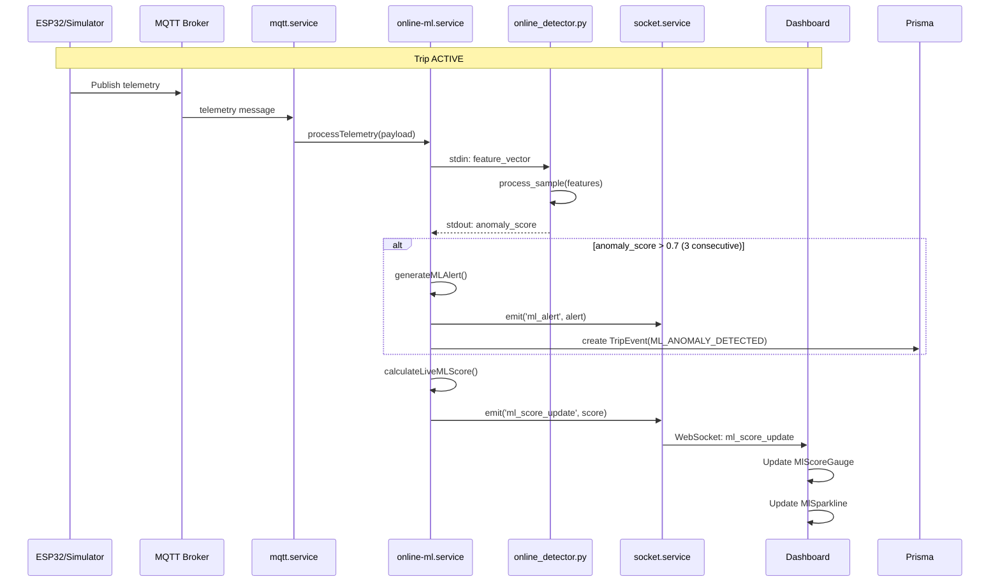
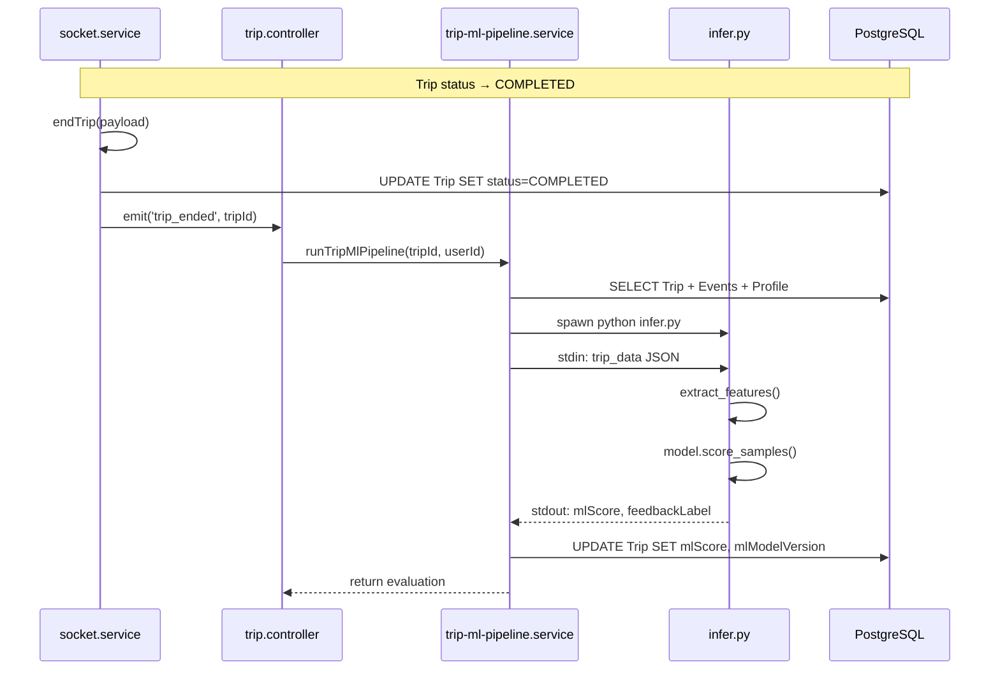
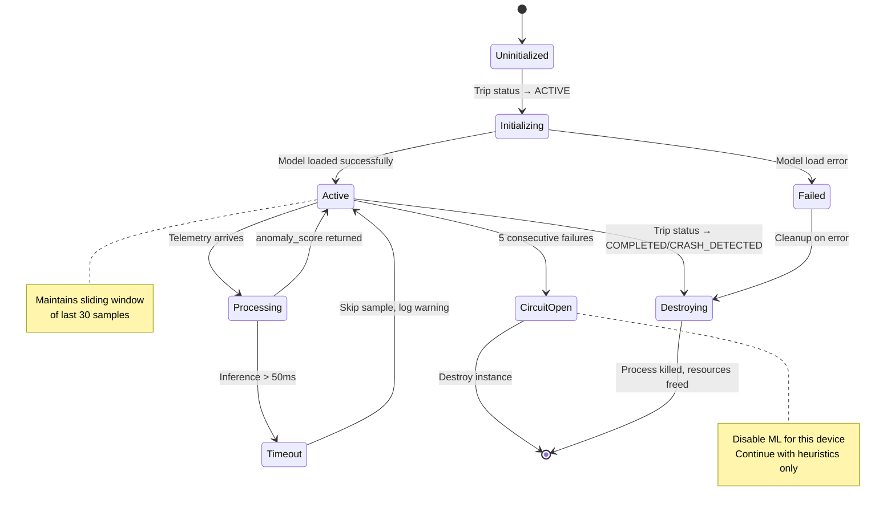

# Design Document: Real-Time ML Pipeline

## Overview

Esta feature transforma o sistema ML do MotoGuard IoT de batch on-demand para streaming real-time, adicionando detecção de anomalias durante a viagem ativa. O sistema atual só executa ML quando o utilizador abre manualmente o TripDetail de uma viagem completada, tornando o ML "invisível" e reativo em vez de preditivo.

A nova arquitetura introduz três componentes principais:

1. **Automatic Batch Pipeline**: Execução automática da pipeline ML ao completar viagens (sem intervenção manual)
2. **Online ML Detector**: Modelo incremental que processa telemetria em streaming durante viagens ativas
3. **Real-Time Alerting**: Sistema de alertas preditivos baseado em padrões anómalos detetados pelo Online_Detector

### Objetivos de Design

- **Proatividade**: Detetar anomalias antes de se tornarem eventos críticos
- **Performance**: Processar telemetria em <50ms sem bloquear o fluxo MQTT
- **Resiliência**: Degradação graciosa quando ML falha (fallback para heurísticas)
- **Escalabilidade**: Suportar 5 viagens concorrentes com Online_Detector ativo
- **Observabilidade**: Logging detalhado para diagnóstico e otimização

### Decisões de Design Principais

**1. Online_Detector Implementation: Python Daemon Process**

Escolhemos a Opção A (daemon process) em vez de HTTP server (Opção B) ou embedding (Opção C):

- **Latência**: Comunicação via stdin/stdout é mais rápida que HTTP (sem overhead de rede)
- **Simplicidade**: Reutiliza a infraestrutura existente de child_process.spawn
- **Isolamento**: Falhas no Python não crasham o Node.js backend
- **Statefulness**: O daemon mantém estado entre samples (sliding window de 30 samples)

**2. Algoritmo ML Online: One-Class SVM com SGD**

Escolhemos One-Class SVM em vez de Isolation Forest ou Autoencoder:

- **Streaming**: Suporta partial_fit para aprendizagem incremental
- **Performance**: Inferência mais rápida que Autoencoders (target: <50ms)
- **Compatibilidade**: Usa o mesmo scaler do modelo batch (Isolation Forest)
- **Simplicidade**: Menos complexo que redes neurais, mais fácil de debugar

**3. Gestão de Estado: Map<deviceId, OnlineDetectorProcess>**

O Backend_Service mantém um Map de processos Python ativos:

- **Lifecycle**: Criado ao iniciar viagem (ACTIVE), destruído ao terminar (COMPLETED/CRASH_DETECTED)
- **Cleanup**: Timeout de 2h para viagens "esquecidas" (proteção contra leaks)
- **Concurrency**: Máximo 5 instâncias simultâneas (Req 11.3)
- **Memory Protection**: Circuit breaker se memória do sistema > 80% (Req 11.5)

**4. Throttling e Performance**

- **Debounce**: ml_score_update emitido no máximo 2x/segundo (Req 7.5)
- **Skip on Timeout**: Se inferência > 50ms, skip sample e log warning (Req 6.5)
- **Circuit Breaker**: Após 5 falhas consecutivas, desativa Online_Detector para esse device
- **Non-Blocking**: Inferência ML não bloqueia processamento MQTT (Req 6.3)

## Architecture

### High-Level Component Diagram

```mermaid
graph TB
    subgraph "Frontend (React + Socket.IO Client)"
        Dashboard[Dashboard.tsx]
        MlGauge[MlScoreGauge.tsx]
        MlSparkline[MlSparkline.tsx]
        Alertas[Alertas.tsx]
    end

    subgraph "Backend (Node.js + Express)"
        MQTT[mqtt.service.ts]
        Socket[socket.service.ts]
        OnlineML[online-ml.service.ts]
        TripML[trip-ml-pipeline.service.ts]
        TripCtrl[trip.controller.ts]
    end

    subgraph "ML Layer (Python)"
        OnlineDetector[online_detector.py<br/>Daemon Process]
        BatchInfer[infer.py<br/>Batch Script]
        Model[(isolation_forest.pkl<br/>Model Artifact)]
    end

    subgraph "Data Layer"
        Prisma[(PostgreSQL<br/>via Prisma)]
        InfluxDB[(InfluxDB<br/>Telemetry)]
    end

    %% Telemetry Flow
    MQTT -->|telemetry| Socket
    MQTT -->|telemetry| OnlineML
    OnlineML -->|stdin/stdout| OnlineDetector
    OnlineDetector -->|anomaly_score| OnlineML
    OnlineML -->|ml_alert| Socket
    OnlineML -->|ml_score_update| Socket

    %% Batch Flow
    TripCtrl -->|trip completed| TripML
    TripML -->|spawn| BatchInfer
    BatchInfer -->|load| Model
    TripML -->|persist mlScore| Prisma

    %% Online Flow
    OnlineML -->|persist ML_ANOMALY_DETECTED| Prisma
    OnlineDetector -->|load| Model

    %% Frontend Flow
    Socket -->|WebSocket| Dashboard
    Dashboard --> MlGauge
    Dashboard --> MlSparkline
    Socket -->|WebSocket| Alertas

    %% Data Persistence
    MQTT -->|write| InfluxDB
    OnlineML -->|write| Prisma
```



### Data Flow Diagrams

#### Streaming ML Flow (Real-Time)



#### Batch ML Flow (Trip Completion)



### Lifecycle Management

#### Online_Detector Lifecycle



## Components and Interfaces

### Backend Services

#### 1. online-ml.service.ts (NEW)

Gere instâncias de Online_Detector e orquestra inferência streaming.

```typescript
interface OnlineDetectorInstance {
  deviceId: string;
  process: ChildProcess;
  slidingWindow: TelemetryPayload[];
  consecutiveHighScores: number;
  consecutiveFailures: number;
  totalSamplesProcessed: number;
  createdAt: Date;
  lastInferenceMs: number;
}

interface MLAlert {
  deviceId: string;
  motoModel: string;
  timestamp: string;
  anomaly_score: number;
  message: string;
  severity: 'WARNING';
  latitude: number;
  longitude: number;
  speedKmh: number;
  rollDeg: number;
  gForce: number;
  dominantFeatures: string[];
}

interface MLScoreUpdate {
  deviceId: string;
  live_ml_score: number;
  timestamp: string;
}

class OnlineMLService {
  private detectors: Map<string, OnlineDetectorInstance>;
  private scoreUpdateThrottle: Map<string, number>; // deviceId → lastEmitTimestamp
  
  // Lifecycle
  initializeDetector(deviceId: string, tripId: string): Promise<void>;
  destroyDetector(deviceId: string): Promise<void>;
  
  // Processing
  processTelemetry(payload: TelemetryPayload): Promise<void>;
  
  // Internal
  private spawnDetectorProcess(deviceId: string): ChildProcess;
  private extractFeatures(payload: TelemetryPayload): number[];
  private sendToDetector(instance: OnlineDetectorInstance, features: number[]): Promise<number>;
  private handleAnomalyScore(deviceId: string, score: number, payload: TelemetryPayload): Promise<void>;
  private generateMLAlert(deviceId: string, payload: TelemetryPayload, score: number, features: string[]): Promise<void>;
  private emitScoreUpdate(deviceId: string, score: number): void;
  private shouldThrottle(deviceId: string): boolean;
  
  // Cleanup
  private cleanupStaleDetectors(): void; // Timeout 2h
  private handleDetectorFailure(deviceId: string, error: Error): void;
}
```

**Key Methods:**

- `initializeDetector()`: Spawns Python daemon, loads model, initializes sliding window
- `processTelemetry()`: Extracts features, sends to detector, handles response
- `handleAnomalyScore()`: Checks threshold (0.7 for 3 consecutive), generates alerts
- `emitScoreUpdate()`: Throttles to 2/sec, emits via Socket.IO
- `destroyDetector()`: Kills process, clears state, logs stats

#### 2. trip-ml-pipeline.service.ts (MODIFIED)

Adiciona trigger automático ao completar viagem.

```typescript
// Existing interface - no changes
export interface TripMlPipelineResult extends TripEvaluation {
  mlScore: number | null;
  mlFeedback: string;
  comparisonReport: ComparisonReport | null;
}

// NEW: Auto-trigger on trip completion
export async function autoRunPipelineOnCompletion(tripId: string, userId: string): Promise<void> {
  // Non-blocking: run in background
  runTripMlPipeline(tripId, userId)
    .then((result) => {
      if (result) {
        console.log(`[ml-pipeline] Auto-execution completed for trip ${tripId}: mlScore=${result.mlScore}`);
      }
    })
    .catch((err) => {
      console.error(`[ml-pipeline] Auto-execution failed for trip ${tripId}:`, err);
    });
}
```

#### 3. socket.service.ts (MODIFIED)

Adiciona emissão de eventos ML.

```typescript
class SocketService {
  // Existing methods...
  
  // NEW: Emit ML events
  emitMLAlert(alert: MLAlert): void {
    this.io?.emit('ml_alert', alert);
  }
  
  emitMLScoreUpdate(update: MLScoreUpdate): void {
    this.io?.emit('ml_score_update', update);
  }
  
  // MODIFIED: Call auto-pipeline on trip end
  private async endTrip(payload: TelemetryPayload): Promise<void> {
    // ... existing code ...
    
    await prisma.trip.update({
      where: { id: tripId },
      data: { endedAt: new Date(timestamp), status: "COMPLETED", /* ... */ }
    });
    
    // NEW: Auto-trigger ML pipeline
    const association = await deviceAssociationService.getAssociation(deviceId);
    if (association) {
      autoRunPipelineOnCompletion(tripId, association.userId);
    }
    
    // ... rest of existing code ...
  }
}
```

#### 4. mqtt.service.ts (MODIFIED)

Integra Online_Detector no fluxo de telemetria.

```typescript
class MqttService {
  // MODIFIED: Add ML processing hook
  connect(): void {
    // ... existing code ...
    
    this.client.on("message", async (topic, message) => {
      if (topic === env.MQTT_TOPIC_TELEMETRIA) {
        try {
          const payload = JSON.parse(message.toString()) as TelemetryPayload;
          
          // Store and emit (existing)
          telemetryStore.update(payload);
          
          // NEW: Process with Online_Detector (non-blocking)
          if (env.ML_REALTIME_ENABLED) {
            onlineMLService.processTelemetry(payload).catch((err) => {
              console.error('[mqtt] ML processing error:', err);
            });
          }
          
          // Emit to frontend (existing)
          for (const handler of this.onTelemetryHandlers) {
            handler(payload);
          }
        } catch (err) {
          console.error("Erro ao parsear telemetria:", err);
        }
      }
    });
  }
}
```

### Python ML Components

#### 1. online_detector.py (NEW)

Daemon process para inferência streaming.

```python
"""
online_detector.py — Streaming ML detector daemon

Comunicação via stdin/stdout JSON (long-running process).

Input (stdin, per sample):
  { "features": [float], "timestamp": str }

Output (stdout, per sample):
  { "anomaly_score": float, "dominant_features": [str], "inference_ms": int }

Output de erro (stdout):
  { "error": str, "anomaly_score": null }
"""

import json
import sys
import time
from pathlib import Path
from collections import deque
import numpy as np
import joblib
from sklearn.svm import OneClassSVM
from sklearn.preprocessing import StandardScaler

DEFAULT_MODEL_PATH = Path(__file__).parent / "models" / "isolation_forest.pkl"
SLIDING_WINDOW_SIZE = 30

class OnlineDetector:
    def __init__(self, model_path: Path):
        """Initialize detector with model artifact."""
        self.artifact = joblib.load(model_path)
        self.scaler: StandardScaler = self.artifact["scaler"]
        self.feature_names: list[str] = self.artifact["metadata"]["feature_names"]
        
        # Initialize One-Class SVM for streaming
        # Use same scaler as batch model for consistency
        self.online_model = OneClassSVM(kernel='rbf', gamma='auto', nu=0.1)
        self.sliding_window = deque(maxlen=SLIDING_WINDOW_SIZE)
        self.is_fitted = False
        
        print(f"[online_detector] Initialized with model version: {self.artifact['metadata']['model_version']}", 
              file=sys.stderr)
    
    def process_sample(self, features: np.ndarray) -> dict:
        """Process a single telemetry sample and return anomaly score."""
        t0 = time.monotonic()
        
        try:
            # Validate and normalize features
            if not np.isfinite(features).all():
                features = np.nan_to_num(features, nan=0.0, posinf=0.0, neginf=0.0)
            
            # Scale features using batch model's scaler
            features_scaled = self.scaler.transform(features.reshape(1, -1))
            
            # Add to sliding window
            self.sliding_window.append(features_scaled[0])
            
            # Fit model if we have enough samples
            if len(self.sliding_window) >= 10 and not self.is_fitted:
                X_window = np.array(list(self.sliding_window))
                self.online_model.fit(X_window)
                self.is_fitted = True
                print(f"[online_detector] Model fitted with {len(self.sliding_window)} samples", 
                      file=sys.stderr)
            
            # Compute anomaly score
            if self.is_fitted:
                # decision_function returns distance to separating hyperplane
                # Negative = anomaly, Positive = normal
                decision = self.online_model.decision_function(features_scaled)[0]
                # Normalize to [0, 1] where 1 = anomaly, 0 = normal
                anomaly_score = 1.0 / (1.0 + np.exp(decision))  # Sigmoid
            else:
                # Not enough data yet - return neutral score
                anomaly_score = 0.5
            
            # Identify dominant features (highest z-scores)
            z_scores = np.abs((features - self.scaler.mean_) / (self.scaler.scale_ + 1e-9))
            top_indices = np.argsort(z_scores)[::-1][:3]
            dominant_features = [self.feature_names[i] for i in top_indices]
            
            inference_ms = int((time.monotonic() - t0) * 1000)
            
            return {
                "anomaly_score": float(anomaly_score),
                "dominant_features": dominant_features,
                "inference_ms": inference_ms,
            }
        
        except Exception as e:
            inference_ms = int((time.monotonic() - t0) * 1000)
            return {
                "error": str(e),
                "anomaly_score": None,
                "inference_ms": inference_ms,
            }

def main():
    """Main loop: read features from stdin, write scores to stdout."""
    import os
    model_path_env = os.environ.get("ML_MODEL_PATH")
    model_path = Path(model_path_env) if model_path_env else DEFAULT_MODEL_PATH
    
    try:
        detector = OnlineDetector(model_path)
    except Exception as e:
        print(json.dumps({"error": f"Failed to initialize detector: {e}", "anomaly_score": None}))
        sys.exit(1)
    
    print("[online_detector] Ready to process samples", file=sys.stderr)
    sys.stderr.flush()
    
    # Process samples line-by-line from stdin
    for line in sys.stdin:
        try:
            data = json.loads(line.strip())
            features = np.array(data["features"], dtype=float)
            result = detector.process_sample(features)
            print(json.dumps(result))
            sys.stdout.flush()
        except json.JSONDecodeError as e:
            print(json.dumps({"error": f"Invalid JSON: {e}", "anomaly_score": None}))
            sys.stdout.flush()
        except Exception as e:
            print(json.dumps({"error": str(e), "anomaly_score": None}))
            sys.stdout.flush()

if __name__ == "__main__":
    main()
```

**Key Features:**

- **Sliding Window**: Mantém últimos 30 samples para contexto
- **Incremental Learning**: Usa One-Class SVM com fit inicial após 10 samples
- **Feature Scaling**: Reutiliza scaler do modelo batch para consistência
- **Error Handling**: Retorna neutral score (0.5) se não houver dados suficientes
- **Performance**: Target <50ms por sample

#### 2. infer.py (NO CHANGES)

O script batch existente permanece inalterado. Continua a usar Isolation Forest para avaliação post-trip.

### Frontend Components

#### 1. MlScoreGauge.tsx (NEW)

Gauge circular para mostrar live_ml_score.

```typescript
interface MlScoreGaugeProps {
  score: number | null;  // 0-100 or null if inactive
  isActive: boolean;
}

export function MlScoreGauge({ score, isActive }: MlScoreGaugeProps) {
  const getColor = (s: number) => {
    if (s >= 80) return 'var(--green)';
    if (s >= 50) return 'var(--yellow)';
    return 'var(--red)';
  };
  
  const displayValue = isActive && score !== null ? score.toFixed(0) : '—';
  const color = isActive && score !== null ? getColor(score) : 'var(--text-muted)';
  
  return (
    <div className={`ml-gauge ${!isActive ? 'ml-gauge-inactive' : ''}`}>
      <div className="ml-gauge-circle" style={{ borderColor: color }}>
        <div className="ml-gauge-value" style={{ color }}>
          {displayValue}
        </div>
        <div className="ml-gauge-label">ML Score</div>
      </div>
      <div className="ml-gauge-badge">ML</div>
    </div>
  );
}
```

**Styling:**

- Circular gauge com border colorido (green/yellow/red)
- Badge "ML" no canto superior direito (purple)
- Estado inativo: dimmed, mostra "—"
- Animação suave nas transições de valor (CSS transition)

#### 2. MlSparkline.tsx (NEW)

Gráfico temporal do score ML (últimos 60 segundos).

```typescript
interface MlSparklineProps {
  history: Array<{ timestamp: number; score: number }>;
  isActive: boolean;
}

export function MlSparkline({ history, isActive }: MlSparklineProps) {
  const getColor = (s: number) => {
    if (s >= 80) return 'var(--green)';
    if (s >= 50) return 'var(--yellow)';
    return 'var(--red)';
  };
  
  // Filter last 60 seconds
  const now = Date.now();
  const filtered = history.filter(h => now - h.timestamp <= 60000);
  
  if (!isActive || filtered.length === 0) {
    return <div className="ml-sparkline ml-sparkline-empty">Sem dados</div>;
  }
  
  // Render SVG sparkline
  const width = 300;
  const height = 60;
  const points = filtered.map((h, i) => {
    const x = (i / (filtered.length - 1)) * width;
    const y = height - (h.score / 100) * height;
    return `${x},${y}`;
  }).join(' ');
  
  return (
    <div className="ml-sparkline">
      <svg width={width} height={height}>
        <polyline
          points={points}
          fill="none"
          stroke={getColor(filtered[filtered.length - 1].score)}
          strokeWidth="2"
        />
      </svg>
    </div>
  );
}
```

**Features:**

- Mostra últimos 60 segundos de histórico
- Cor da linha muda conforme score atual
- Scroll horizontal automático (novos pontos à direita)
- Limpa ao terminar viagem

#### 3. Dashboard.tsx (MODIFIED)

Integra MlScoreGauge e MlSparkline.

```typescript
export default function Dashboard() {
  const { telemetry, status } = useSocket();
  const [mlScore, setMlScore] = useState<number | null>(null);
  const [mlHistory, setMlHistory] = useState<Array<{ timestamp: number; score: number }>>([]);
  const [isTripActive, setIsTripActive] = useState(false);
  
  useEffect(() => {
    const socket = io();
    
    socket.on('ml_score_update', (update: MLScoreUpdate) => {
      setMlScore(update.live_ml_score);
      setMlHistory(prev => [...prev, { timestamp: Date.now(), score: update.live_ml_score }]);
    });
    
    socket.on('trip_started', () => {
      setIsTripActive(true);
      setMlHistory([]);
    });
    
    socket.on('trip_ended', () => {
      setIsTripActive(false);
      setMlScore(null);
      setMlHistory([]);
    });
    
    return () => { socket.disconnect(); };
  }, []);
  
  return (
    <div className="db-page">
      {/* Existing gauges... */}
      
      <div className="db-ml-section">
        <MlScoreGauge score={mlScore} isActive={isTripActive} />
        <MlSparkline history={mlHistory} isActive={isTripActive} />
      </div>
      
      {/* Rest of dashboard... */}
    </div>
  );
}
```

#### 4. Alertas.tsx (MODIFIED)

Adiciona badge ML para alertas ML_ANOMALY_DETECTED.

```typescript
function AlertRow({ event }: { event: TripEvent }) {
  const isMLAlert = event.type === 'ML_ANOMALY_DETECTED';
  
  return (
    <div className={`alert-row alert-${event.severity.toLowerCase()}`}>
      <AlertTriangle size={14} />
      <div className="alert-content">
        <span className="alert-title">
          {event.message}
          {isMLAlert && <span className="alert-badge alert-badge-ml">ML</span>}
        </span>
        <span className="alert-time">{formatTime(event.occurredAt)}</span>
      </div>
    </div>
  );
}
```

**Styling:**

- Badge "ML" com cor purple (#9333ea)
- Distingue visualmente de alertas heurísticos
- Clickable para mostrar detalhes (anomaly_score, dominant_features)

## Data Models

### Database Schema Changes

#### 1. EventType Enum (MODIFIED)

Adicionar novo valor ao enum existente.

```prisma
enum EventType {
  HARD_BRAKING
  EXCESSIVE_LEAN
  HIGH_VIBRATION
  OVERHEAT
  LOW_VOLTAGE
  CRASH_DETECTED
  RAPID_ACCELERATION
  TIRE_PRESSURE_LOW
  OIL_PRESSURE_LOW
  SPEEDING
  ML_ANOMALY_DETECTED  // NEW
}
```

**Migration:**

```sql
-- Add new enum value
ALTER TYPE "EventType" ADD VALUE 'ML_ANOMALY_DETECTED';
```

Esta migration é idempotente (pode ser executada múltiplas vezes sem erro) e não requer downtime.

#### 2. TripEvent Model (NO CHANGES)

O modelo existente já suporta todos os campos necessários para ML alerts:

- `type`: EventType (agora inclui ML_ANOMALY_DETECTED)
- `severity`: EventSeverity (sempre WARNING para ML alerts)
- `message`: String (descrição human-readable das features anómalas)
- `latitude`, `longitude`, `speedKmh`, `rollDeg`, `gForce`: Telemetry snapshot
- `occurredAt`: Timestamp do alerta

#### 3. Trip Model (NO CHANGES)

Os campos `mlScore` e `mlModelVersion` já existem e serão populados pela batch pipeline automática.

### Feature Vector Structure

O Online_Detector usa o mesmo feature extractor que o batch model (features.py):

```python
FEATURE_NAMES = [
    # Event counts (10 features)
    "count_HARD_BRAKING", "count_EXCESSIVE_LEAN", "count_HIGH_VIBRATION",
    "count_OVERHEAT", "count_LOW_VOLTAGE", "count_CRASH_DETECTED",
    "count_RAPID_ACCELERATION", "count_TIRE_PRESSURE_LOW", 
    "count_OIL_PRESSURE_LOW", "count_SPEEDING",
    
    # Severity counts (3 features)
    "count_CRITICAL", "count_WARNING", "count_INFO",
    
    # Trip metrics (3 features)
    "maxSpeedKmh", "maxRollDeg", "maxGForce",
    
    # Profile ratios (3 features)
    "speed_ratio",    # maxSpeedKmh / profile.maxSpeedKmh
    "roll_ratio",     # maxRollDeg / profile.typicalMaxRollDeg
    "gforce_ratio",   # maxGForce / profile.crashGForce
    
    # Derived metrics (2 features)
    "events_per_km",  # total_events / distanceKm
    "critical_ratio", # count_CRITICAL / total_events
]
# Total: 21 features
```

**Streaming Adaptation:**

Para streaming, os event counts são calculados incrementalmente:

- Mantemos um contador acumulado por tipo de evento
- A cada novo sample, atualizamos os contadores se novos eventos forem detetados
- Os ratios são recalculados a cada sample com base nos valores atuais

## Correctness Properties

*A property is a characteristic or behavior that should hold true across all valid executions of a system—essentially, a formal statement about what the system should do. Properties serve as the bridge between human-readable specifications and machine-verifiable correctness guarantees.*


### Property 1: Automatic Pipeline Invocation on Trip Completion

*For any* trip that transitions to COMPLETED status, the ML_Pipeline SHALL be invoked within 5 seconds, and the invocation SHALL not block the trip completion transaction.

**Validates: Requirements 1.1, 1.4**

### Property 2: ML Score Persistence Round-Trip

*For any* successful ML_Pipeline execution, if the pipeline returns an mlScore and mlModelVersion, then querying the Trip record SHALL return the same mlScore and mlModelVersion values.

**Validates: Requirements 1.2**

### Property 3: Graceful Degradation on ML Failure

*For any* trip where the ML_Pipeline fails or times out, the Trip record SHALL contain a Heuristic_Score, the mlScore field SHALL be null, and an error SHALL be logged.

**Validates: Requirements 1.3**

### Property 4: ML Pipeline Queuing Under Load

*For any* set of N trips that complete simultaneously, the Backend_Service SHALL queue ML_Pipeline invocations such that no more than a configured maximum (default: 3) execute concurrently, preventing resource exhaustion.

**Validates: Requirements 1.5**

### Property 5: Online Detector Lifecycle

*For any* trip that transitions to ACTIVE status, an Online_Detector instance SHALL be initialized for that deviceId, and when the trip transitions to COMPLETED or CRASH_DETECTED, the instance SHALL be destroyed within 1 second.

**Validates: Requirements 2.1, 2.5**

### Property 6: Telemetry Processing Latency

*For any* telemetry sample received during an active trip, the Backend_Service SHALL pass it to the Online_Detector within 100ms of MQTT receipt.

**Validates: Requirements 2.2**

### Property 7: Anomaly Score Range Invariant

*For any* telemetry sample processed by the Online_Detector, the returned anomaly_score SHALL be a finite number in the range [0.0, 1.0].

**Validates: Requirements 2.3**

### Property 8: Consecutive Anomaly Alert Generation

*For any* deviceId where the Online_Detector returns anomaly_score > 0.7 for 3 consecutive samples, the Backend_Service SHALL generate exactly one ML_Anomaly_Alert.

**Validates: Requirements 2.4**

### Property 9: Sliding Window Context Maintenance

*For any* Online_Detector instance, after processing N samples (where N ≥ 30), the detector SHALL maintain exactly the last 30 samples in its sliding window.

**Validates: Requirements 2.7**

### Property 10: ML Alert Persistence

*For any* ML_Anomaly_Alert generated, a TripEvent record with type ML_ANOMALY_DETECTED SHALL be created in the database with severity WARNING and a non-empty message.

**Validates: Requirements 3.1, 5.1, 5.2**

### Property 11: ML Alert WebSocket Emission

*For any* ML_Anomaly_Alert generated, the Socket_Service SHALL emit an "ml_alert" event to all connected clients containing deviceId, motoModel, timestamp, anomaly_score, message, severity, latitude, and longitude.

**Validates: Requirements 3.2, 7.1, 7.3**

### Property 12: Alert Message Human-Readability

*For any* ML_Anomaly_Alert, the message field SHALL contain a human-readable description that includes at least one dominant anomalous feature name.

**Validates: Requirements 3.3**

### Property 13: Alert Data Completeness

*For any* ML_Anomaly_Alert, the alert SHALL include non-null values for anomaly_score, latitude, longitude, speedKmh, rollDeg, and gForce.

**Validates: Requirements 3.4**

### Property 14: Live ML Score Calculation

*For any* telemetry sample processed during an active trip, if the Online_Detector returns an anomaly_score, then a live_ml_score SHALL be calculated and SHALL be in the range [0, 100].

**Validates: Requirements 4.1, 4.2**

### Property 15: Score Update WebSocket Emission

*For any* live_ml_score calculated, the Socket_Service SHALL emit a "ml_score_update" event containing deviceId, live_ml_score, and timestamp.

**Validates: Requirements 4.3, 7.2, 7.4**

### Property 16: Score Update Throttling

*For any* deviceId, the Socket_Service SHALL emit at most 2 "ml_score_update" events per second, regardless of how many scores are calculated.

**Validates: Requirements 7.5**

### Property 17: TripEvent Foreign Key Integrity

*For any* TripEvent with type ML_ANOMALY_DETECTED, the tripId foreign key SHALL reference a valid Trip record in the database.

**Validates: Requirements 5.3**

### Property 18: Active Trip Check Before ML Processing

*For any* telemetry sample received via MQTT, the Backend_Service SHALL check if a trip is active for that deviceId before passing to the Online_Detector.

**Validates: Requirements 6.1**

### Property 19: ML Processing Order

*For any* telemetry sample during an active trip, if ML is enabled, the Online_Detector SHALL receive the telemetry before the Socket_Service emits it to clients.

**Validates: Requirements 6.2**

### Property 20: Non-Blocking MQTT Processing

*For any* telemetry sample, MQTT message processing SHALL complete and emit to Socket_Service even if Online_Detector inference is slow or fails.

**Validates: Requirements 6.3**

### Property 21: Inference Performance Threshold

*For any* 100 consecutive telemetry samples processed by the Online_Detector, at least 95 SHALL complete inference within 50ms.

**Validates: Requirements 6.4, 11.1**

### Property 22: Inference Timeout Handling

*For any* telemetry sample where Online_Detector inference exceeds 50ms, the Backend_Service SHALL log a performance warning and skip ML processing for that sample.

**Validates: Requirements 6.5**

### Property 23: Model Artifact Loading

*For any* Online_Detector instance, the Model_Artifact SHALL be loaded exactly once during initialization, not per sample.

**Validates: Requirements 8.1**

### Property 24: Feature Normalization Consistency

*For any* feature vector processed by the Online_Detector, features SHALL be normalized using the same StandardScaler from the Model_Artifact used by the batch pipeline.

**Validates: Requirements 8.5**

### Property 25: Invalid Feature Handling

*For any* feature vector containing NaN, Inf, or missing values, the Online_Detector SHALL substitute neutral values (0.0) and continue processing without raising an exception.

**Validates: Requirements 8.6**

### Property 26: Graceful Degradation on Missing Model

*For any* system startup where the Model_Artifact file does not exist, the Backend_Service SHALL disable Online_Detector, log a warning, and continue operating with heuristics only.

**Validates: Requirements 9.1**

### Property 27: Graceful Degradation on Initialization Failure

*For any* Online_Detector initialization that raises an exception, the Backend_Service SHALL disable real-time ML for that deviceId, log the error, and continue with heuristic-only mode.

**Validates: Requirements 9.2**

### Property 28: Graceful Degradation on Inference Exception

*For any* Online_Detector inference that raises an exception, the Backend_Service SHALL log the error, skip ML processing for that sample, and continue processing subsequent samples.

**Validates: Requirements 9.3**

### Property 29: Batch Pipeline Independence

*For any* trip completion, the batch ML_Pipeline SHALL execute regardless of whether Online_Detector is enabled or disabled.

**Validates: Requirements 9.5, 10.3**

### Property 30: Configuration Flag Respect

*For any* system startup, if the environment variable ML_REALTIME_ENABLED is false, the Backend_Service SHALL not initialize any Online_Detector instances.

**Validates: Requirements 10.1, 10.2**

### Property 31: Model Artifact Validation

*For any* system startup where ML_REALTIME_ENABLED is true, the Backend_Service SHALL validate that the Model_Artifact file exists before enabling Online_Detector.

**Validates: Requirements 10.5**

### Property 32: Throughput Requirement

*For any* active trip, the Backend_Service SHALL process at least 10 telemetry samples per second through the Online_Detector.

**Validates: Requirements 11.2**

### Property 33: Concurrency Limit

*For any* point in time, the Backend_Service SHALL support at most 5 concurrent active trips with Online_Detector enabled.

**Validates: Requirements 11.3**

### Property 34: Memory Consumption Limit

*For any* Online_Detector instance, the Python process SHALL consume no more than 100MB of memory.

**Validates: Requirements 11.4**

### Property 35: Memory Protection Circuit Breaker

*For any* system state where memory usage exceeds 80%, the Backend_Service SHALL refuse to initialize new Online_Detector instances and log a warning.

**Validates: Requirements 11.5**

### Property 36: Initialization Logging

*For any* Online_Detector initialization, the Backend_Service SHALL log the deviceId and model version.

**Validates: Requirements 12.1**

### Property 37: Alert Generation Logging

*For any* ML_Anomaly_Alert generated, the Backend_Service SHALL log the deviceId, anomaly_score, and dominant features.

**Validates: Requirements 12.2**

### Property 38: Detector Destruction Logging

*For any* Online_Detector destruction, the Backend_Service SHALL log the deviceId and total samples processed.

**Validates: Requirements 12.4**

### Property 39: Batch Pipeline Execution Logging

*For any* batch ML_Pipeline invocation, the Backend_Service SHALL log the start time, completion time, and duration.

**Validates: Requirements 12.5**

## Error Handling

### Error Categories and Strategies

#### 1. Model Loading Errors

**Scenarios:**
- Model_Artifact file not found
- Corrupted .pkl file
- Incompatible model version
- Missing dependencies (sklearn, joblib)

**Strategy:**
- Log error with full stack trace
- Disable Online_Detector for all devices
- Set `ML_REALTIME_ENABLED` flag to false in runtime
- Continue with heuristic-only mode
- Emit status event to frontend: `{ ml_status: 'disabled', reason: 'model_load_error' }`

**Recovery:**
- Manual intervention required (fix model file)
- Restart backend service to re-enable ML

#### 2. Inference Timeout

**Scenarios:**
- Python process hangs
- Inference takes > 50ms
- Network/IPC delay

**Strategy:**
- Skip the current sample (don't block MQTT flow)
- Log performance warning with inference time
- Increment timeout counter for that device
- If 5 consecutive timeouts: open circuit breaker, destroy detector
- Continue processing subsequent samples

**Recovery:**
- Automatic: circuit breaker resets after 60 seconds
- If persistent: investigate Python process (memory leak, CPU spike)

#### 3. Python Process Crash

**Scenarios:**
- Segmentation fault
- Out of memory
- Unhandled exception in Python

**Strategy:**
- Detect via `process.on('exit')` event
- Log crash with exit code and stderr
- Destroy detector instance
- Disable ML for that device
- Notify frontend: `{ ml_status: 'crashed', deviceId }`

**Recovery:**
- Automatic: new detector spawned on next trip start
- If crash persists: disable ML globally, investigate root cause

#### 4. Invalid Telemetry Data

**Scenarios:**
- Missing required fields
- NaN/Inf values
- Out-of-range values (e.g., speed = -100)

**Strategy:**
- Validate telemetry before feature extraction
- Substitute invalid values with neutral defaults (0.0)
- Log warning with deviceId and invalid fields
- Continue processing (don't skip sample)

**Recovery:**
- Automatic: validation happens per-sample
- If persistent: investigate telemetry source (simulator/device)

#### 5. Database Errors

**Scenarios:**
- Connection lost
- Constraint violation
- Disk full

**Strategy:**
- Retry TripEvent creation up to 3 times with exponential backoff
- If all retries fail: log error, skip persistence, continue processing
- Alert still emitted to frontend (in-memory only)
- Emit error event to monitoring system

**Recovery:**
- Automatic: retry mechanism
- If persistent: investigate database health

#### 6. WebSocket Disconnection

**Scenarios:**
- Client disconnects
- Network interruption
- Server restart

**Strategy:**
- Socket.IO handles reconnection automatically
- On reconnect: emit current state (active trip, latest score)
- No data loss (scores stored in backend memory)

**Recovery:**
- Automatic: Socket.IO reconnection logic

### Circuit Breaker Pattern

Implementado para proteger contra falhas repetidas:

```typescript
interface CircuitBreaker {
  state: 'CLOSED' | 'OPEN' | 'HALF_OPEN';
  failureCount: number;
  lastFailureTime: number;
  threshold: number;  // 5 failures
  timeout: number;    // 60 seconds
}

function shouldAllowRequest(breaker: CircuitBreaker): boolean {
  if (breaker.state === 'CLOSED') return true;
  
  if (breaker.state === 'OPEN') {
    const elapsed = Date.now() - breaker.lastFailureTime;
    if (elapsed > breaker.timeout) {
      breaker.state = 'HALF_OPEN';
      return true;
    }
    return false;
  }
  
  // HALF_OPEN: allow one request to test recovery
  return true;
}

function recordSuccess(breaker: CircuitBreaker): void {
  breaker.failureCount = 0;
  breaker.state = 'CLOSED';
}

function recordFailure(breaker: CircuitBreaker): void {
  breaker.failureCount++;
  breaker.lastFailureTime = Date.now();
  
  if (breaker.failureCount >= breaker.threshold) {
    breaker.state = 'OPEN';
    console.error(`[circuit-breaker] OPEN - ${breaker.failureCount} consecutive failures`);
  }
}
```

## Testing Strategy

### Dual Testing Approach

Esta feature requer uma combinação de unit tests e property-based tests para garantir correção e robustez.

#### Unit Tests

Focam em casos específicos, edge cases e integração entre componentes:

**Backend (TypeScript + Jest):**

1. `online-ml.service.test.ts`
   - Detector lifecycle (init, destroy, cleanup)
   - Feature extraction from telemetry
   - Alert generation logic (3 consecutive high scores)
   - Throttling behavior (2 updates/sec)
   - Circuit breaker state transitions
   - Error handling (timeout, crash, invalid data)

2. `trip-ml-pipeline.service.test.ts`
   - Auto-trigger on trip completion
   - Non-blocking execution
   - Fallback to heuristic on ML failure

3. `socket.service.test.ts`
   - ML event emission (ml_alert, ml_score_update)
   - Payload structure validation
   - WebSocket reconnection handling

**Python (pytest):**

1. `test_online_detector.py`
   - Model loading (valid, missing, corrupted)
   - Sample processing (valid, invalid, edge cases)
   - Sliding window management (size, FIFO behavior)
   - Feature normalization (same scaler as batch)
   - Error handling (NaN, Inf, missing features)

**Frontend (React Testing Library + Vitest):**

1. `MlScoreGauge.test.tsx`
   - Rendering with different scores (0, 50, 100)
   - Color coding (green, yellow, red)
   - Inactive state (no trip)
   - Animation transitions

2. `MlSparkline.test.tsx`
   - Data filtering (last 60 seconds)
   - Empty state handling
   - Color changes based on score

3. `Dashboard.test.tsx`
   - WebSocket event handling (ml_score_update, ml_alert)
   - State updates on trip start/end
   - History management (clear on trip end)

#### Property-Based Tests

Validam propriedades universais através de geração aleatória de inputs. Usamos **fast-check** (TypeScript) e **Hypothesis** (Python).

**Configuration:**
- Minimum 100 iterations per test
- Each test tagged with: `Feature: real-time-ml-pipeline, Property N: <property_text>`

**Backend Property Tests (fast-check):**

```typescript
import fc from 'fast-check';

describe('Property 7: Anomaly Score Range Invariant', () => {
  it('Feature: real-time-ml-pipeline, Property 7: For any telemetry sample, anomaly_score is in [0.0, 1.0]', () => {
    fc.assert(
      fc.asyncProperty(
        fc.record({
          speed_kmh: fc.float({ min: 0, max: 300 }),
          roll_deg: fc.float({ min: -90, max: 90 }),
          g_force: fc.float({ min: 0, max: 5 }),
          // ... other telemetry fields
        }),
        async (telemetry) => {
          const score = await onlineMLService.processSample(telemetry);
          expect(score).toBeGreaterThanOrEqual(0.0);
          expect(score).toBeLessThanOrEqual(1.0);
        }
      ),
      { numRuns: 100 }
    );
  });
});

describe('Property 16: Score Update Throttling', () => {
  it('Feature: real-time-ml-pipeline, Property 16: At most 2 updates per second per device', () => {
    fc.assert(
      fc.asyncProperty(
        fc.array(fc.float({ min: 0, max: 100 }), { minLength: 10, maxLength: 50 }),
        async (scores) => {
          const deviceId = 'test-device';
          const startTime = Date.now();
          
          for (const score of scores) {
            await onlineMLService.emitScoreUpdate(deviceId, score);
          }
          
          const elapsed = Date.now() - startTime;
          const emittedCount = mockSocket.emitCalls.filter(c => c.event === 'ml_score_update').length;
          const maxAllowed = Math.ceil(elapsed / 1000) * 2;
          
          expect(emittedCount).toBeLessThanOrEqual(maxAllowed);
        }
      ),
      { numRuns: 100 }
    );
  });
});
```

**Python Property Tests (Hypothesis):**

```python
from hypothesis import given, strategies as st
import numpy as np

@given(st.lists(st.floats(min_value=-100, max_value=100), min_size=21, max_size=21))
def test_property_7_anomaly_score_range(features):
    """Feature: real-time-ml-pipeline, Property 7: anomaly_score in [0.0, 1.0]"""
    detector = OnlineDetector(model_path=TEST_MODEL_PATH)
    features_array = np.array(features, dtype=float)
    
    result = detector.process_sample(features_array)
    
    assert result['anomaly_score'] is not None
    assert 0.0 <= result['anomaly_score'] <= 1.0

@given(st.integers(min_value=1, max_value=100))
def test_property_9_sliding_window_size(num_samples):
    """Feature: real-time-ml-pipeline, Property 9: sliding window maintains last 30 samples"""
    detector = OnlineDetector(model_path=TEST_MODEL_PATH)
    
    for i in range(num_samples):
        features = np.random.rand(21)
        detector.process_sample(features)
    
    expected_size = min(num_samples, 30)
    assert len(detector.sliding_window) == expected_size
```

**Integration Tests:**

Simulam fluxos completos end-to-end:

1. **Streaming ML Flow**
   - Start trip → spawn detector
   - Send telemetry stream with known anomalies
   - Verify alerts generated at correct thresholds
   - Verify scores emitted via WebSocket
   - End trip → verify detector destroyed

2. **Batch ML Flow**
   - Complete trip → verify auto-trigger
   - Verify mlScore persisted within 5 seconds
   - Verify non-blocking (trip completion returns immediately)

3. **Graceful Degradation**
   - Remove model file → verify ML disabled
   - Simulate Python crash → verify fallback to heuristics
   - Verify frontend shows "ML indisponível"

### Test Data Generation

**Synthetic Telemetry:**

```typescript
function generateAnomalousTelemetry(): TelemetryPayload {
  return {
    telemetry: {
      speed_kmh: 180,  // High speed
      rpm: 9000,
      throttle_pct: 100,
      // ...
    },
    imu: {
      roll_deg: 55,    // Excessive lean
      pitch_deg: 10,
      yaw_deg: 0,
      g_force: 2.8,    // High G-force
    },
    // ...
  };
}

function generateNormalTelemetry(): TelemetryPayload {
  return {
    telemetry: {
      speed_kmh: 60,
      rpm: 4000,
      throttle_pct: 40,
      // ...
    },
    imu: {
      roll_deg: 15,
      pitch_deg: 5,
      yaw_deg: 0,
      g_force: 1.0,
    },
    // ...
  };
}
```

### Performance Benchmarks

Além dos testes funcionais, incluímos benchmarks de performance:

```typescript
describe('Performance Benchmarks', () => {
  it('Inference latency: 95th percentile < 50ms', async () => {
    const latencies: number[] = [];
    
    for (let i = 0; i < 1000; i++) {
      const telemetry = generateRandomTelemetry();
      const start = performance.now();
      await onlineMLService.processSample(telemetry);
      const end = performance.now();
      latencies.push(end - start);
    }
    
    latencies.sort((a, b) => a - b);
    const p95 = latencies[Math.floor(latencies.length * 0.95)];
    
    expect(p95).toBeLessThan(50);
  });
  
  it('Throughput: >= 10 samples/sec', async () => {
    const numSamples = 100;
    const start = Date.now();
    
    for (let i = 0; i < numSamples; i++) {
      await onlineMLService.processSample(generateRandomTelemetry());
    }
    
    const elapsed = (Date.now() - start) / 1000;
    const throughput = numSamples / elapsed;
    
    expect(throughput).toBeGreaterThanOrEqual(10);
  });
});
```

## Performance and Scalability Considerations

### Latency Targets

| Operation | Target | P95 | P99 |
|-----------|--------|-----|-----|
| Online_Detector inference | 30ms | 50ms | 80ms |
| Feature extraction | 5ms | 10ms | 15ms |
| Alert persistence (DB write) | 20ms | 50ms | 100ms |
| WebSocket emission | 1ms | 5ms | 10ms |
| End-to-end (telemetry → frontend) | 100ms | 150ms | 200ms |

### Throughput Targets

- **Telemetry processing**: 10 samples/sec per active trip (minimum)
- **Concurrent trips**: 5 active trips with Online_Detector enabled
- **WebSocket clients**: 50 concurrent connections
- **Alert generation**: 1 alert/sec per device (burst), 10 alerts/min sustained

### Resource Limits

**Backend (Node.js):**
- Memory: 512MB baseline + 50MB per active detector
- CPU: 1 core baseline + 0.2 cores per active detector
- File descriptors: 1024 (for WebSocket connections)

**Python (Online_Detector):**
- Memory: 100MB per instance (model + sliding window)
- CPU: 0.2 cores per instance (inference)
- Startup time: <2 seconds (model loading)

**Database (PostgreSQL):**
- Connections: 20 (pooled)
- Write throughput: 100 TripEvents/sec
- Query latency: <10ms for Trip lookups

### Scaling Strategies

#### Horizontal Scaling (Future)

Para suportar >5 viagens concorrentes:

1. **Stateless Backend**: Mover estado de Online_Detector para Redis
2. **Load Balancer**: Distribuir WebSocket connections por múltiplas instâncias
3. **Message Queue**: Usar RabbitMQ para desacoplar telemetry processing
4. **Dedicated ML Service**: Separar Online_Detector num serviço independente

#### Vertical Scaling (Current)

Otimizações para a arquitetura atual:

1. **Model Caching**: Partilhar Model_Artifact entre instâncias (mmap)
2. **Batch Inference**: Processar múltiplos samples em batch (GPU)
3. **Feature Caching**: Cache de features calculadas (LRU cache)
4. **Connection Pooling**: Reutilizar conexões DB e WebSocket

### Monitoring and Observability

**Metrics to Track:**

```typescript
interface MLMetrics {
  // Detector lifecycle
  active_detectors: number;
  detector_initializations_total: number;
  detector_failures_total: number;
  
  // Inference performance
  inference_latency_ms: Histogram;
  inference_timeouts_total: number;
  samples_processed_total: number;
  
  // Alert generation
  alerts_generated_total: number;
  alerts_by_device: Map<string, number>;
  
  // Resource usage
  memory_usage_mb: Gauge;
  cpu_usage_percent: Gauge;
  
  // Circuit breaker
  circuit_breaker_state: 'CLOSED' | 'OPEN' | 'HALF_OPEN';
  circuit_breaker_trips_total: number;
}
```

**Logging Levels:**

- **INFO**: Detector lifecycle, trip start/end, batch pipeline execution
- **WARN**: Inference timeout, high memory usage, circuit breaker open
- **ERROR**: Model load failure, Python crash, database errors

**Alerting Rules:**

- Inference P95 latency > 50ms for 5 minutes → Page on-call
- Active detectors > 5 → Warning
- Circuit breaker open for > 1 minute → Page on-call
- Memory usage > 80% → Warning
- Alert generation rate > 10/min per device → Investigate anomaly

## Deployment and Migration

### Deployment Steps

1. **Database Migration**
   ```bash
   cd app
   npx prisma migrate dev --name add-ml-anomaly-event
   ```

2. **Python Dependencies**
   ```bash
   cd ml
   pip install scikit-learn==1.3.0 joblib numpy
   ```

3. **Environment Variables**
   ```bash
   # .env
   ML_REALTIME_ENABLED=true
   ML_MODEL_PATH=../ml/models/isolation_forest.pkl
   ML_INFERENCE_TIMEOUT_MS=5000
   ML_MAX_CONCURRENT_DETECTORS=5
   ```

4. **Backend Deployment**
   ```bash
   cd app/backend
   npm install
   npm run build
   pm2 restart motoguard-backend
   ```

5. **Frontend Deployment**
   ```bash
   cd app/frontend
   npm install
   npm run build
   # Deploy dist/ to CDN or static hosting
   ```

### Rollback Plan

Se houver problemas críticos após deployment:

1. **Disable Real-Time ML**
   ```bash
   export ML_REALTIME_ENABLED=false
   pm2 restart motoguard-backend
   ```

2. **Revert Database Migration** (se necessário)
   ```bash
   npx prisma migrate resolve --rolled-back add-ml-anomaly-event
   ```

3. **Revert Code**
   ```bash
   git revert <commit-hash>
   npm run build
   pm2 restart motoguard-backend
   ```

### Feature Flags

Implementar feature flags para controlo granular:

```typescript
interface FeatureFlags {
  ml_realtime_enabled: boolean;           // Global on/off
  ml_auto_batch_enabled: boolean;         // Auto-trigger batch pipeline
  ml_alerts_enabled: boolean;             // Generate ML alerts
  ml_score_updates_enabled: boolean;      // Emit score updates
  ml_max_concurrent_detectors: number;    // Concurrency limit
}
```

Permite ativar/desativar features individualmente sem redeploy.

## Future Enhancements

### Phase 2: Advanced ML Features

1. **Adaptive Thresholds**: Ajustar threshold de alerta (0.7) dinamicamente por perfil de mota
2. **Personalized Models**: Treinar modelos específicos por utilizador (transfer learning)
3. **Predictive Maintenance**: Detetar padrões de desgaste antes de falhas mecânicas
4. **Driving Style Classification**: Classificar estilo de condução (agressivo, defensivo, económico)

### Phase 3: Scalability Improvements

1. **GPU Acceleration**: Usar TensorFlow/PyTorch para inferência mais rápida
2. **Edge Computing**: Executar ML no ESP32 (TensorFlow Lite)
3. **Federated Learning**: Treinar modelos distribuídos sem centralizar dados
4. **Real-Time Retraining**: Atualizar modelo online com feedback do utilizador

### Phase 4: Advanced Analytics

1. **Anomaly Explanation**: Usar SHAP/LIME para explicar porque um alerta foi gerado
2. **Counterfactual Analysis**: "Se tivesses travado 2 segundos antes, evitavas o alerta"
3. **Risk Prediction**: Prever probabilidade de acidente nos próximos 30 segundos
4. **Route Optimization**: Sugerir rotas mais seguras baseadas em histórico de anomalias

---

**Document Version:** 1.0  
**Last Updated:** 2024  
**Authors:** Kiro AI Assistant  
**Status:** Ready for Implementation
