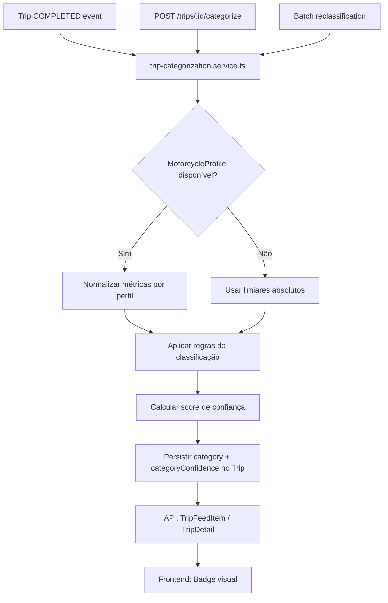

# Design Técnico — Trip Categorization

## Overview

Esta feature adiciona classificação automática de viagens concluídas na aplicação MotoGuard. Cada viagem com `status = COMPLETED` recebe exatamente uma de quatro categorias (`COMMUTE`, `WEEKEND_RIDE`, `TRACK_DAY`, `OFF_ROAD`) calculada a partir das métricas já existentes no modelo `Trip` e dos eventos `TripEvent` associados.

O sistema é puramente heurístico (sem ML), complementar ao scoring existente em `trip-evaluation.service.ts`, e persiste a categoria e um score de confiança (0.0–1.0) na base de dados. A categoria é exposta na API de feed e de detalhe, e apresentada como badge visual no frontend.

### Decisões de design

- **Sem novo serviço ML**: a categorização é determinística e baseada em limiares, pelo que vive num módulo separado `trip-categorization.service.ts` sem dependências externas.
- **Persistência imediata**: a categoria é calculada e persistida quando a viagem transita para `COMPLETED`, evitando recálculo a cada pedido.
- **Prioridade explícita**: quando múltiplos critérios se sobrepõem, a ordem `TRACK_DAY > OFF_ROAD > WEEKEND_RIDE > COMMUTE` é aplicada de forma determinística.
- **Normalização por perfil**: quando o `MotorcycleProfile` está disponível, os limiares de velocidade e inclinação são normalizados em relação ao perfil, tornando a classificação agnóstica ao tipo de mota.
- **Reclassificação em lote**: uma função utilitária permite reclassificar viagens existentes sem categoria, executável manualmente ou via endpoint.

---

## Architecture



O fluxo de categorização é invocado em três pontos:
1. **Automaticamente** quando uma viagem transita para `COMPLETED` (no serviço que fecha a viagem).
2. **Sob pedido** via `POST /trips/:id/categorize`.
3. **Em lote** via função utilitária para viagens existentes sem categoria.

---

## Components and Interfaces

### `trip-categorization.service.ts` (novo)

Módulo central de categorização. Exporta:

```typescript
export type TripCategory = "COMMUTE" | "WEEKEND_RIDE" | "TRACK_DAY" | "OFF_ROAD";

export interface CategorizationInput {
  trip: {
    distanceKm: number | null;
    avgSpeedKmh: number | null;
    maxSpeedKmh: number | null;
    maxRollDeg: number | null;
    maxGForce: number | null;
  };
  profile?: {
    maxSpeedKmh: number;
    typicalMaxRollDeg: number;
  } | null;
  eventCounts: Partial<Record<string, number>>; // byType counts
}

export interface CategorizationResult {
  category: TripCategory;
  confidence: number; // 0.0 – 1.0
  matchedRules: string[]; // para debugging/logging
}

export function categorizeTrip(input: CategorizationInput): CategorizationResult;

export async function categorizeTripById(tripId: string, userId: string): Promise<CategorizationResult | null>;

export async function reclassifyAllUnategorized(): Promise<{ processed: number; errors: number }>;
```

### Integração com `trip-feed.service.ts`

`buildTripFeedItem` já recebe os dados da viagem. O campo `category` e `categoryConfidence` são lidos diretamente do modelo `Trip` persistido — não são recalculados em runtime.

### Integração com `trip.controller.ts`

Novo handler:

```typescript
// POST /api/trips/:id/categorize
export async function categorizeTripHandler(req: AuthRequest, res: Response): Promise<void>;
```

### Componente `TripCategoryBadge` (novo, frontend)

```typescript
// app/frontend/src/components/trips/TripCategoryBadge.tsx
interface TripCategoryBadgeProps {
  category: TripCategory | null | undefined;
  confidence?: number | null;
}
```

Renderiza o badge com cor e rótulo corretos. Se `category` for nulo, não renderiza nada. Se `confidence < 0.5`, aplica opacidade reduzida.

---

## Data Models

### Migração Prisma

Adicionar ao modelo `Trip` em `schema.prisma`:

```prisma
enum TripCategory {
  COMMUTE
  WEEKEND_RIDE
  TRACK_DAY
  OFF_ROAD
}

model Trip {
  // ... campos existentes ...
  category           TripCategory? @map("category")
  categoryConfidence Float?        @map("category_confidence")
}
```

A migração é não-destrutiva: os campos são opcionais (`?`), pelo que viagens existentes ficam com `null` até reclassificação.

### Tipos TypeScript frontend (`app/frontend/src/types/index.ts`)

```typescript
export type TripCategory = "COMMUTE" | "WEEKEND_RIDE" | "TRACK_DAY" | "OFF_ROAD";

// Adicionar a Trip:
category?: TripCategory | null;
categoryConfidence?: number | null;

// Adicionar a TripFeedItem:
category?: TripCategory | null;
categoryConfidence?: number | null;
```

### Lógica de normalização e limiares

Quando o `MotorcycleProfile` está disponível:
- `normalizedSpeed = maxSpeedKmh / profile.maxSpeedKmh`
- `normalizedRoll = maxRollDeg / profile.typicalMaxRollDeg`

Os limiares de classificação são aplicados sobre os valores normalizados (ou absolutos quando sem perfil):

| Categoria      | Condições (AND)                                                                                      |
|----------------|------------------------------------------------------------------------------------------------------|
| `TRACK_DAY`    | `maxSpeedKmh > 120` AND `maxRollDeg > 40°` AND `(SPEEDING + EXCESSIVE_LEAN events) > 2`            |
| `OFF_ROAD`     | `avgSpeedKmh < 40` AND `maxRollDeg > 30°` AND `HIGH_VIBRATION events > 0`                          |
| `WEEKEND_RIDE` | `distanceKm >= 30` AND `avgSpeedKmh` entre 50–100 AND `maxRollDeg < 40°`                           |
| `COMMUTE`      | `distanceKm < 30` AND `avgSpeedKmh < 50` AND `SPEEDING events = 0`                                 |

Prioridade de desempate: `TRACK_DAY > OFF_ROAD > WEEKEND_RIDE > COMMUTE`.

Se nenhum critério for satisfeito, atribui `COMMUTE` com `confidence < 0.5`.

### Cálculo do score de confiança

O score de confiança é calculado como a proporção de condições satisfeitas para a categoria vencedora:

```
confidence = condições_satisfeitas / total_condições_da_categoria
```

Se a categoria foi atribuída por fallback (nenhum critério satisfeito), `confidence = 0.3`.


---

## Correctness Properties

*A property is a characteristic or behavior that should hold true across all valid executions of a system — essentially, a formal statement about what the system should do. Properties serve as the bridge between human-readable specifications and machine-verifiable correctness guarantees.*

### Property 1: Output sempre é uma categoria válida

*Para qualquer* input de categorização com métricas arbitrárias (incluindo nulos), o categorizador SHALL sempre devolver exatamente uma das quatro categorias válidas: `COMMUTE`, `WEEKEND_RIDE`, `TRACK_DAY` ou `OFF_ROAD`.

**Validates: Requirements 1.1**

---

### Property 2: Score de confiança está sempre no intervalo [0.0, 1.0]

*Para qualquer* input de categorização, o score de confiança devolvido SHALL estar sempre no intervalo fechado [0.0, 1.0].

**Validates: Requirements 1.5**

---

### Property 3: Normalização por perfil é invariante à escala

*Para qualquer* viagem com métricas (maxSpeedKmh, maxRollDeg) e perfil (maxSpeedKmh, typicalMaxRollDeg), se escalarmos ambos os valores e o perfil pelo mesmo fator positivo, a categoria atribuída SHALL ser a mesma. Isto verifica que a classificação depende da proporção relativa, não dos valores absolutos.

**Validates: Requirements 1.3**

---

### Property 4: Regras de classificação por categoria

*Para qualquer* viagem que satisfaça os critérios de exatamente uma categoria (sem sobreposição com categorias de maior prioridade), o categorizador SHALL atribuir essa categoria. Especificamente:
- Viagens com `distanceKm < 30`, `avgSpeedKmh < 50` e zero eventos `SPEEDING` → `COMMUTE`
- Viagens com `distanceKm >= 30`, `avgSpeedKmh` ∈ [50, 100] e `maxRollDeg < 40` → `WEEKEND_RIDE`
- Viagens com `maxSpeedKmh > 120`, `maxRollDeg > 40` e `(SPEEDING + EXCESSIVE_LEAN) > 2` → `TRACK_DAY`
- Viagens com `avgSpeedKmh < 40`, `maxRollDeg > 30` e `HIGH_VIBRATION > 0` → `OFF_ROAD`

**Validates: Requirements 2.1, 2.2, 2.3, 2.4**

---

### Property 5: Prioridade de desempate é determinística

*Para qualquer* viagem que satisfaça os critérios de múltiplas categorias simultaneamente, o categorizador SHALL sempre escolher a categoria de maior prioridade segundo a ordem `TRACK_DAY > OFF_ROAD > WEEKEND_RIDE > COMMUTE`.

**Validates: Requirements 2.5**

---

### Property 6: Persistência é um round-trip

*Para qualquer* viagem COMPLETED, após invocar `categorizeTripById`, a leitura da viagem na base de dados SHALL devolver os mesmos valores de `category` e `categoryConfidence` que foram calculados e persistidos.

**Validates: Requirements 3.3**

---

### Property 7: Badge renderiza rótulo e cor corretos para cada categoria

*Para qualquer* valor de `TripCategory`, o componente `TripCategoryBadge` SHALL renderizar o rótulo português correto (`COMMUTE` → "Urbana", `WEEKEND_RIDE` → "Passeio", `TRACK_DAY` → "Pista", `OFF_ROAD` → "Todo-o-Terreno") e a cor correspondente (azul, verde, laranja, castanho).

**Validates: Requirements 5.3, 5.5**

---

### Property 8: Badge de baixa confiança aplica estilo visual distinto

*Para qualquer* categoria com `confidence < 0.5`, o componente `TripCategoryBadge` SHALL aplicar um estilo visual diferente do badge normal (ex: opacidade reduzida ou ícone de interrogação).

**Validates: Requirements 5.6**

---

### Property 9: Reclassificação em lote cobre todas as viagens elegíveis

*Para qualquer* conjunto de viagens com `status = COMPLETED` e `category = null` (com dados suficientes), após executar `reclassifyAllUnategorized`, todas essas viagens SHALL ter `category` não nulo.

**Validates: Requirements 6.1**

---

### Property 10: Resultado do lote contabiliza corretamente processadas e erros

*Para qualquer* execução de `reclassifyAllUnategorized`, o valor `processed` SHALL ser igual ao número de viagens que receberam categoria, e `errors` SHALL ser igual ao número de viagens que foram ignoradas por dados insuficientes.

**Validates: Requirements 6.3**

---

## Error Handling

### Dados insuficientes

Quando `distanceKm` e `avgSpeedKmh` são ambos nulos, o categorizador não tem informação suficiente para classificar. Neste caso:
- A função `categorizeTrip` atribui `COMMUTE` com `confidence = 0.0` e inclui `"insufficient_data"` em `matchedRules`.
- A função `categorizeTripById` regista um aviso no log e retorna `null` sem persistir.
- A função `reclassifyAllUnategorized` incrementa o contador `errors` e continua para a próxima viagem.

### Viagem não encontrada ou sem autorização

O endpoint `POST /trips/:id/categorize` devolve HTTP 404 se:
- O `tripId` não existir na base de dados.
- A viagem não pertencer ao utilizador autenticado.

### Falha de persistência

Se a operação de `prisma.trip.update` falhar durante a categorização, o erro é propagado e registado. A viagem mantém `category = null`.

### Viagem não COMPLETED

Se `categorizeTripById` for invocado para uma viagem com `status != COMPLETED`, a função devolve `null` sem calcular nem persistir.

---

## Testing Strategy

### Abordagem dual

Os testes cobrem dois níveis complementares:
- **Testes unitários**: verificam exemplos concretos, casos limite e condições de erro.
- **Testes de propriedade (PBT)**: verificam invariantes universais sobre o espaço de inputs.

### Testes unitários

Focados em:
- Exemplos concretos de cada categoria com valores específicos.
- Comportamento com `MotorcycleProfile` ausente vs. presente.
- Casos limite: `distanceKm = 30` (fronteira COMMUTE/WEEKEND_RIDE), `maxRollDeg = 40` (fronteira WEEKEND_RIDE/TRACK_DAY).
- Viagem sem dados suficientes (`distanceKm = null`, `avgSpeedKmh = null`).
- Endpoint `POST /trips/:id/categorize` com ID inválido → HTTP 404.
- Renderização do `TripCategoryBadge` com `category = null` (sem badge).
- Renderização do `TripCategoryBadge` com `confidence = 0.3` (badge com baixa confiança).

### Testes de propriedade (PBT)

Biblioteca: **fast-check** (já disponível no ecossistema TypeScript/Node.js).

Configuração: mínimo 100 iterações por propriedade.

Cada teste de propriedade deve incluir um comentário de rastreabilidade:
`// Feature: trip-categorization, Property N: <texto da propriedade>`

**Geradores necessários:**

```typescript
// Gerador de CategorizationInput arbitrário
const arbCategorizationInput = fc.record({
  trip: fc.record({
    distanceKm: fc.option(fc.float({ min: 0, max: 500 })),
    avgSpeedKmh: fc.option(fc.float({ min: 0, max: 200 })),
    maxSpeedKmh: fc.option(fc.float({ min: 0, max: 300 })),
    maxRollDeg: fc.option(fc.float({ min: 0, max: 90 })),
    maxGForce: fc.option(fc.float({ min: 0, max: 10 })),
  }),
  profile: fc.option(fc.record({
    maxSpeedKmh: fc.integer({ min: 80, max: 300 }),
    typicalMaxRollDeg: fc.integer({ min: 20, max: 60 }),
  })),
  eventCounts: fc.dictionary(
    fc.constantFrom("SPEEDING", "EXCESSIVE_LEAN", "HIGH_VIBRATION", "HARD_BRAKING"),
    fc.integer({ min: 0, max: 20 })
  ),
});
```

**Mapeamento propriedade → teste PBT:**

| Propriedade | Teste PBT |
|-------------|-----------|
| Property 1 | `fc.assert(fc.property(arbCategorizationInput, (input) => VALID_CATEGORIES.includes(categorizeTrip(input).category)))` |
| Property 2 | `fc.assert(fc.property(arbCategorizationInput, (input) => { const r = categorizeTrip(input); return r.confidence >= 0.0 && r.confidence <= 1.0; }))` |
| Property 3 | Gerar input com perfil, escalar métricas e perfil pelo mesmo fator, verificar categoria igual |
| Property 4 | Gerar inputs que satisfazem exatamente os critérios de cada categoria, verificar categoria esperada |
| Property 5 | Gerar inputs que satisfazem múltiplos critérios, verificar que a categoria de maior prioridade é escolhida |
| Property 7 | `fc.assert(fc.property(fc.constantFrom(...VALID_CATEGORIES), (cat) => { const rendered = render(<TripCategoryBadge category={cat} />); return rendered includes LABELS[cat] && rendered includes COLORS[cat]; }))` |
| Property 8 | `fc.assert(fc.property(fc.constantFrom(...VALID_CATEGORIES), fc.float({ min: 0, max: 0.49 }), (cat, conf) => { const rendered = render(<TripCategoryBadge category={cat} confidence={conf} />); return rendered has low-confidence style; }))` |

Os testes de propriedade 6, 9 e 10 requerem base de dados de teste (integração) e são executados separadamente com mocks do Prisma.
