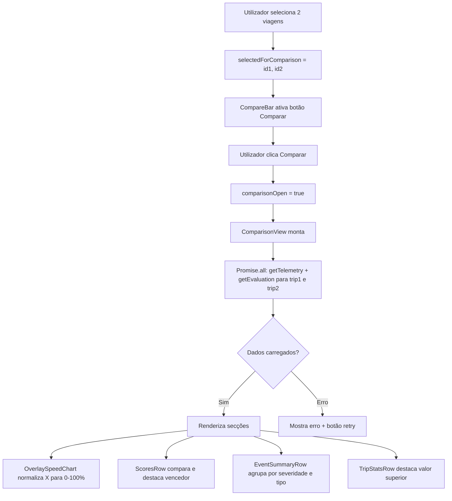

# Design Document: Trip Comparison

## Overview

Esta funcionalidade permite ao utilizador selecionar duas viagens na página Trips e visualizá-las lado a lado numa `ComparisonView`. A comparação inclui gráficos de velocidade sobrepostos com eixo temporal normalizado, scores heurístico e ML, contagem de eventos por tipo e severidade, e métricas resumo (distância, duração, velocidade média/máxima).

A implementação é inteiramente frontend — sem novos endpoints de backend — reutilizando as APIs existentes `tripsAPI.getTelemetry` e `tripsAPI.getEvaluation`. A `ComparisonView` é renderizada como um overlay de ecrã completo dentro da página `Trips.tsx`, sem navegação para uma rota separada.

### Princípios de Design

1. **Zero novos endpoints**: Reutiliza `GET /telemetry/:tripId` e `GET /trips/:tripId/evaluation`
2. **Carregamento paralelo**: Ambas as viagens carregam em simultâneo com `Promise.all`
3. **Normalização temporal**: O eixo X do gráfico é normalizado para [0%, 100%] para comparação independente da duração
4. **Estado preservado**: Fechar a `ComparisonView` restaura filtros, página e seleções da lista
5. **Degradação graciosa**: Dados em falta mostram "—" ou "N/D" sem quebrar o layout

## Architecture

### Estrutura de Componentes

```
Trips.tsx (página existente, modificada)
├── Estado de seleção: selectedForComparison: string[] (máx 2)
├── Estado de comparação: comparisonOpen: boolean
├── TripListCard (modificado)
│   └── CompareCheckbox — checkbox de seleção por cartão
├── CompareBar — barra flutuante com contador e botão "Comparar"
└── ComparisonView (novo componente overlay)
    ├── ComparisonHeader — identificadores das duas viagens + botão fechar
    ├── TripStatsRow — métricas resumo lado a lado
    ├── ScoresRow — heurístico e ML lado a lado
    ├── OverlaySpeedChart — gráfico de velocidade sobreposto (Recharts)
    ├── EventSummaryRow — contagem por severidade e tipo lado a lado
    └── AccessibleDataTable — tabela alternativa para o gráfico
```

### Fluxo de Dados



### Gestão de Estado

Todo o estado de comparação vive em `Trips.tsx` para preservar o contexto da lista:

```typescript
// Estado adicionado a Trips.tsx
const [selectedForComparison, setSelectedForComparison] = useState<string[]>([]);
const [comparisonOpen, setComparisonOpen] = useState(false);

// Snapshot do estado da lista ao abrir a comparação
const [listStateSnapshot, setListStateSnapshot] = useState<ListStateSnapshot | null>(null);
```

Ao abrir a `ComparisonView`, é guardado um snapshot do estado atual (filtros, página, seleções) para restauração ao fechar.

## Components and Interfaces

### 1. CompareCheckbox (inline em TripListCard)

Adicionado ao `TripListCard` existente. Visível apenas na vista Lista.

```typescript
interface CompareCheckboxProps {
  tripId: string;
  selected: boolean;
  disabled: boolean; // true quando já há 2 selecionadas e esta não é uma delas
  onChange: (tripId: string, checked: boolean) => void;
}
```

### 2. CompareBar

Barra flutuante que aparece quando há ≥1 viagem selecionada.

```typescript
interface CompareBarProps {
  selectedCount: number;       // 0, 1 ou 2
  onClear: () => void;
  onCompare: () => void;       // só ativo quando selectedCount === 2
}
```

### 3. ComparisonView

Componente principal do overlay. Gere o carregamento de dados internamente.

```typescript
interface ComparisonViewProps {
  tripIds: [string, string];
  trips: Trip[];               // lista de trips já carregada em Trips.tsx
  onClose: () => void;
}
```

### 4. OverlaySpeedChart

Gráfico Recharts com duas séries de velocidade normalizadas.

```typescript
interface OverlaySpeedChartProps {
  seriesA: NormalizedSpeedPoint[] | null;
  seriesB: NormalizedSpeedPoint[] | null;
  labelA: string;
  labelB: string;
  avgSpeedA: number | null;
  avgSpeedB: number | null;
}

interface NormalizedSpeedPoint {
  pct: number;       // 0–100, posição normalizada na viagem
  speed: number;     // km/h
}
```

### 5. Funções Utilitárias Puras

```typescript
// Normaliza array de pontos de telemetria para eixo X [0, 100]
function normalizeTelemetryToPercent(
  points: TripTelemetryPoint[]
): NormalizedSpeedPoint[]

// Calcula velocidade média de uma série
function calcAvgSpeed(points: NormalizedSpeedPoint[]): number

// Retorna qual dos dois valores é o "vencedor" (maior)
function compareValues(a: number | null, b: number | null): "A" | "B" | "tie" | "none"

// Calcula diferença absoluta formatada
function formatDiff(a: number | null, b: number | null, unit: string): string

// Codificação de cor de score (reutiliza lógica existente de Trips.tsx)
function scoreStyle(score: number): { bg: string; color: string }
```

## Data Models

### Estado de Comparação

```typescript
interface ComparisonState {
  selectedForComparison: string[];   // máx 2 IDs
  comparisonOpen: boolean;
}

interface ListStateSnapshot {
  page: number;
  pageSize: number;
  statusFilter: TripStatusFilter;
  sourceFilter: TripSourceFilter;
  selectedMotoId: string;
  fromDate: string;
  toDate: string;
  onlyWithEvents: boolean;
  expandedId: string | null;
}
```

### Dados Carregados na ComparisonView

```typescript
interface TripComparisonData {
  trip: Trip;
  telemetry: TripTelemetryResponse | null;
  evaluation: TripEvaluationResponse | null;
  telemetryError: string | null;
  evaluationError: string | null;
  telemetryLoading: boolean;
  evaluationLoading: boolean;
}
```

### Ponto Normalizado

```typescript
interface NormalizedSpeedPoint {
  pct: number;    // 0–100
  speed: number;  // km/h
}
```

### Limite de Pontos de Telemetria

O backend já suporta paginação. O frontend passa `limit=500` no query param de `getTelemetry`. A API existente `GET /telemetry/:tripId` aceita `?limit=N`.

## Correctness Properties

*A property is a characteristic or behavior that should hold true across all valid executions of a system — essentially, a formal statement about what the system should do. Properties serve as the bridge between human-readable specifications and machine-verifiable correctness guarantees.*

### Property 1: Limite de seleção

*For any* lista de viagens, selecionar mais de 2 viagens deve ser rejeitado e o array `selectedForComparison` deve ter comprimento máximo de 2.

**Validates: Requirements 1.3**

### Property 2: Botão Comparar ativo apenas com 2 selecionadas

*For any* estado de seleção, o botão "Comparar Viagens" deve estar ativo se e só se `selectedForComparison.length === 2`.

**Validates: Requirements 1.4**

### Property 3: Toggle de seleção é round-trip

*For any* viagem, selecionar e depois desselecionar deve resultar no mesmo estado de `selectedForComparison` que antes da seleção.

**Validates: Requirements 1.6**

### Property 4: Fechar restaura estado da lista

*For any* estado da lista (filtros, página, seleções) ao abrir a `ComparisonView`, fechar a `ComparisonView` deve restaurar exatamente esse estado.

**Validates: Requirements 2.2**

### Property 5: Cabeçalho contém identificadores das duas viagens

*For any* par de viagens, o cabeçalho da `ComparisonView` deve conter o nome da mota e a data de início de cada viagem.

**Validates: Requirements 2.3**

### Property 6: Limite de 500 pontos de telemetria

*For any* viagem, os dados de telemetria carregados na `ComparisonView` devem ter no máximo 500 pontos.

**Validates: Requirements 3.5**

### Property 7: Normalização do eixo X para [0, 100]

*For any* array de pontos de telemetria com comprimento ≥ 1, a função `normalizeTelemetryToPercent` deve produzir pontos com `pct` no intervalo [0, 100], com o primeiro ponto em 0 e o último em 100.

**Validates: Requirements 4.2**

### Property 8: Velocidade média de referência é a média aritmética

*For any* série de pontos normalizados, o valor da linha de referência de velocidade média deve ser igual à média aritmética dos valores `speed` da série.

**Validates: Requirements 4.6**

### Property 9: Destaque do vencedor é correto

*For any* par de valores numéricos (a, b), a função `compareValues` deve retornar "A" se a > b, "B" se b > a, e "tie" se a === b. Esta propriedade aplica-se a scores, contagens de eventos e métricas de viagem.

**Validates: Requirements 5.2, 6.4, 7.3**

### Property 10: Diferença absoluta é correta

*For any* par de valores numéricos (a, b), a diferença exibida deve ser igual a |a - b|.

**Validates: Requirements 5.3, 7.5**

### Property 11: Codificação de cor de score

*For any* score no intervalo [0, 100], a função `scoreStyle` deve retornar cor verde para score ≥ 80, amarela para score ≥ 60 e < 80, e vermelha para score < 60.

**Validates: Requirements 5.5**

### Property 12: Event summary exibe contagens corretas

*For any* `TripEvaluationResponse`, as contagens exibidas por severidade (INFO, WARNING, CRITICAL) e por tipo devem corresponder exatamente aos valores em `severityCounts` e `typeCounts`.

**Validates: Requirements 6.2, 6.3**

### Property 13: Trip stats exibe as quatro métricas

*For any* viagem com dados disponíveis, a secção de Trip Stats deve exibir distância, duração, velocidade média e velocidade máxima.

**Validates: Requirements 7.2**

## Error Handling

### Viagem inválida ou sem permissão

- **Cenário**: Um dos `tripIds` não existe ou não pertence ao utilizador
- **Comportamento**: A API retorna 404/403; a `ComparisonView` mostra mensagem de erro e botão fechar
- **Estado**: Não bloqueia o carregamento da outra viagem

### Falha de telemetria

- **Cenário**: `getTelemetry` falha para uma ou ambas as viagens
- **Comportamento**: `telemetryError` é preenchido; o `OverlaySpeedChart` mostra mensagem de erro com botão "Tentar novamente" na secção correspondente
- **Estado**: As outras secções (scores, eventos, stats) continuam a renderizar normalmente

### Falha de avaliação

- **Cenário**: `getEvaluation` falha para uma ou ambas as viagens
- **Comportamento**: `evaluationError` é preenchido; as secções de scores e eventos mostram erro com retry
- **Estado**: O gráfico de velocidade continua a renderizar se a telemetria estiver disponível

### ML Score nulo

- **Cenário**: `evaluation.mlScore === null`
- **Comportamento**: Exibe "N/D" na célula; a lógica de destaque do vencedor ignora esta categoria
- **Estado**: Não quebra o layout

### Telemetria vazia

- **Cenário**: `data.length === 0` na resposta de telemetria
- **Comportamento**: `normalizeTelemetryToPercent` retorna `[]`; o gráfico mostra mensagem "Sem dados de telemetria"
- **Estado**: A linha de referência de velocidade média não é renderizada

### Zero eventos

- **Cenário**: Ambas as viagens têm `severityCounts` todos a zero
- **Comportamento**: Exibe "Sem eventos registados" na secção de eventos
- **Estado**: Não renderiza tabela de tipos de evento

## Testing Strategy

### Abordagem Dual

**Testes unitários** focam em:
- Renderização inicial da `ComparisonView` com dados mock
- Estado de loading e erro em cada secção
- Comportamento do botão fechar e restauração de estado
- Casos extremos: ML score nulo, telemetria vazia, zero eventos

**Testes de propriedade** focam em:
- Funções utilitárias puras (`normalizeTelemetryToPercent`, `compareValues`, `formatDiff`, `scoreStyle`)
- Lógica de seleção (limite de 2, toggle round-trip, ativação do botão)
- Invariantes de dados (limite de 500 pontos, normalização [0,100])

### Configuração de Property-Based Testing

**Biblioteca**: `fast-check` (a adicionar como devDependency)

**Configuração**:
- Mínimo 100 iterações por teste de propriedade
- Cada teste anotado com feature e número de propriedade
- Formato: `// Feature: trip-comparison, Property N: <texto>`

**Exemplo de estrutura**:

```typescript
import fc from 'fast-check';
import { normalizeTelemetryToPercent, compareValues, scoreStyle } from '../utils/tripComparison';

// Feature: trip-comparison, Property 7: Normalização do eixo X para [0, 100]
test('normalizeTelemetryToPercent produz pct em [0, 100]', () => {
  fc.assert(
    fc.property(
      fc.array(fc.record({ speed_kmh: fc.float({ min: 0, max: 300 }) }), { minLength: 1 }),
      (points) => {
        const result = normalizeTelemetryToPercent(points as any);
        return result.every(p => p.pct >= 0 && p.pct <= 100)
          && result[0].pct === 0
          && result[result.length - 1].pct === 100;
      }
    ),
    { numRuns: 100 }
  );
});

// Feature: trip-comparison, Property 9: Destaque do vencedor é correto
test('compareValues retorna o vencedor correto', () => {
  fc.assert(
    fc.property(
      fc.float({ min: 0, max: 100 }),
      fc.float({ min: 0, max: 100 }),
      (a, b) => {
        const result = compareValues(a, b);
        if (a > b) return result === 'A';
        if (b > a) return result === 'B';
        return result === 'tie';
      }
    ),
    { numRuns: 100 }
  );
});

// Feature: trip-comparison, Property 11: Codificação de cor de score
test('scoreStyle retorna cor correta para qualquer score', () => {
  fc.assert(
    fc.property(
      fc.integer({ min: 0, max: 100 }),
      (score) => {
        const { color } = scoreStyle(score);
        if (score >= 80) return color === '#22c55e';
        if (score >= 60) return color === '#ca8a04';
        return color === '#ef4444';
      }
    ),
    { numRuns: 100 }
  );
});
```

### Estrutura de Ficheiros de Teste

```
app/frontend/src/
├── utils/
│   └── tripComparison.ts          (funções puras — fáceis de testar)
├── components/trips/
│   └── ComparisonView.test.tsx    (testes unitários do componente)
└── test/
    └── tripComparison.property.test.ts  (testes de propriedade)
```

### Cobertura Esperada

- Todas as 13 propriedades de correção cobertas por testes de propriedade
- Casos extremos (ML nulo, telemetria vazia, zero eventos) cobertos por testes unitários
- Funções utilitárias puras com cobertura >90%
