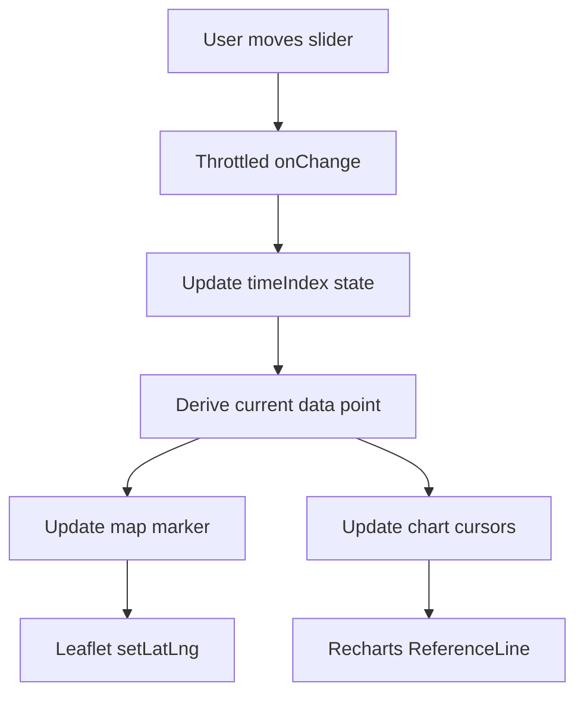

# Design Document: Trip Detail Interactive Slider

## Overview

This design specifies the implementation of an interactive slider control for the TripDetail page that enables synchronized playback of trip data. The slider allows users to scrub through trip telemetry with real-time updates to the map marker position and chart cursors across all visualizations.

The feature supports both data sources:
- **Telemetry data**: Time-series sensor data from InfluxDB (simulated or real device trips)
- **GPX data**: Imported GPS tracks with derived metrics

The implementation follows a state-driven architecture where a single time index state variable drives all synchronized updates, ensuring consistency across the map and chart components.

### Key Design Principles

1. **Single Source of Truth**: A single `timeIndex` state variable controls all playback
2. **Performance First**: Throttled updates and memoized calculations prevent UI lag
3. **Data Source Agnostic**: Unified interface for both telemetry and GPX data
4. **Progressive Enhancement**: Slider disabled when no data available
5. **Accessibility**: Full keyboard support and ARIA annotations

## Architecture

### Component Structure

```
TripDetail (existing component)
├── State Management
│   ├── timeIndex: number (new)
│   ├── isPlaying: boolean (new, optional for future auto-play)
│   └── existing states (trip, telemetryRes, etc.)
├── PlaybackSlider (new component)
│   ├── Range input control
│   ├── Time display (HH:MM:SS)
│   └── Throttled onChange handler
├── Map Visualization (enhanced)
│   ├── Route polyline (existing)
│   ├── Event markers (existing)
│   └── Playback marker (new)
└── Chart Visualizations (enhanced)
    ├── Recharts components (existing)
    └── ReferenceLine cursors (new)
```

### Data Flow



### State Management Strategy

The component will use React's built-in state management:

```typescript
const [timeIndex, setTimeIndex] = useState<number>(0);
```

This index represents the current position in the data array (either `telemetryRes.data` or `gpxSeries`). All derived values are computed via `useMemo` hooks to prevent unnecessary recalculations.

## Components and Interfaces

### 1. PlaybackSlider Component

A new reusable component that renders the slider control with time display.

**Props Interface:**
```typescript
interface PlaybackSliderProps {
  value: number;
  max: number;
  currentTime: string; // formatted HH:MM:SS
  disabled: boolean;
  onChange: (index: number) => void;
}
```

**Responsibilities:**
- Render HTML5 range input
- Display formatted current time
- Throttle input events (16ms for 60fps)
- Handle keyboard navigation
- Provide ARIA labels

**Implementation Notes:**
- Use `lodash.throttle` or custom throttle for performance
- Position below map panel in "Rota e eventos" section
- Style consistently with existing design tokens
- Ensure touch-friendly on mobile (min 44px touch target)

### 2. Playback Marker (Map Enhancement)

A new Leaflet marker that shows the current playback position.

**Implementation:**
```typescript
const playbackMarkerRef = useRef<L.Marker | null>(null);
```

**Marker Configuration:**
- Custom icon (distinct from route/event markers)
- Color: `#eab308` (yellow/amber for visibility)
- Size: Slightly larger than event markers
- Z-index: Above route polyline, below event markers
- Popup: Display current time and speed

**Update Logic:**
```typescript
useEffect(() => {
  if (!mapRef.current || !playbackMarkerRef.current) return;
  
  const point = getCurrentDataPoint(timeIndex);
  if (point?.latitude && point?.longitude) {
    playbackMarkerRef.current.setLatLng([point.latitude, point.longitude]);
  }
}, [timeIndex]);
```

### 3. Chart Cursor (Recharts Enhancement)

Vertical reference lines added to all LineChart and ScatterChart components.

**Implementation:**
```typescript
<ReferenceLine
  x={currentTimestamp}
  stroke="#eab308"
  strokeWidth={2}
  strokeDasharray="3 3"
  label={{ value: 'Current', position: 'top' }}
/>
```

**Applied to Charts:**
- Telemetry: Speed, RPM, Temperature, Roll, Oil Pressure, Tire Pressure
- GPX: Speed, Altitude, Distance

**Synchronization:**
The cursor position is derived from `timeIndex`:
```typescript
const currentTimestamp = useMemo(() => {
  if (trip?.source === "GPX_IMPORTED") {
    return gpxSeries[timeIndex]?.t ?? 0;
  }
  return chartSeries[timeIndex]?.t ?? 0;
}, [timeIndex, trip?.source, gpxSeries, chartSeries]);
```

### 4. Data Point Selector

A utility function to retrieve the current data point based on source.

**Interface:**
```typescript
interface CurrentDataPoint {
  latitude?: number;
  longitude?: number;
  time: string;
  speed?: number;
  [key: string]: any;
}

function getCurrentDataPoint(index: number): CurrentDataPoint | null;
```

**Implementation:**
```typescript
const getCurrentDataPoint = useCallback((index: number): CurrentDataPoint | null => {
  if (trip?.source === "GPX_IMPORTED") {
    const point = gpxSeries[index];
    if (!point) return null;
    return {
      latitude: point.lat,
      longitude: point.lon,
      time: point.time,
      speed: point.speedKmh ?? undefined,
    };
  }
  
  const point = telemetryRes?.data[index];
  if (!point) return null;
  return {
    latitude: point.latitude,
    longitude: point.longitude,
    time: point.time,
    speed: point.speed_kmh,
    ...point,
  };
}, [trip?.source, gpxSeries, telemetryRes]);
```

## Data Models

### Time Index State

```typescript
// Primary state variable
timeIndex: number  // Range: 0 to (dataLength - 1)
```

### Derived Values

```typescript
// Maximum slider value
const maxIndex = useMemo(() => {
  if (trip?.source === "GPX_IMPORTED") {
    return Math.max(0, gpxSeries.length - 1);
  }
  return Math.max(0, (telemetryRes?.data?.length ?? 0) - 1);
}, [trip?.source, gpxSeries, telemetryRes]);

// Current timestamp for display
const currentTimeFormatted = useMemo(() => {
  const point = getCurrentDataPoint(timeIndex);
  if (!point) return "00:00:00";
  return new Date(point.time).toLocaleTimeString("pt-PT");
}, [timeIndex, getCurrentDataPoint]);

// Current timestamp for charts (milliseconds)
const currentTimestamp = useMemo(() => {
  const point = getCurrentDataPoint(timeIndex);
  if (!point) return 0;
  return new Date(point.time).getTime();
}, [timeIndex, getCurrentDataPoint]);
```

### Data Source Abstraction

Both data sources are normalized to a common interface:

| Field | Telemetry Source | GPX Source |
|-------|-----------------|------------|
| Time | `telemetryRes.data[i].time` | `gpxSeries[i].time` |
| Latitude | `telemetryRes.data[i].latitude` | `gpxSeries[i].lat` |
| Longitude | `telemetryRes.data[i].longitude` | `gpxSeries[i].lon` |
| Speed | `telemetryRes.data[i].speed_kmh` | `gpxSeries[i].speedKmh` |


## Correctness Properties

*A property is a characteristic or behavior that should hold true across all valid executions of a system—essentially, a formal statement about what the system should do. Properties serve as the bridge between human-readable specifications and machine-verifiable correctness guarantees.*

### Property Reflection

After analyzing all acceptance criteria, I identified the following redundancies:
- Properties 4.5 and 5.5 both test initial state (index = 0), can be combined into one property
- Properties 2.2 and 2.3 test data source selection, can be combined with 4.1 and 5.1 into a comprehensive data routing property
- Properties 4.2 and 5.2 both test slider range calculation, can be combined into one property
- Properties 4.3 and 5.3 both test array indexing, can be combined into one property
- Properties 8.3 and 8.4 both test that existing features aren't broken, redundant

The following properties provide unique validation value:

### Property 1: Time Display Formatting

*For any* valid timestamp in the trip data, when displayed by the slider, the time SHALL be formatted as HH:MM:SS in pt-PT locale.

**Validates: Requirements 1.4**

### Property 2: Slider State Synchronization

*For any* slider value change event, the timeIndex state SHALL update to match the new slider value.

**Validates: Requirements 1.5**

### Property 3: Data Source Routing

*For any* trip, the system SHALL use telemetry data when trip.source is not "GPX_IMPORTED", and SHALL use GPX data when trip.source is "GPX_IMPORTED".

**Validates: Requirements 2.2, 2.3, 4.1, 5.1**

### Property 4: Map Marker Position Synchronization

*For any* valid timeIndex value, the map marker position SHALL match the GPS coordinates (latitude, longitude) of the data point at that index.

**Validates: Requirements 2.1**

### Property 5: Slider Range Calculation

*For any* trip with data, the slider maximum value SHALL equal the length of the data array minus 1.

**Validates: Requirements 4.2, 5.2**

### Property 6: Data Point Retrieval

*For any* valid timeIndex within the data array bounds, retrieving the data point SHALL return the element at that array index.

**Validates: Requirements 4.3, 5.3**

### Property 7: Null Value Handling

*For any* data point with null or missing field values, the system SHALL handle it gracefully without throwing errors or crashing.

**Validates: Requirements 4.4**

### Property 8: Chart Cursor Rendering

*For any* timeIndex change, chart cursor indicators SHALL be rendered on all visible chart components.

**Validates: Requirements 3.1**

### Property 9: Chart Cursor Position

*For any* timeIndex value, the chart cursor x-axis position SHALL correspond to the timestamp of the data point at that index.

**Validates: Requirements 3.2**

### Property 10: Chart Cursor Synchronization (Telemetry)

*For any* telemetry-based trip, all telemetry charts (speed, RPM, temperature, roll, oil pressure, tire pressure) SHALL display the cursor at the same timestamp.

**Validates: Requirements 3.3**

### Property 11: Chart Cursor Synchronization (GPX)

*For any* GPX-based trip, all GPX charts (speed, altitude, distance) SHALL display the cursor at the same timestamp.

**Validates: Requirements 3.4**

### Property 12: Cursor Tooltip Content

*For any* timeIndex value, the chart cursor tooltip SHALL display the data values from the data point at that index.

**Validates: Requirements 3.5**

### Property 13: Slider Disabled State

*For any* trip without telemetry or GPX data, the slider SHALL be disabled.

**Validates: Requirements 1.2**

### Property 14: Keyboard Accessibility

*For any* keyboard event (arrow keys, Home, End) on the focused slider, the timeIndex SHALL update according to the keyboard input.

**Validates: Requirements 7.1**

### Property 15: Disabled State Message

*For any* trip where the slider is disabled, an explanatory message SHALL be displayed indicating why the slider is unavailable.

**Validates: Requirements 7.6**

### Property 16: Existing Features Preservation

*For any* existing feature (PDF export, CSV export, GPX export, sharing), the feature SHALL continue to function correctly after slider integration.

**Validates: Requirements 8.3, 8.4**

### Property 17: GPX Series Derivation

*For any* GPX-based trip, the speed and distance values SHALL be derived using the deriveGpxSeries utility function.

**Validates: Requirements 5.4**

## Error Handling

### Missing or Invalid Data

**Scenario**: Trip has no telemetry or GPX data
- **Behavior**: Slider is disabled
- **UI Feedback**: Display message "No trip data available for playback"
- **State**: timeIndex remains at 0

**Scenario**: Data point at timeIndex has null GPS coordinates
- **Behavior**: Map marker remains at last valid position
- **UI Feedback**: No error shown (graceful degradation)
- **State**: timeIndex continues to update normally

**Scenario**: Data array is empty
- **Behavior**: Slider is disabled, maxIndex = 0
- **UI Feedback**: Display message "No trip data available for playback"
- **State**: timeIndex = 0

### Out of Bounds Access

**Scenario**: timeIndex exceeds data array length
- **Prevention**: Slider max value is always `dataLength - 1`
- **Fallback**: If somehow exceeded, clamp to valid range
- **Logging**: Log warning in development mode

### Performance Degradation

**Scenario**: Large dataset (>10,000 points) causes lag
- **Mitigation**: Throttle slider updates to 16ms (60fps)
- **Mitigation**: Use React.memo for chart components
- **Mitigation**: Debounce map marker updates if needed
- **Monitoring**: Log performance warnings if update takes >50ms

### Chart Rendering Errors

**Scenario**: Recharts fails to render with cursor
- **Fallback**: Render chart without cursor (graceful degradation)
- **Logging**: Log error to console
- **UI Feedback**: No user-facing error (charts still visible)

### Map Marker Errors

**Scenario**: Leaflet marker update fails
- **Fallback**: Keep marker at previous position
- **Logging**: Log error to console
- **Recovery**: Attempt to recreate marker on next update

## Testing Strategy

### Dual Testing Approach

This feature requires both unit tests and property-based tests for comprehensive coverage:

**Unit Tests** focus on:
- Specific examples of time formatting (e.g., "14:30:00")
- Initial component mount state (timeIndex = 0)
- Slider disabled when data is empty
- Specific keyboard events (ArrowRight increases index)
- Integration with existing export functions

**Property-Based Tests** focus on:
- Time formatting for all valid timestamps
- Map marker synchronization across all indices
- Chart cursor synchronization across all indices
- Data source routing for all trip types
- Null value handling for all possible data combinations

### Property-Based Testing Configuration

**Library**: `fast-check` (JavaScript/TypeScript property-based testing library)

**Configuration**:
- Minimum 100 iterations per property test
- Each test tagged with feature name and property reference
- Tag format: `Feature: trip-detail-interactive-slider, Property {number}: {property_text}`

**Example Test Structure**:
```typescript
import fc from 'fast-check';

// Feature: trip-detail-interactive-slider, Property 1: Time Display Formatting
test('time formatting property', () => {
  fc.assert(
    fc.property(
      fc.date(), // Generate random dates
      (date) => {
        const formatted = formatTime(date);
        expect(formatted).toMatch(/^\d{2}:\d{2}:\d{2}$/);
      }
    ),
    { numRuns: 100 }
  );
});
```

### Test Coverage Goals

- **Unit Test Coverage**: >80% of new code
- **Property Test Coverage**: All 17 correctness properties
- **Integration Tests**: Slider interaction with map and charts
- **Accessibility Tests**: Keyboard navigation and ARIA attributes
- **Performance Tests**: Update latency <16ms for 60fps

### Testing Data Sources

**Telemetry Data Generators**:
- Generate arrays of TripTelemetryPoint with varying lengths (0-10,000)
- Include null/missing values in random fields
- Include valid and invalid GPS coordinates

**GPX Data Generators**:
- Generate arrays of GpxPoint with varying lengths (0-10,000)
- Include points with and without elevation/time
- Include edge cases (single point, two points, gaps in time)

**Trip Object Generators**:
- Generate trips with source: "SIMULATOR", "GPX_IMPORTED", "DEVICE_REAL"
- Include trips with and without data
- Include trips with various status values

### Manual Testing Checklist

- [ ] Slider moves smoothly without lag on large datasets (>5000 points)
- [ ] Map marker updates in real-time as slider moves
- [ ] All chart cursors stay synchronized
- [ ] Keyboard navigation works (arrows, Home, End)
- [ ] Slider is disabled when no data available
- [ ] Explanatory message shown when disabled
- [ ] Works on mobile devices (touch interaction)
- [ ] Works on different screen sizes (responsive)
- [ ] Existing export features still work
- [ ] PDF export includes slider in correct state
- [ ] No console errors during normal operation
- [ ] Accessible with screen readers


## Implementation Details

### File Structure

```
app/frontend/src/
├── components/
│   └── PlaybackSlider.tsx (new)
├── pages/
│   └── TripDetail.tsx (modified)
├── utils/
│   └── gpx.ts (existing, no changes)
└── types/
    └── index.ts (existing, no changes)
```

### Code Changes Required

#### 1. Create PlaybackSlider Component

**File**: `app/frontend/src/components/PlaybackSlider.tsx`

```typescript
import { useCallback, useMemo } from 'react';
import { throttle } from 'lodash';

interface PlaybackSliderProps {
  value: number;
  max: number;
  currentTime: string;
  disabled: boolean;
  onChange: (index: number) => void;
  disabledMessage?: string;
}

export function PlaybackSlider({
  value,
  max,
  currentTime,
  disabled,
  onChange,
  disabledMessage = "No trip data available for playback"
}: PlaybackSliderProps) {
  // Throttle to 60fps (16ms)
  const throttledOnChange = useMemo(
    () => throttle((newValue: number) => onChange(newValue), 16),
    [onChange]
  );

  const handleChange = useCallback(
    (e: React.ChangeEvent<HTMLInputElement>) => {
      throttledOnChange(parseInt(e.target.value, 10));
    },
    [throttledOnChange]
  );

  return (
    <div className="playback-slider-container" style={{ marginTop: 14 }}>
      <div style={{ display: 'flex', justifyContent: 'space-between', alignItems: 'center', marginBottom: 8 }}>
        <label htmlFor="playback-slider" style={{ fontSize: 13, color: 'var(--text-secondary)' }}>
          Playback Position
        </label>
        <span style={{ fontSize: 14, fontWeight: 600, fontFamily: 'monospace' }}>
          {currentTime}
        </span>
      </div>
      <input
        id="playback-slider"
        type="range"
        min={0}
        max={max}
        value={value}
        onChange={handleChange}
        disabled={disabled}
        aria-label="Trip playback timeline slider"
        aria-valuemin={0}
        aria-valuemax={max}
        aria-valuenow={value}
        aria-valuetext={`Current time: ${currentTime}`}
        style={{
          width: '100%',
          height: 8,
          cursor: disabled ? 'not-allowed' : 'pointer',
          opacity: disabled ? 0.5 : 1,
        }}
      />
      {disabled && disabledMessage && (
        <div style={{ fontSize: 12, color: 'var(--text-muted)', marginTop: 6, textAlign: 'center' }}>
          {disabledMessage}
        </div>
      )}
    </div>
  );
}
```

#### 2. Modify TripDetail Component

**File**: `app/frontend/src/pages/TripDetail.tsx`

**Add State**:
```typescript
const [timeIndex, setTimeIndex] = useState<number>(0);
```

**Add Refs**:
```typescript
const playbackMarkerRef = useRef<L.Marker | null>(null);
```

**Add Derived Values**:
```typescript
const maxIndex = useMemo(() => {
  if (trip?.source === "GPX_IMPORTED") {
    return Math.max(0, gpxSeries.length - 1);
  }
  return Math.max(0, (telemetryRes?.data?.length ?? 0) - 1);
}, [trip?.source, gpxSeries, telemetryRes]);

const getCurrentDataPoint = useCallback((index: number) => {
  if (trip?.source === "GPX_IMPORTED") {
    const point = gpxSeries[index];
    if (!point) return null;
    return {
      latitude: point.lat,
      longitude: point.lon,
      time: point.time,
      speed: point.speedKmh ?? undefined,
    };
  }
  
  const point = telemetryRes?.data[index];
  if (!point) return null;
  return {
    latitude: point.latitude,
    longitude: point.longitude,
    time: point.time,
    speed: point.speed_kmh,
  };
}, [trip?.source, gpxSeries, telemetryRes]);

const currentTimeFormatted = useMemo(() => {
  const point = getCurrentDataPoint(timeIndex);
  if (!point) return "00:00:00";
  return new Date(point.time).toLocaleTimeString("pt-PT");
}, [timeIndex, getCurrentDataPoint]);

const currentTimestamp = useMemo(() => {
  const point = getCurrentDataPoint(timeIndex);
  if (!point) return 0;
  return new Date(point.time).getTime();
}, [timeIndex, getCurrentDataPoint]);

const hasPlaybackData = useMemo(() => {
  if (trip?.source === "GPX_IMPORTED") {
    return gpxSeries.length > 0;
  }
  return (telemetryRes?.data?.length ?? 0) > 0;
}, [trip?.source, gpxSeries, telemetryRes]);
```

**Add Playback Marker Effect**:
```typescript
useEffect(() => {
  if (!mapRef.current) return;
  
  // Create playback marker if it doesn't exist
  if (!playbackMarkerRef.current) {
    const icon = L.divIcon({
      className: 'playback-marker',
      html: '<div style="background: #eab308; width: 16px; height: 16px; border-radius: 50%; border: 3px solid white; box-shadow: 0 2px 4px rgba(0,0,0,0.3);"></div>',
      iconSize: [16, 16],
      iconAnchor: [8, 8],
    });
    
    playbackMarkerRef.current = L.marker([0, 0], { icon }).addTo(mapRef.current);
  }
  
  // Update marker position
  const point = getCurrentDataPoint(timeIndex);
  if (point?.latitude && point?.longitude) {
    playbackMarkerRef.current.setLatLng([point.latitude, point.longitude]);
    
    // Update popup content
    const popupContent = `
      <div style="min-width:150px">
        <div style="font-weight:600;margin-bottom:4px">Playback Position</div>
        <div style="font-size:12px;color:#71717a">${currentTimeFormatted}</div>
        ${point.speed ? `<div style="font-size:12px;margin-top:4px">${point.speed.toFixed(1)} km/h</div>` : ''}
      </div>
    `;
    playbackMarkerRef.current.bindPopup(popupContent);
  }
}, [timeIndex, getCurrentDataPoint, currentTimeFormatted]);
```

**Add Slider to JSX** (in the "Rota e eventos" panel):
```typescript
<div className="panel" style={{ marginTop: 14 }}>
  <div className="panel-header">
    <div className="panel-title">🗺️ Rota e eventos</div>
    <div className="page-subtitle" style={{ margin: 0 }}>
      {routePoints.length} ponto{routePoints.length !== 1 ? "s" : ""}
    </div>
  </div>
  <div className="panel-body">
    <div className="map-shell">
      <div ref={mapContainerRef} className="map-canvas" />
    </div>
    
    {/* NEW: Add PlaybackSlider here */}
    <PlaybackSlider
      value={timeIndex}
      max={maxIndex}
      currentTime={currentTimeFormatted}
      disabled={!hasPlaybackData}
      onChange={setTimeIndex}
    />
    
    <div style={{ marginTop: 10, display: "flex", flexWrap: "wrap", gap: 8 }}>
      {/* existing badges */}
    </div>
  </div>
</div>
```

**Add ReferenceLine to Charts**:

For each LineChart component, add:
```typescript
<ReferenceLine
  x={currentTimestamp}
  stroke="#eab308"
  strokeWidth={2}
  strokeDasharray="3 3"
/>
```

Example for Speed chart:
```typescript
<ChartCard title="Velocidade (km/h)">
  <ResponsiveContainer width="100%" height={240}>
    <LineChart data={chartSeries}>
      <CartesianGrid strokeDasharray="3 3" stroke="rgba(255,255,255,0.06)" />
      <XAxis
        dataKey="t"
        type="number"
        domain={["dataMin", "dataMax"]}
        tickFormatter={(v) => new Date(v).toLocaleTimeString("pt-PT")}
      />
      <YAxis />
      <Tooltip labelFormatter={(v) => new Date(v as number).toLocaleTimeString("pt-PT")} />
      <Line type="monotone" dataKey="speed" stroke="#3b82f6" dot={false} />
      {/* NEW: Add reference line */}
      <ReferenceLine
        x={currentTimestamp}
        stroke="#eab308"
        strokeWidth={2}
        strokeDasharray="3 3"
      />
    </LineChart>
  </ResponsiveContainer>
</ChartCard>
```

### CSS Additions

Add to `app/frontend/src/App.css`:

```css
/* Playback Slider Styles */
.playback-slider-container {
  padding: 12px 0;
}

input[type="range"] {
  -webkit-appearance: none;
  appearance: none;
  background: transparent;
}

input[type="range"]::-webkit-slider-track {
  background: rgba(255, 255, 255, 0.1);
  border-radius: 4px;
  height: 8px;
}

input[type="range"]::-webkit-slider-thumb {
  -webkit-appearance: none;
  appearance: none;
  width: 20px;
  height: 20px;
  border-radius: 50%;
  background: #eab308;
  cursor: pointer;
  border: 2px solid white;
  box-shadow: 0 2px 4px rgba(0, 0, 0, 0.3);
  margin-top: -6px;
}

input[type="range"]::-moz-range-track {
  background: rgba(255, 255, 255, 0.1);
  border-radius: 4px;
  height: 8px;
}

input[type="range"]::-moz-range-thumb {
  width: 20px;
  height: 20px;
  border-radius: 50%;
  background: #eab308;
  cursor: pointer;
  border: 2px solid white;
  box-shadow: 0 2px 4px rgba(0, 0, 0, 0.3);
}

input[type="range"]:focus {
  outline: none;
}

input[type="range"]:focus::-webkit-slider-thumb {
  box-shadow: 0 0 0 3px rgba(234, 179, 8, 0.3);
}

input[type="range"]:focus::-moz-range-thumb {
  box-shadow: 0 0 0 3px rgba(234, 179, 8, 0.3);
}

input[type="range"]:disabled::-webkit-slider-thumb {
  background: #71717a;
  cursor: not-allowed;
}

input[type="range"]:disabled::-moz-range-thumb {
  background: #71717a;
  cursor: not-allowed;
}

.playback-marker {
  z-index: 1000 !important;
}
```

### Dependencies

**New Dependencies**:
- `lodash` (for throttle function) - likely already installed

**Verify Installation**:
```bash
npm list lodash
```

If not installed:
```bash
npm install lodash
npm install --save-dev @types/lodash
```

### Performance Considerations

1. **Throttling**: Slider updates throttled to 16ms (60fps) to prevent excessive re-renders
2. **Memoization**: All derived values use `useMemo` to avoid recalculation
3. **Callback Stability**: `getCurrentDataPoint` uses `useCallback` for stable reference
4. **Marker Updates**: Leaflet marker updates are efficient (setLatLng is optimized)
5. **Chart Re-renders**: Recharts handles ReferenceLine updates efficiently

**Expected Performance**:
- Small datasets (<1000 points): No noticeable lag
- Medium datasets (1000-5000 points): Smooth 60fps
- Large datasets (>5000 points): May drop to 30-45fps on slower devices

**Optimization Opportunities** (if needed):
- Downsample large datasets for display
- Use requestAnimationFrame for marker updates
- Implement virtual scrolling for chart data
- Add Web Worker for data processing

### Browser Compatibility

**Supported Browsers**:
- Chrome/Edge 90+
- Firefox 88+
- Safari 14+
- Mobile Safari 14+
- Chrome Android 90+

**Features Used**:
- HTML5 range input (universal support)
- CSS custom properties (universal support)
- React hooks (framework requirement)
- Leaflet (library requirement)
- Recharts (library requirement)

### Accessibility Compliance

**WCAG 2.1 Level AA Compliance**:
- ✅ Keyboard accessible (arrow keys, Home, End)
- ✅ Focus indicators visible
- ✅ ARIA labels present
- ✅ Color contrast sufficient (yellow #eab308 on dark background)
- ✅ Touch targets ≥44px (slider thumb is 20px + padding)
- ⚠️ Screen reader support (requires testing with NVDA/JAWS)

**Note**: Full WCAG compliance requires manual testing with assistive technologies.

### Migration and Rollout

**Phase 1: Development**
1. Create PlaybackSlider component
2. Add state management to TripDetail
3. Implement map marker synchronization
4. Add chart cursors
5. Write unit tests

**Phase 2: Testing**
1. Run property-based tests
2. Manual testing on various datasets
3. Performance testing on large datasets
4. Accessibility testing with screen readers
5. Cross-browser testing

**Phase 3: Deployment**
1. Deploy to staging environment
2. User acceptance testing
3. Monitor performance metrics
4. Deploy to production
5. Monitor error rates and user feedback

**Rollback Plan**:
- Feature can be disabled by not rendering PlaybackSlider
- No database migrations required
- No API changes required
- Safe to rollback without data loss

### Future Enhancements

**Potential Future Features** (out of scope for this design):
1. **Auto-play**: Automatically advance slider with play/pause controls
2. **Speed Control**: Adjust playback speed (0.5x, 1x, 2x, 4x)
3. **Event Markers on Slider**: Show event positions on slider track
4. **Minimap**: Small overview map showing full route with current position
5. **Keyboard Shortcuts**: Space for play/pause, J/K for frame-by-frame
6. **Export Animation**: Export playback as video or animated GIF
7. **Comparison Mode**: Compare two trips side-by-side with synchronized playback
8. **Heatmap Overlay**: Show speed/temperature heatmap on route

These enhancements would require separate design documents and implementation phases.

## Conclusion

This design provides a comprehensive specification for implementing an interactive slider feature in the TripDetail page. The implementation follows React best practices, ensures accessibility, and maintains performance even with large datasets.

The key architectural decisions are:
1. Single state variable (`timeIndex`) drives all synchronization
2. Data source abstraction allows unified handling of telemetry and GPX data
3. Throttled updates ensure smooth 60fps performance
4. Graceful degradation handles missing or invalid data
5. Existing features remain unaffected

The design includes 17 testable correctness properties that will be validated through property-based testing, ensuring robust behavior across all input scenarios.

