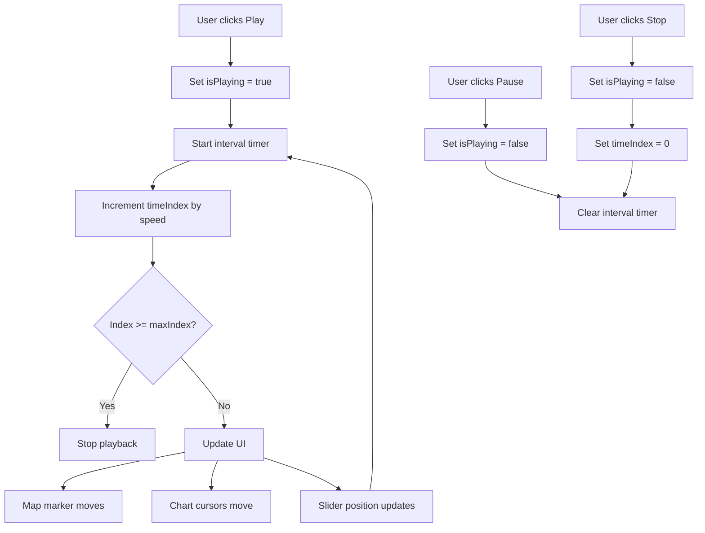

# Design Document: Trip Replay Animation

## Overview

This design specifies the implementation of animated trip replay functionality for the TripDetail page. Building on the existing PlaybackSlider component, this feature adds automatic timeline advancement with playback controls (Play, Pause, Stop) and speed control (1x, 2x, 5x, 10x multipliers).

The feature enables users to watch their trip data animate in real-time, with synchronized updates to the map marker, chart cursors, and telemetry displays. The implementation supports both telemetry data from InfluxDB and imported GPX tracks.

### Key Design Principles

1. **Non-Destructive Enhancement**: Builds on existing PlaybackSlider without breaking manual scrubbing
2. **Smooth Animation**: Uses interval-based timing for consistent frame advancement
3. **User Control**: Allows manual slider adjustment during playback without interruption
4. **Resource Safety**: Proper cleanup of timers prevents memory leaks
5. **Data Source Agnostic**: Works seamlessly with both telemetry and GPX data

## Architecture

### Component Structure

```
TripDetail (existing component)
├── State Management
│   ├── timeIndex: number (existing)
│   ├── isPlaying: boolean (new)
│   ├── playbackSpeed: number (new)
│   └── existing states (trip, telemetryRes, etc.)
├── PlaybackSlider (existing component)
│   └── Manual scrubbing (unchanged)
├── PlaybackControls (new component)
│   ├── Play button
│   ├── Pause button
│   ├── Stop button
│   └── Speed selector (1x, 2x, 5x, 10x)
├── Map Visualization (existing, enhanced)
│   └── Playback marker (existing, animated)
└── Chart Visualizations (existing, enhanced)
    └── ReferenceLine cursors (existing, animated)
```

### Data Flow



### State Management Strategy

The component will add two new state variables to the existing TripDetail component:

```typescript
const [isPlaying, setIsPlaying] = useState<boolean>(false);
const [playbackSpeed, setPlaybackSpeed] = useState<number>(1);
```

The existing `timeIndex` state drives all visual updates. The playback system increments this index automatically when `isPlaying` is true.

### Animation Timing

The system uses `setInterval` with a 100ms tick rate:
- **1x speed**: Advance 1 position every 100ms (10 fps)
- **2x speed**: Advance 2 positions every 100ms (20 fps)
- **5x speed**: Advance 5 positions every 100ms (50 fps)
- **10x speed**: Advance 10 positions every 100ms (100 fps)

This approach provides smooth animation while maintaining reasonable performance even with large datasets.

## Components and Interfaces

### 1. PlaybackControls Component

A new component that renders the playback control buttons and speed selector.

**Props Interface:**
```typescript
interface PlaybackControlsProps {
  isPlaying: boolean;
  playbackSpeed: number;
  disabled: boolean;
  onPlay: () => void;
  onPause: () => void;
  onStop: () => void;
  onSpeedChange: (speed: number) => void;
}
```

**Responsibilities:**
- Render Play, Pause, Stop buttons
- Render speed selector dropdown/buttons
- Manage button enabled/disabled states
- Emit events for user actions

**Button States:**
- Play: Enabled when paused/stopped, disabled when playing
- Pause: Enabled when playing, disabled when paused/stopped
- Stop: Always enabled (resets to beginning)
- Speed selector: Always enabled

**Layout:**
```
[▶ Play] [⏸ Pause] [⏹ Stop]  |  Speed: [1x ▼]
```

### 2. Playback System (TripDetail Enhancement)

The playback logic is implemented directly in TripDetail using React hooks.

**Key Functions:**

```typescript
// Start playback
const handlePlay = useCallback(() => {
  setIsPlaying(true);
}, []);

// Pause playback
const handlePause = useCallback(() => {
  setIsPlaying(false);
}, []);

// Stop playback and reset
const handleStop = useCallback(() => {
  setIsPlaying(false);
  setTimeIndex(0);
}, []);

// Change playback speed
const handleSpeedChange = useCallback((speed: number) => {
  setPlaybackSpeed(speed);
}, []);
```

**Animation Loop:**

```typescript
useEffect(() => {
  if (!isPlaying) return;
  
  const intervalId = setInterval(() => {
    setTimeIndex((prevIndex) => {
      const nextIndex = prevIndex + playbackSpeed;
      
      // Stop at end
      if (nextIndex >= maxIndex) {
        setIsPlaying(false);
        return maxIndex;
      }
      
      return nextIndex;
    });
  }, 100);
  
  return () => clearInterval(intervalId);
}, [isPlaying, playbackSpeed, maxIndex]);
```

### 3. Manual Slider Interaction

The existing PlaybackSlider continues to work during playback. When the user drags the slider:

1. The `onChange` handler updates `timeIndex` immediately
2. The playback loop continues from the new position
3. No pause or stop occurs

This allows users to "scrub" to interesting moments without interrupting the animation.

### 4. Telemetry Display Updates

The existing telemetry display logic already reacts to `timeIndex` changes. No modifications needed - the displays will automatically update as the index advances during playback.

## Data Models

### Playback State

```typescript
interface PlaybackState {
  isPlaying: boolean;      // Whether animation is active
  playbackSpeed: number;   // Multiplier: 1, 2, 5, or 10
  timeIndex: number;       // Current position (existing)
}
```

### Speed Options

```typescript
const SPEED_OPTIONS = [1, 2, 5, 10] as const;
type PlaybackSpeed = typeof SPEED_OPTIONS[number];
```

### Timer Management

```typescript
interface TimerRef {
  intervalId: number | null;
}
```

The timer is stored in a ref to ensure proper cleanup:

```typescript
const timerRef = useRef<number | null>(null);
```

## Correctness Properties

*A property is a characteristic or behavior that should hold true across all valid executions of a system—essentially, a formal statement about what the system should do. Properties serve as the bridge between human-readable specifications and machine-verifiable correctness guarantees.*

### Property Reflection

After analyzing all acceptance criteria, I identified the following redundancies:

- Properties 1.7 and 3.5 both test automatic stop at max index - can be combined
- Properties 2.5, 2.6, 2.7, 2.8 all test speed-specific advancement rates - can be combined into one property that tests all speeds
- Properties 5.1 and 5.2 both test data source selection - can be combined
- Properties 3.2, 3.3, 3.4 all test UI synchronization - these are distinct enough to keep separate but related

The following properties provide unique validation value:

### Property 1: Play Button Starts Playback

*For any* trip with playback data, when the Play button is clicked, the Timeline_Index SHALL begin incrementing automatically at regular intervals.

**Validates: Requirements 1.2, 3.1**

### Property 2: Pause Button Stops Advancement

*For any* timeline position during active playback, when the Pause button is clicked, the Timeline_Index SHALL stop changing while preserving its current value.

**Validates: Requirements 1.3**

### Property 3: Stop Button Resets Position

*For any* timeline position during playback, when the Stop button is clicked, the Timeline_Index SHALL reset to zero and playback SHALL stop.

**Validates: Requirements 1.4**

### Property 4: Play Button State During Playback

*For any* active playback session, the Play button SHALL be disabled and the Pause button SHALL be enabled.

**Validates: Requirements 1.5**

### Property 5: Play Button State When Stopped

*For any* paused or stopped playback session, the Play button SHALL be enabled and the Pause button SHALL be disabled.

**Validates: Requirements 1.6**

### Property 6: Automatic Stop at End

*For any* playback session, when the Timeline_Index reaches the maximum value, playback SHALL stop automatically.

**Validates: Requirements 1.7, 3.5**

### Property 7: Speed-Based Advancement Rate

*For any* playback speed (1x, 2x, 5x, 10x), the Timeline_Index SHALL advance by the speed multiplier every 100 milliseconds.

**Validates: Requirements 2.2, 2.5, 2.6, 2.7, 2.8**

### Property 8: Speed Display Synchronization

*For any* selected playback speed, the Speed_Control SHALL display the currently selected speed value.

**Validates: Requirements 2.3**

### Property 9: Speed Change During Playback

*For any* speed change during active playback, the new speed SHALL be applied immediately without stopping or pausing playback.

**Validates: Requirements 2.4**

### Property 10: Slider Position Synchronization

*For any* Timeline_Index change during playback, the PlaybackSlider visual position SHALL update to match the new index.

**Validates: Requirements 3.2**

### Property 11: Map Marker Synchronization

*For any* Timeline_Index change during playback, the Map_Marker position SHALL update to the GPS coordinates of the data point at that index.

**Validates: Requirements 3.3**

### Property 12: Chart Cursor Synchronization

*For any* Timeline_Index change during playback, all Chart_Cursor positions SHALL update to the timestamp of the data point at that index.

**Validates: Requirements 3.4**

### Property 13: Data Point Retrieval

*For any* Timeline_Index value, the Playback_System SHALL retrieve the data point at that array index from the appropriate data source.

**Validates: Requirements 4.1**

### Property 14: Telemetry Field Display

*For any* telemetry-based trip, the Playback_System SHALL display speed, RPM, engine temperature, roll angle, oil pressure, and tire pressures when available.

**Validates: Requirements 4.2**

### Property 15: GPX Field Display

*For any* GPX-based trip, the Playback_System SHALL display speed, altitude, and GPS coordinates when available.

**Validates: Requirements 4.3**

### Property 16: Value Formatting

*For any* telemetry or GPX value displayed, the value SHALL be formatted with appropriate units and precision.

**Validates: Requirements 4.4**

### Property 17: Data Source Selection

*For any* trip, the Playback_System SHALL use Telemetry_Data when trip.source is not "GPX_IMPORTED", and SHALL use GPX_Data when trip.source is "GPX_IMPORTED".

**Validates: Requirements 5.1, 5.2**

### Property 18: Maximum Index Calculation

*For any* trip with data, the maximum Timeline_Index SHALL equal the data array length minus 1.

**Validates: Requirements 5.3**

### Property 19: Data Structure Handling

*For any* data source (telemetry or GPX), the Playback_System SHALL correctly access latitude/longitude fields using the appropriate property names for that data structure.

**Validates: Requirements 5.4**

### Property 20: Controls Disabled Without Data

*For any* trip without playback data, the Playback_Controls SHALL be disabled.

**Validates: Requirements 5.5, 7.5**

### Property 21: Manual Slider During Playback

*For any* slider drag event during active playback, the Timeline_Index SHALL update to the selected position and playback SHALL continue from that position without pausing.

**Validates: Requirements 6.1, 6.2, 6.3**

### Property 22: Manual Seek to End

*For any* manual slider adjustment to the maximum value during playback, playback SHALL stop automatically.

**Validates: Requirements 6.4**

### Property 23: Responsive Layout

*For any* viewport size, the Playback_Controls SHALL render in a usable layout without overflow or clipping.

**Validates: Requirements 7.4**

### Property 24: Component Unmount Cleanup

*For any* component unmount during active playback, all timers and intervals SHALL be cleared.

**Validates: Requirements 8.1**

### Property 25: Navigation Cleanup

*For any* navigation away from TripDetail during active playback, playback SHALL stop and all resources SHALL be cleaned up.

**Validates: Requirements 8.2**

### Property 26: Stop Cleanup

*For any* stop action, the animation timer SHALL be cleared.

**Validates: Requirements 8.3**

### Property 27: Single Timer Invariant

*For any* playback session, only one interval timer SHALL exist at any given time.

**Validates: Requirements 8.4**

## Error Handling

### Missing or Invalid Data

**Scenario**: Trip has no telemetry or GPX data
- **Behavior**: Playback controls are disabled
- **UI Feedback**: Display message "No trip data available for playback"
- **State**: isPlaying remains false, buttons disabled

**Scenario**: Data array is empty
- **Behavior**: Playback controls are disabled, maxIndex = 0
- **UI Feedback**: Display message "No trip data available for playback"
- **State**: timeIndex = 0, isPlaying = false

### Playback Edge Cases

**Scenario**: User clicks Play when already at end (timeIndex === maxIndex)
- **Behavior**: Reset to beginning and start playing
- **Alternative**: Do nothing (stay at end)
- **Decision**: Reset to beginning for better UX

**Scenario**: Speed change causes index to exceed maxIndex
- **Behavior**: Clamp to maxIndex and stop playback
- **Implementation**: Check in interval callback before setting state

**Scenario**: Manual slider adjustment during playback
- **Behavior**: Update index immediately, continue playback from new position
- **Implementation**: No special handling needed - state update triggers re-render

### Timer Management Errors

**Scenario**: Component unmounts during active playback
- **Prevention**: useEffect cleanup function clears interval
- **Verification**: Check timerRef.current is null after unmount

**Scenario**: Multiple rapid Play/Pause clicks
- **Prevention**: Clear existing interval before starting new one
- **Implementation**: Always clear in useEffect cleanup

**Scenario**: Browser tab becomes inactive
- **Behavior**: Interval continues but may throttle
- **Mitigation**: No special handling needed - acceptable behavior

### Performance Issues

**Scenario**: Large dataset (>10,000 points) causes lag
- **Mitigation**: Existing throttling on slider updates (16ms)
- **Mitigation**: Memoized calculations prevent recalculation
- **Monitoring**: Log warning if frame time exceeds 100ms

**Scenario**: High playback speed (10x) on slow device
- **Behavior**: May drop frames but won't crash
- **Mitigation**: Consider capping speed on mobile devices
- **Future**: Add adaptive speed based on performance

## Testing Strategy

### Dual Testing Approach

This feature requires both unit tests and property-based tests for comprehensive coverage:

**Unit Tests** focus on:
- Specific button click sequences (Play → Pause → Play)
- Initial component state (isPlaying = false, speed = 1x)
- Specific speed values (1x, 2x, 5x, 10x)
- Timer cleanup on unmount
- Disabled state when no data

**Property-Based Tests** focus on:
- Advancement rate for all speeds
- Synchronization across all indices
- Data source routing for all trip types
- Manual slider interaction at all positions
- Timer cleanup in all scenarios

### Property-Based Testing Configuration

**Library**: `fast-check` (JavaScript/TypeScript property-based testing library)

**Configuration**:
- Minimum 100 iterations per property test
- Each test tagged with feature name and property reference
- Tag format: `Feature: trip-replay-animation, Property {number}: {property_text}`

**Example Test Structure**:
```typescript
import fc from 'fast-check';

// Feature: trip-replay-animation, Property 7: Speed-Based Advancement Rate
test('advancement rate matches speed multiplier', () => {
  fc.assert(
    fc.property(
      fc.constantFrom(1, 2, 5, 10), // Generate random speed
      fc.integer({ min: 0, max: 1000 }), // Generate random starting index
      (speed, startIndex) => {
        const result = advanceIndex(startIndex, speed);
        expect(result).toBe(startIndex + speed);
      }
    ),
    { numRuns: 100 }
  );
});
```

### Test Coverage Goals

- **Unit Test Coverage**: >80% of new code
- **Property Test Coverage**: All 27 correctness properties
- **Integration Tests**: Playback with map and chart updates
- **Timer Tests**: Cleanup in all scenarios
- **Performance Tests**: Frame time <100ms at all speeds

### Testing Data Sources

**Playback State Generators**:
- Generate random isPlaying values (true/false)
- Generate random playbackSpeed values (1, 2, 5, 10)
- Generate random timeIndex values (0 to maxIndex)

**Trip Data Generators**:
- Generate trips with varying data lengths (0-10,000)
- Generate trips with both telemetry and GPX sources
- Generate trips with missing/null data fields

**Timing Generators**:
- Generate random sequences of Play/Pause/Stop actions
- Generate random speed changes during playback
- Generate random manual slider adjustments

### Manual Testing Checklist

- [ ] Play button starts smooth animation
- [ ] Pause button stops animation without resetting
- [ ] Stop button resets to beginning
- [ ] Speed selector changes animation speed immediately
- [ ] Manual slider works during playback
- [ ] Animation stops automatically at end
- [ ] Map marker moves smoothly
- [ ] Chart cursors stay synchronized
- [ ] No lag with large datasets (>5000 points)
- [ ] Controls disabled when no data
- [ ] No console errors during playback
- [ ] Timer cleanup verified (no memory leaks)
- [ ] Works on mobile devices
- [ ] Works on different screen sizes

## Implementation Details

### File Structure

```
app/frontend/src/
├── components/
│   ├── PlaybackSlider.tsx (existing, unchanged)
│   └── PlaybackControls.tsx (new)
├── pages/
│   └── TripDetail.tsx (modified)
└── types/
    └── index.ts (existing, no changes)
```

### Code Changes Required

#### 1. Create PlaybackControls Component

**File**: `app/frontend/src/components/PlaybackControls.tsx`

```typescript
interface PlaybackControlsProps {
  isPlaying: boolean;
  playbackSpeed: number;
  disabled: boolean;
  onPlay: () => void;
  onPause: () => void;
  onStop: () => void;
  onSpeedChange: (speed: number) => void;
}

const SPEED_OPTIONS = [1, 2, 5, 10] as const;

export function PlaybackControls({
  isPlaying,
  playbackSpeed,
  disabled,
  onPlay,
  onPause,
  onStop,
  onSpeedChange,
}: PlaybackControlsProps) {
  return (
    <div className="playback-controls" style={{ marginTop: 12, display: 'flex', gap: 8, alignItems: 'center' }}>
      <div style={{ display: 'flex', gap: 6 }}>
        <button
          className="btn btn-sm btn-primary"
          onClick={onPlay}
          disabled={disabled || isPlaying}
          aria-label="Play trip replay"
          title="Play"
        >
          ▶ Play
        </button>
        <button
          className="btn btn-sm btn-ghost"
          onClick={onPause}
          disabled={disabled || !isPlaying}
          aria-label="Pause trip replay"
          title="Pause"
        >
          ⏸ Pause
        </button>
        <button
          className="btn btn-sm btn-ghost"
          onClick={onStop}
          disabled={disabled}
          aria-label="Stop trip replay and reset to beginning"
          title="Stop"
        >
          ⏹ Stop
        </button>
      </div>
      
      <div style={{ marginLeft: 8, display: 'flex', alignItems: 'center', gap: 6 }}>
        <label htmlFor="playback-speed" style={{ fontSize: 13, color: 'var(--text-secondary)' }}>
          Speed:
        </label>
        <select
          id="playback-speed"
          value={playbackSpeed}
          onChange={(e) => onSpeedChange(Number(e.target.value))}
          disabled={disabled}
          className="select-input"
          aria-label="Playback speed"
          style={{
            padding: '4px 8px',
            fontSize: 13,
            borderRadius: 4,
            border: '1px solid var(--border-color)',
            background: 'var(--bg-secondary)',
            color: 'var(--text-primary)',
            cursor: disabled ? 'not-allowed' : 'pointer',
          }}
        >
          {SPEED_OPTIONS.map((speed) => (
            <option key={speed} value={speed}>
              {speed}x
            </option>
          ))}
        </select>
      </div>
    </div>
  );
}
```

#### 2. Modify TripDetail Component

**File**: `app/frontend/src/pages/TripDetail.tsx`

**Add Imports**:
```typescript
import { PlaybackControls } from "../components/PlaybackControls";
```

**Add State**:
```typescript
const [isPlaying, setIsPlaying] = useState<boolean>(false);
const [playbackSpeed, setPlaybackSpeed] = useState<number>(1);
```

**Add Playback Handlers**:
```typescript
const handlePlay = useCallback(() => {
  // If at end, reset to beginning
  if (timeIndex >= maxIndex) {
    setTimeIndex(0);
  }
  setIsPlaying(true);
}, [timeIndex, maxIndex]);

const handlePause = useCallback(() => {
  setIsPlaying(false);
}, []);

const handleStop = useCallback(() => {
  setIsPlaying(false);
  setTimeIndex(0);
}, []);

const handleSpeedChange = useCallback((speed: number) => {
  setPlaybackSpeed(speed);
}, []);
```

**Add Animation Loop Effect**:
```typescript
useEffect(() => {
  if (!isPlaying) return;
  
  const intervalId = setInterval(() => {
    setTimeIndex((prevIndex) => {
      const nextIndex = prevIndex + playbackSpeed;
      
      // Stop at end
      if (nextIndex >= maxIndex) {
        setIsPlaying(false);
        return maxIndex;
      }
      
      return nextIndex;
    });
  }, 100);
  
  return () => clearInterval(intervalId);
}, [isPlaying, playbackSpeed, maxIndex]);
```

**Add PlaybackControls to JSX** (below PlaybackSlider in "Rota e eventos" panel):
```typescript
<PlaybackSlider
  value={timeIndex}
  max={maxIndex}
  currentTime={currentTimeFormatted}
  disabled={!hasPlaybackData}
  onChange={setTimeIndex}
/>

{/* NEW: Add PlaybackControls here */}
<PlaybackControls
  isPlaying={isPlaying}
  playbackSpeed={playbackSpeed}
  disabled={!hasPlaybackData}
  onPlay={handlePlay}
  onPause={handlePause}
  onStop={handleStop}
  onSpeedChange={handleSpeedChange}
/>
```

### CSS Additions

Add to `app/frontend/src/App.css`:

```css
/* Playback Controls Styles */
.playback-controls {
  padding: 8px 0;
}

.playback-controls .btn {
  min-width: 80px;
  font-size: 13px;
}

.playback-controls .select-input {
  min-width: 60px;
}

.playback-controls .select-input:disabled {
  opacity: 0.5;
  cursor: not-allowed;
}

/* Button hover states */
.playback-controls .btn:not(:disabled):hover {
  transform: translateY(-1px);
  box-shadow: 0 2px 4px rgba(0, 0, 0, 0.2);
}

.playback-controls .btn:not(:disabled):active {
  transform: translateY(0);
}

/* Disabled button styling */
.playback-controls .btn:disabled {
  opacity: 0.5;
  cursor: not-allowed;
}
```

### Dependencies

**Existing Dependencies**:
- React (hooks: useState, useEffect, useCallback)
- Existing UI components and styles

**No New Dependencies Required**

### Performance Considerations

1. **Interval Timing**: 100ms interval provides smooth animation without excessive updates
2. **State Updates**: Using functional setState prevents stale closure issues
3. **Cleanup**: useEffect cleanup ensures no timer leaks
4. **Memoization**: Existing memoized values (maxIndex, getCurrentDataPoint) prevent recalculation
5. **Throttling**: Existing slider throttling (16ms) handles manual adjustments during playback

**Expected Performance**:
- Small datasets (<1000 points): Smooth 10fps at 1x speed
- Medium datasets (1000-5000 points): Smooth at all speeds
- Large datasets (>5000 points): May show slight lag at 10x speed on slower devices

**Optimization Opportunities** (if needed):
- Use requestAnimationFrame instead of setInterval for smoother animation
- Implement adaptive speed based on device performance
- Add frame skipping for very large datasets at high speeds

### Browser Compatibility

**Supported Browsers**:
- Chrome/Edge 90+
- Firefox 88+
- Safari 14+
- Mobile Safari 14+
- Chrome Android 90+

**Features Used**:
- setInterval (universal support)
- React hooks (framework requirement)
- HTML5 button and select elements (universal support)
- CSS flexbox (universal support)

### Accessibility Compliance

**WCAG 2.1 Level AA Compliance**:
- ✅ Keyboard accessible (buttons focusable, select navigable)
- ✅ Focus indicators visible
- ✅ ARIA labels present on all controls
- ✅ Color contrast sufficient for button text
- ✅ Touch targets ≥44px (buttons are adequately sized)
- ⚠️ Screen reader support (requires testing with NVDA/JAWS)

**Keyboard Shortcuts** (future enhancement):
- Space: Play/Pause toggle
- R: Stop and reset
- +/-: Increase/decrease speed

### Migration and Rollout

**Phase 1: Development**
1. Create PlaybackControls component
2. Add state management to TripDetail
3. Implement animation loop
4. Add cleanup logic
5. Write unit tests

**Phase 2: Testing**
1. Run property-based tests
2. Manual testing on various datasets
3. Performance testing at all speeds
4. Timer cleanup verification
5. Cross-browser testing

**Phase 3: Deployment**
1. Deploy to staging environment
2. User acceptance testing
3. Monitor performance metrics
4. Deploy to production
5. Monitor error rates and user feedback

**Rollback Plan**:
- Feature can be disabled by not rendering PlaybackControls
- No database migrations required
- No API changes required
- Safe to rollback without data loss
- Existing PlaybackSlider continues to work independently

### Future Enhancements

**Potential Future Features** (out of scope for this design):
1. **Keyboard Shortcuts**: Space for play/pause, arrow keys for frame-by-frame
2. **Loop Mode**: Automatically restart playback when reaching the end
3. **Playback Range**: Select start/end points for partial replay
4. **Frame-by-Frame**: Step forward/backward one frame at a time
5. **Playback Bookmarks**: Save interesting moments for quick access
6. **Export Animation**: Export playback as video or animated GIF
7. **Picture-in-Picture**: Detach map to separate window during playback
8. **Synchronized Multi-Trip**: Compare two trips with synchronized playback

These enhancements would require separate design documents and implementation phases.

## Conclusion

This design provides a comprehensive specification for implementing animated trip replay functionality in the TripDetail page. The implementation builds on the existing PlaybackSlider component and follows React best practices for state management and resource cleanup.

The key architectural decisions are:
1. Interval-based animation with 100ms tick rate for smooth playback
2. Speed multiplier approach (1x, 2x, 5x, 10x) for flexible replay speed
3. Non-destructive enhancement that preserves manual slider functionality
4. Proper timer cleanup prevents memory leaks
5. Disabled state when no data available

The design includes 27 testable correctness properties that will be validated through property-based testing, ensuring robust behavior across all scenarios.
