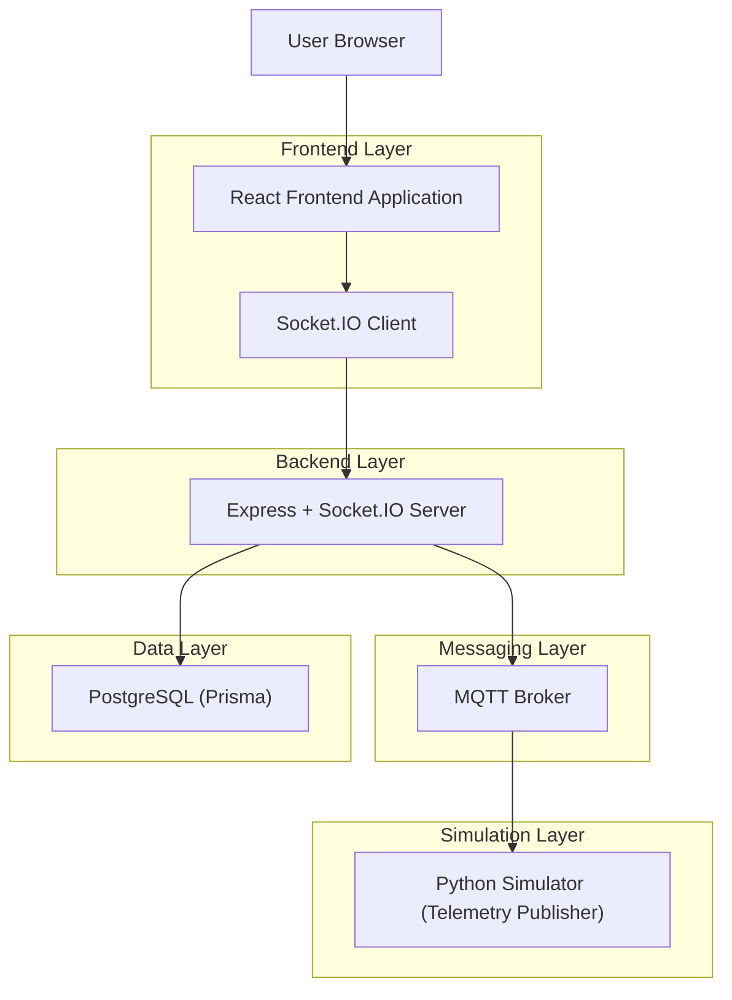
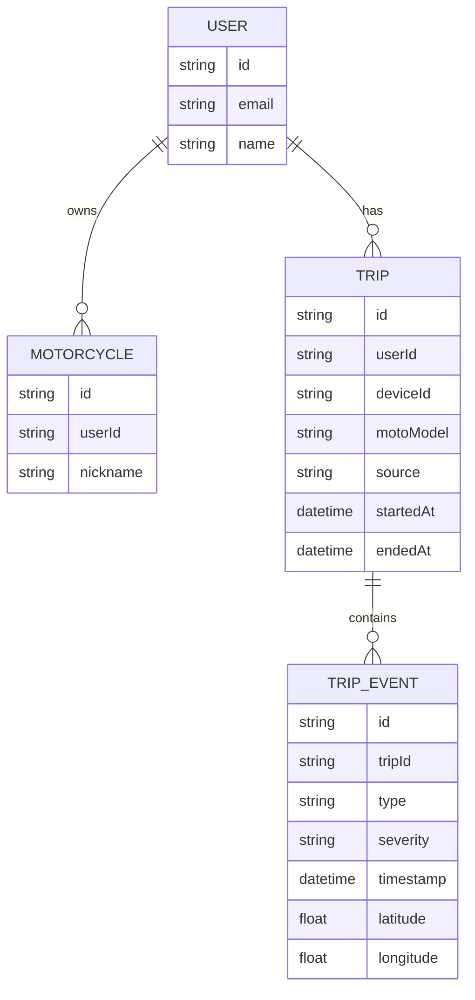

## 1.Architecture design


## 2.Technology Description
- Frontend: React@19 + react-router-dom@7 + socket.io-client@4 + Leaflet@1.9 + Vite + TypeScript
- Backend: Express@4 + socket.io@4 + MQTT client + Prisma
- Database: PostgreSQL

## 3.Route definitions
| Route | Purpose |
|---|---|
| /login | Autenticação |
| /reset-password/:token | Recuperação de password |
| /dashboard | Cockpit de telemetria ao vivo + comandos |
| /map | Mapa ao vivo + envio de trajeto |
| /simulator-contexts | Aba Simulador (reformulada como cockpit de rota/estado/comandos/logs) |
| /trips | Lista de viagens |
| /trips/:id | Detalhe de viagem |
| /gpx | Gestão/visualização GPX |
| /profile | Perfil |

## 4.API definitions (If it includes backend services)
### 4.1 Socket events (frontend  backend)
**Emit**
- send_command

TypeScript (contrato do comando):
```ts
export interface SimulatorCommand {
  acao: string;
  modelo?: string;
  tipo?: string;
  device_id?: string;
  userId?: string;
  route?: {
    start: { latitude: number; longitude: number };
    end: { latitude: number; longitude: number };
    loop?: boolean;
  };
}
```

**Listen**
- status: { mqttConnected: boolean; telemetryCount: number; hasData: boolean }
- telemetry_update: TelemetryPayload
- error_msg: { message: string }
- alert
- trip_started / trip_ended

## 6.Data model(if applicable)
### 6.1 Data model definition
