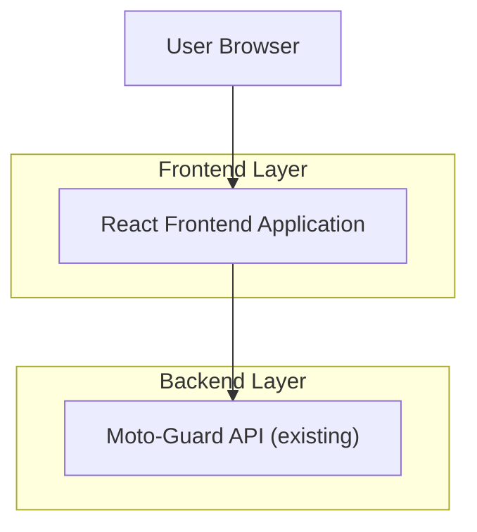

## 1.Architecture design


## 2.Technology Description
- Frontend: React@18 + TypeScript + vite + tailwindcss@3
- Backend: API existente do Moto-Guard (consumida via HTTPS; opcional WebSocket/SSE se já existir)

## 3.Route definitions
| Route | Purpose |
|-------|---------|
| / | Entrada (redirect para /dashboard) |
| /dashboard | Painel principal com KPIs, estado atual e atalhos |
| /analytics | Métricas, gráficos e filtros temporais |
| /alertas | Lista e detalhe de alertas + ações básicas |
| /settings | Preferências e persistência de configurações |

## 4.API definitions (If it includes backend services)
### 4.1 Core API
Obter dados do dashboard
```
GET /api/dashboard/summary
```

Obter analytics
```
GET /api/analytics?from=ISO_DATE&to=ISO_DATE&granularity=hour|day
```

Listar alertas
```
GET /api/alerts?status=unread|ack&severity=low|medium|high
```

Detalhe do alerta
```
GET /api/alerts/:id
```

Reconhecer / marcar como lido
```
PATCH /api/alerts/:id
```
Request (exemplo):
```json
{ "status": "ack" }
```

Guardar settings
```
PUT /api/settings
```
Request (exemplo):
```json
{ "theme": "light", "units": "metric", "alertPrefs": { "enabled": true } }
```