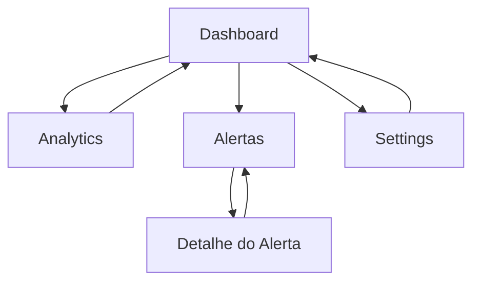

## 1. Product Overview
Moto-Guard: módulo de Frontend P0 para observar o sistema (Dashboard/Analytics), reagir a eventos (Alertas) e ajustar preferências (Settings).
Foco: melhorar visibilidade operacional e consistência visual do painel.

## 2. Core Features

### 2.1 Feature Module
O P0 é composto pelas seguintes páginas:
1. **Dashboard**: KPIs e estado atual, atalhos para Analytics/Alertas, alinhamento visual (layout/espaçamentos/componentes).
2. **Analytics**: métricas e tendências em gráficos, filtros por intervalo de tempo.
3. **Alertas**: lista de alertas, detalhe do alerta, ações básicas (marcar como lido/reconhecido).
4. **Settings**: preferências do utilizador e do ecrã (ex.: tema, unidades, preferências de alertas), salvar alterações.

### 2.2 Page Details
| Page Name | Module Name | Feature description |
|-----------|-------------|---------------------|
| Dashboard | Estrutura e alinhamento | Aplicar grelha consistente (cards, margens, tipografia) e alinhar componentes ao mesmo sistema visual usado nas restantes páginas. |
| Dashboard | KPIs/Resumo | Mostrar KPIs principais e “estado atual” em cards; suportar estados loading/empty/error. |
| Dashboard | Atalhos | Navegar rapidamente para Analytics e Alertas a partir de secções/CTAs do dashboard. |
| Analytics | Filtros | Selecionar intervalo temporal (ex.: 24h/7d/30d e/ou custom) e atualizar os dados apresentados. |
| Analytics | Visualização | Apresentar gráficos e tabelas/resumos essenciais; suportar loading/empty/error. |
| Alertas | Lista | Listar alertas por ordem recente, com severidade/estado e pesquisa/filtro mínimo (ex.: severidade/estado). |
| Alertas | Detalhe | Abrir um alerta para ver informação completa (timestamp, origem/contexto, mensagem). |
| Alertas | Ações | Marcar alerta como lido/reconhecido e refletir estado na lista. |
| Settings | Preferências | Editar e guardar preferências (ex.: tema, unidades, preferências de alertas) com validação básica. |
| Settings | Persistência | Carregar preferências ao entrar; salvar e confirmar sucesso/erro. |

## 3. Core Process
Fluxo principal do utilizador:
- Começas no **Dashboard** para ver o estado atual e KPIs.
- Se precisares de tendências/detalhe, vais para **Analytics**, ajustas o intervalo de tempo e consultas gráficos.
- Se existirem eventos, vais para **Alertas**, abres um alerta e marcas como lido/reconhecido.
- Para ajustar preferências, vais a **Settings**, alteras opções e guardas.

