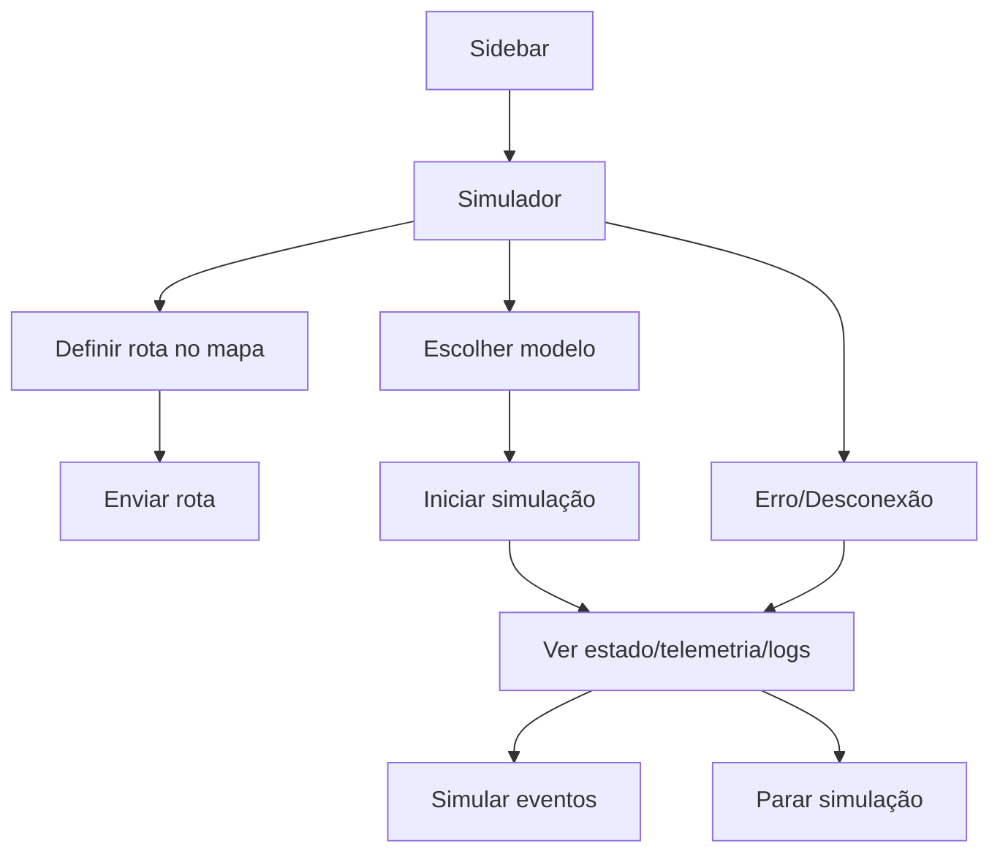

## 1. Product Overview
MotoGuard IoT é uma aplicação web para visualizar telemetria de motas em tempo real e testar fluxos ponta‑a‑ponta através de um simulador (telemetria, rota, eventos).
O objetivo desta reformulação é tornar a aba **Simulador** o “cockpit” único para configurar rota, iniciar/parar simulação e validar o estado/erros.

## 2. Core Features

### 2.1 User Roles
| Role | Registration Method | Core Permissions |
|------|---------------------|------------------|
| Utilizador autenticado | Email + password | Aceder a dashboard, mapa, viagens/GPX e aba Simulador; enviar comandos ao simulador |

### 2.2 Feature Module
1. **Home**: apresentação do projeto, CTA para login.
2. **Login / Reset Password**: autenticação e recuperação de conta.
3. **Dashboard**: telemetria ao vivo, mapa, digital twin e consola de comandos.
4. **Viagens + Detalhe de Viagem**: lista e detalhe com eventos e métricas.
5. **Mapa**: posição e trilho ao vivo + seleção de trajeto para o simulador.
6. **GPX**: importação/visualização de ficheiros GPX.
7. **Simulador** (reformulado): planeamento de rota, estado da simulação, comandos e feedback de erro.
8. **Perfil**: dados do utilizador e sessão.

### 2.3 Page Details
| Page Name | Module Name | Feature description |
|---|---|---|
| Simulador | Mapa & Planeamento de Rota | Definir início/fim da rota no mapa (clique e drag‑and‑drop); visualizar linha de seleção; limpar seleção; enviar rota ao simulador; repor rota padrão; persistir rota localmente ("sim_route"). |
| Simulador | Estado & Conectividade | Mostrar estado WS/MQTT/“a receber dados”; indicar dispositivo ativo; indicar modelo atual, último timestamp e contador de mensagens; bloquear ações quando desconectado. |
| Simulador | Comandos | Selecionar modelo; iniciar simulação; parar simulação; simular eventos (queda/alternador/sobreaquecimento) e reset; garantir ordem modelo→rota quando aplicável. |
| Simulador | Consola & Feedback de Erro | Mostrar consola de logs (comandos enviados, alertas e erros); mostrar toast/banner de erro quando backend reporta “error_msg” e quando rota/comandos são inválidos. |

## 3. Core Process
**Fluxo do Utilizador (Simulador):**
1) Entras na aba Simulador e confirmas estado de ligação (WS/MQTT).
2) Defines uma rota (opcional) escolhendo ponto de início e fim no mapa e clicas “Enviar Rota”.
3) Escolhes um modelo e clicas “Iniciar Simulação”.
4) Acompanhar telemetria e trilho; opcionalmente disparas eventos/falhas.
5) Paras a simulação; a UI limpa estado de execução e reseta elementos dependentes (ex.: trilho).
6) Se ocorrer erro (WS down, comando inválido, rota incompleta), vês feedback imediato e a ação é bloqueada.

