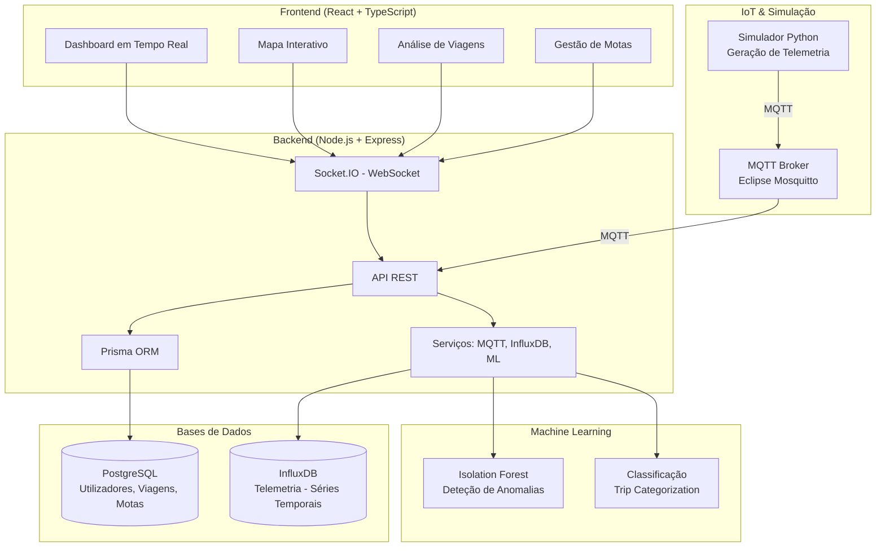
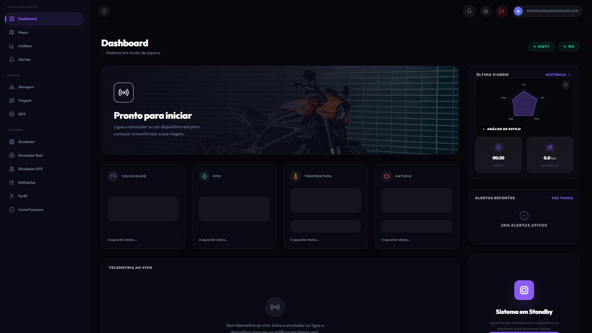
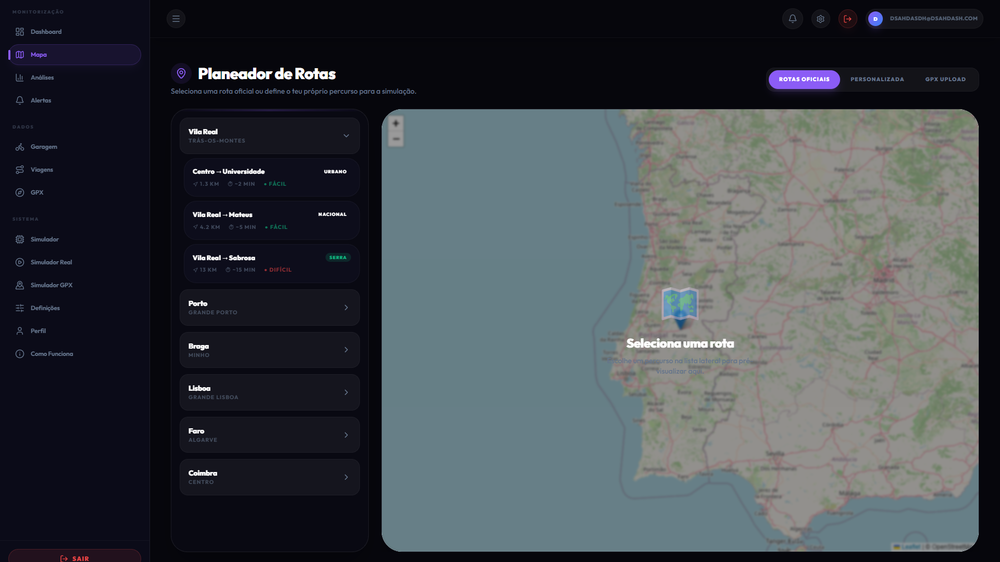
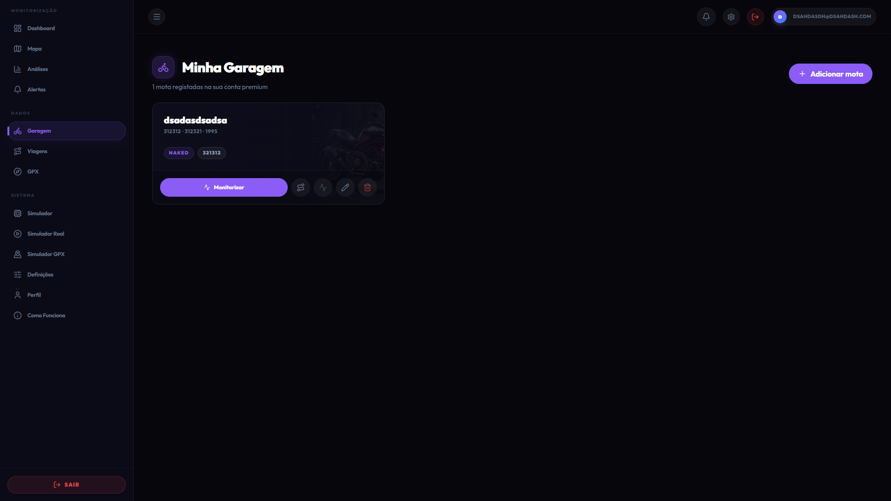
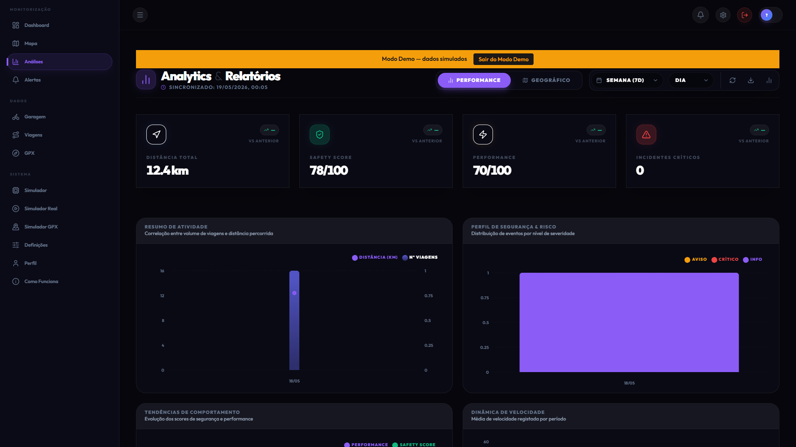
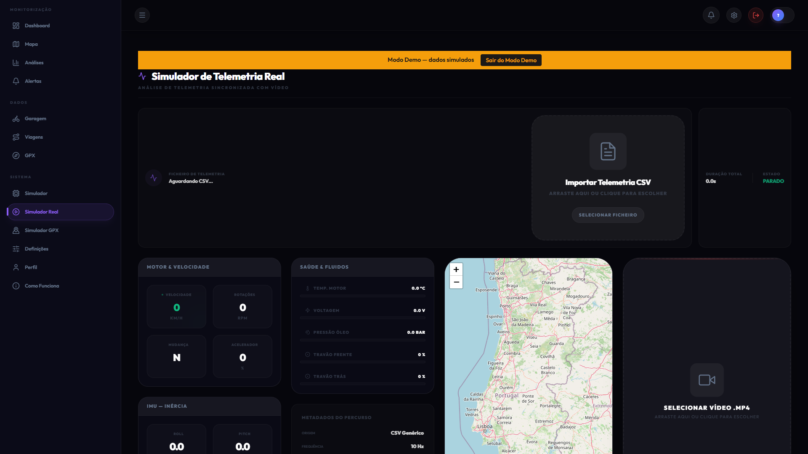

# 🏍️ MotoGuard IoT — Sistema de Monitorização Inteligente para Motociclos

> **Uma solução completa de IoT para monitorização em tempo real de motociclos, deteção de anomalias e análise de condução com Machine Learning.**

---

## 📋 Índice

- [Sobre o Projeto](#sobre-o-projeto)
- [Demonstração](#demonstração)
- [Arquitetura do Sistema](#arquitetura-do-sistema)
- [Funcionalidades](#funcionalidades)
- [Tecnologias Utilizadas](#tecnologias-utilizadas)
- [Estrutura do Projeto](#estrutura-do-projeto)
- [Instalação e Configuração](#instalação-e-configuração)
- [Utilização](#utilização)
- [Screenshots](#screenshots)
- [API Documentation](#api-documentation)
- [Simulador de Telemetria](#simulador-de-telemetria)
- [Machine Learning](#machine-learning)
- [Contribuição](#contribuição)
- [Licença](#licença)

---

## 🎯 Sobre o Projeto

O **MotoGuard IoT** é um sistema avançado de monitorização para motociclos que permite:

- **Monitorização em tempo real** de telemetria (velocidade, RPM, temperatura, inclinação, etc.)
- **Deteção automática de eventos críticos** (quedas, travagens bruscas, sobreaquecimento, falhas de alternador)
- **Análise pós-viagem** com classificação automática e scoring ML
- **Visualização interativa** com mapas, gráficos e heatmaps
- **Simulação realista** com 8 perfis de motociclos diferentes
- **Importação de ficheiros GPX** para análise de rotas reais
- **Modo Demo** para apresentações sem dependências externas

Este projeto foi desenvolvido no âmbito da **Proposta de Licenciatura 2025/2026** orientada por **Cristiano Pendão** e **Arsénio Reis (UTAD)**.

---

## 🎬 Demonstração

### Vídeo Demo
<!-- Adicionar link para vídeo de demonstração quando disponível -->
<!-- [](https://www.youtube.com/watch?v=VIDEO_ID) -->

---

## 🏗️ Arquitetura do Sistema



### Fluxos de Dados

1. **Telemetria em Tempo Real:**
   ```
   Simulador Python → MQTT (Mosquitto) → Backend (MQTT Client) → InfluxDB + Socket.IO → Frontend
   ```

2. **Armazenamento de Viagens:**
   ```
   Backend → Prisma ORM → PostgreSQL
   ```

3. **Análise ML:**
   ```
   Dados da Viagem → Pipeline ML → Isolation Forest → Score de Anomalia + Classificação
   ```

---

## ✨ Funcionalidades

### 🔴 Monitorização em Tempo Real
- ✅ Dashboard com gauges interativos (velocidade, RPM, temperatura, voltagem)
- ✅ Visualização de inclinação (roll/pitch) em tempo real
- ✅ Mapa com posição GPS atualizada
- ✅ Deteção automática de eventos críticos
- ✅ Alertas visuais e sonoros

### 📊 Análise Pós-Viagem
- ✅ Gráficos interativos (velocidade, RPM, temperatura, G-force)
- ✅ Mapa com rota percorrida e eventos marcados
- ✅ Heatmap de densidade de eventos
- ✅ Classificação automática (Urbano, Autoestrada, Curvas, Noturno)
- ✅ Scoring ML de segurança (0-100)
- ✅ Exportação para PDF, CSV e GPX

### 🏍️ Gestão de Motas
- ✅ Registo de múltiplas motas por utilizador
- ✅ 8 perfis pré-configurados (Scooter, Naked, Desportiva, Trail, etc.)
- ✅ Associação de dispositivos IoT (device_id)
- ✅ Configuração de thresholds por modelo

### 🎮 Simulador Avançado
- ✅ 8 perfis de motociclos com física realista
- ✅ Simulação de eventos (quedas, falhas, sobreaquecimento)
- ✅ Suporte para rotas GPX reais
- ✅ Modo headless para Docker
- ✅ Integração IRL (In Real Life) com dados de sensores reais

### 🌐 Funcionalidades Extra
- ✅ **Modo Demo** com dados pré-gravados (2 motas, 5 viagens)
- ✅ **Internacionalização** (PT/EN) com ~200 chaves traduzidas
- ✅ **Modo Noturno** automático
- ✅ **Alertas por Email** (integração Resend)
- ✅ **Onboarding** para novos utilizadores

---

## 🛠️ Tecnologias Utilizadas

### Frontend
| Tecnologia | Versão | Propósito |
|-----------|--------|-----------|
| React | 18.x | Framework UI |
| TypeScript | 5.x | Tipagem estática |
| Vite | 5.x | Build tool |
| Socket.IO Client | 4.x | WebSocket em tempo real |
| Leaflet | 1.9.x | Mapas interativos |
| Recharts | 2.x | Gráficos |
| i18next | 23.x | Internacionalização |

### Backend
| Tecnologia | Versão | Propósito |
|-----------|--------|-----------|
| Node.js | 20.x | Runtime JavaScript |
| TypeScript | 5.x | Tipagem estática |
| Express | 4.x | Framework web |
| Prisma | 5.x | ORM |
| Socket.IO | 4.x | WebSocket server |
| MQTT.js | 5.x | Cliente MQTT |
| JWT | 9.x | Autenticação |

### Bases de Dados
| Tecnologia | Versão | Propósito |
|-----------|--------|-----------|
| PostgreSQL | 16.x | Dados relacionais |
| InfluxDB | 2.x | Séries temporais (telemetria) |

### IoT & Simulação
| Tecnologia | Versão | Propósito |
|-----------|--------|-----------|
| Python | 3.12.x | Simulador |
| Paho MQTT | 2.x | Cliente MQTT |
| Eclipse Mosquitto | 2.x | Broker MQTT |

### Machine Learning
| Tecnologia | Versão | Propósito |
|-----------|--------|-----------|
| Python | 3.12.x | Scripts ML |
| Scikit-learn | 1.5.x | Isolation Forest |
| Pandas | 2.x | Manipulação de dados |
| NumPy | 1.26.x | Computação numérica |

### Infraestrutura
| Tecnologia | Versão | Propósito |
|-----------|--------|-----------|
| Docker | 24.x | Contentorização |
| Docker Compose | 2.x | Orquestração |
| Nginx | Alpine | Proxy reverso (opcional) |

---

## 📁 Estrutura do Projeto

```
Moto-Guard-IoT/
├── app/
│   ├── backend/                 # API Node.js + TypeScript
│   │   ├── src/
│   │   │   ├── controllers/     # Controladores da API
│   │   │   ├── routes/          # Rotas Express
│   │   │   ├── services/        # Lógica de negócio
│   │   │   ├── middleware/      # Middleware (auth, etc.)
│   │   │   └── utils/           # Utilitários
│   │   ├── prisma/              # Schema e migrations
│   │   └── Dockerfile
│   │
│   ├── frontend/                # App React + TypeScript
│   │   ├── src/
│   │   │   ├── pages/           # Páginas da aplicação
│   │   │   ├── components/      # Componentes reutilizáveis
│   │   │   ├── hooks/           # Custom hooks
│   │   │   ├── i18n/            # Internacionalização
│   │   │   └── demo/            # Modo demo
│   │   └── Dockerfile
│   │
│   └── prisma/
│       ├── schema.prisma        # Schema da BD
│       └── seed.ts              # Seed dos perfis de motas
│
├── simulador/                   # Simulador Python (Telemetria)
│   ├── headless_simulator.py    # Simulador sem GUI
│   ├── config.py                # Configurações e perfis
│   ├── routes.py                # Lógica de rotas GPX
│   └── requirements.txt
│
├── simulador_irl/               # Simulador IRL (In Real Life)
│   ├── enhanced_simulator.py    # Simulador com dados reais
│   └── telemetry_overlay/       # Overlay para vídeo
│
├── ml/                          # Machine Learning
│   ├── infer.py                 # Inferência (Isolation Forest)
│   ├── train.py                 # Treino de modelos
│   ├── clustering.py            # Clustering (nice-to-have)
│   └── models/                  # Modelos treinados
│
├── docker/                      # Configurações Docker
│   ├── mosquitto/               # Broker MQTT
│   │   ├── Dockerfile
│   │   ├── mosquitto.conf
│   │   └── acl.conf
│   └── postgres/                # Scripts de inicialização
│
├── gpx_files/                   # Ficheiros GPX para testes
├── IRL_DATA/                    # Dados reais de sensores
├── imagens/                     # Imagens dos modelos de motas
├── docs/                        # Documentação adicional
│
├── docker-compose.yml           # Orquestração principal
├── docker-compose.infra.yml     # Infraestrutura adicional
├── package.json                 # Dependências do projeto
└── README.md                    # Este ficheiro
```

---

## 🚀 Instalação e Configuração

### Pré-requisitos

- **Docker** e **Docker Compose** instalados
- **Node.js** 20.x ou superior (para desenvolvimento local)
- **Python** 3.12.x (para simulador e ML)
- **Git** para clonar o repositório

### 1. Clonar o Repositório

```bash
git clone https://github.com/seu-utilizador/Moto-Guard-IoT.git
cd Moto-Guard-IoT
```

### 2. Configurar Variáveis de Ambiente

Criar ficheiro `.env` na raiz do projeto (baseado no `.env.example`):

```bash
cp .env.example .env
```

Editar o `.env` com as suas configurações:

```env
# PostgreSQL
POSTGRES_USER=motoguard
POSTGRES_PASSWORD=motoguard123
POSTGRES_DB=motoguard

# InfluxDB
INFLUXDB_USER=motoguard
INFLUXDB_PASSWORD=motoguard123
INFLUXDB_ORG=motoguard
INFLUXDB_BUCKET=motoguard_telemetry
INFLUXDB_TOKEN=motoguard-dev-token

# MQTT
MQTT_USER=motoguard
MQTT_PASS=motoguard123
MQTT_SIM_USER=simulator
MQTT_SIM_PASS=simulator123
MQTT_BACK_USER=backend
MQTT_BACK_PASS=backend123

# JWT
JWT_SECRET=motoguard-dev-secret-change-in-prod

# ML
ML_ENABLED=true
ML_MODEL_PATH=ml/models/isolation_forest.pkl

# Resend (Email)
RESEND_API_KEY=sua_api_key_aqui
```

### 3. Iniciar com Docker Compose

```bash
# Construir e iniciar todos os serviços
docker compose up -d --build

# Verificar o estado dos containers
docker compose ps

# Ver logs do backend
docker compose logs -f backend
```

### 4. Executar Migrations e Seed

```bash
# As migrations são executadas automaticamente no arranque do backend
# Para forçar manualmente:
docker compose exec backend npx prisma migrate deploy
docker compose exec backend npx tsx prisma/seed.ts
```

### 5. Aceder à Aplicação

- **Frontend:** http://localhost:5173 (modo dev) ou http://localhost (se usar nginx)
- **Backend API:** http://localhost:3000
- **InfluxDB UI:** http://localhost:8086
- **MQTT Broker:** localhost:1883 (WebSocket: 9001)

---

## 💡 Utilização

### Registo e Login

1. Aceder ao frontend em http://localhost:5173
2. Criar uma conta ou fazer login
3. Adicionar uma mota na secção "Garagem"
4. Associar um device_id (ex: `MOTOGUARD-SIM-01`)

### Iniciar Simulação

#### Via Interface Web:
1. Ir para "Simulador" no menu
2. Selecionar o modelo de mota
3. Escolher uma rota ou usar GPS simulado
4. Clicar em "Iniciar Viagem"

#### Via MQTT (Manual):
```bash
# Definir modelo
mosquitto_pub -h localhost -t motoguard/comando \
  -m '{"acao":"definir_modelo","modelo":"Naked"}'

# Iniciar viagem
mosquitto_pub -h localhost -t motoguard/comando \
  -m '{"acao":"start_trip"}'

# Simular queda
mosquitto_pub -h localhost -t motoguard/comando \
  -m '{"acao":"evento","tipo":"queda"}'
```

### Importar Ficheiro GPX

1. Ir para "Mapa" no menu
2. Clicar em "Importar GPX"
3. Selecionar ficheiro (ex: de `gpx_files/`)
4. Escolher mota associada
5. Visualizar rota e telemetria

### Visualizar Analytics

1. Ir para "Analytics" no menu
2. Ver estatísticas agregadas
3. Consultar heatmap de eventos
4. Analisar padrões de condução

---

## 📸 Screenshots

<!-- ADICIONAR SCREENSHOTS REAIS DO PROJETO AQUI -->

### Dashboard em Tempo Real
<!--  -->
*Placeholder: Adicionar screenshot do Dashboard com gauges e telemetria ao vivo*

### Mapa com Rota e Eventos
<!--  -->
*Placeholder: Adicionar screenshot do mapa Leaflet com rota GPX e eventos marcados*

### Análise de Viagem (Trip Detail)
<!--  -->
*Placeholder: Adicionar screenshot da análise pós-viagem com gráficos*

### Gestão de Motas (Garagem)
<!--  -->
*Placeholder: Adicionar screenshot da página de gestão de motas*

### Analytics e Heatmap
<!--  -->
*Placeholder: Adicionar screenshot dos analytics com heatmap*

### Simulador e Controlo
<!--  -->
*Placeholder: Adicionar screenshot da página do simulador*

### Modo Demo
<!--  -->
*Placeholder: Adicionar screenshot do banner do modo demo*

### Mobile Responsivo
<!--  -->
*Placeholder: Adicionar screenshot em dispositivo móvel*

---

## 🔌 API Documentation

### Endpoints Principais

#### Autenticação
```http
POST /api/auth/register    # Registo de utilizador
POST /api/auth/login       # Login (retorna JWT)
GET  /api/auth/me          # Dados do utilizador autenticado
```

#### Motas
```http
POST   /api/motorcycles          # Criar mota
GET    /api/motorcycles          # Listar motas do utilizador
GET    /api/motorcycle-profiles  # Listar perfis disponíveis
PUT    /api/motorcycles/:id      # Atualizar mota
DELETE /api/motorcycles/:id      # Eliminar mota
```

#### Viagens
```http
GET    /api/trips              # Listar viagens
GET    /api/trips/:id          # Detalhes de uma viagem
POST   /api/trips/:id/end      # Terminar viagem
DELETE /api/trips/:id          # Eliminar viagem
GET    /api/trips/:id/export   # Exportar (PDF/CSV/GPX)
```

#### Telemetria
```http
POST   /api/telemetry          # Receber telemetria (MQTT internal)
GET    /api/telemetry/:tripId  # Obter telemetria de uma viagem
```

#### GPX
```http
POST   /api/gpx/import         # Importar ficheiro GPX
GET    /api/gpx/:tripId        # Obter dados GPX de uma viagem
```

#### Analytics
```http
GET    /api/analytics/overview     # Visão geral
GET    /api/analytics/heatmap      # Dados para heatmap
GET    /api/analytics/by-category  # Viagens por categoria
```

### WebSocket Events (Socket.IO)

```javascript
// Eventos recebidos do servidor
'telemetry_update'    // Nova telemetria em tempo real
'trip_started'        // Viagem iniciada
'trip_ended'          // Viagem terminada
'event_detected'      // Evento crítico detetado
'crash_alert'         // Alerta de queda confirmada

// Eventos enviados para o servidor
'join_trip'           // Subscrever atualizações de uma viagem
'leave_trip'          // Desubscrever
```

---

## 🎮 Simulador de Telemetria

O simulador Python gera dados realistas de telemetria para testar o sistema.

### Perfis de Motociclos Suportados

| Modelo | Vel. Máx | RPM Máx | Temp. Motor | Peso | Inclinação Típica |
|--------|----------|---------|-------------|------|-------------------|
| **Scooter** | 120 km/h | 9 000 | 60-90°C | 130 kg | 25° |
| **Naked** | 200 km/h | 12 000 | 70-105°C | 190 kg | 40° |
| **Desportiva** | 299 km/h | 15 000 | 80-110°C | 200 kg | 55° |
| **Trail / Adventure** | 200 km/h | 10 000 | 70-100°C | 230 kg | 35° |
| **Custom / Cruiser** | 180 km/h | 7 000 | 65-95°C | 300 kg | 30° |
| **Motocross / Enduro** | 130 km/h | 13 000 | 80-115°C | 110 kg | 40° |
| **Touring** | 220 km/h | 8 000 | 60-95°C | 350 kg | 30° |
| **Supermotard** | 160 km/h | 11 000 | 75-110°C | 150 kg | 50° |

### Deteção de Queda (Thresholds por Modelo)

| Modelo | Roll Mínimo | G-Force Mínimo | Tempo Confirmação | Justificação |
|--------|-------------|----------------|-------------------|--------------|
| Scooter | ≥55° | ≥2.0G | 2s | Centro de gravidade alto |
| Naked | ≥70° | ≥2.5G | 2s | Posição semi-ereta |
| Desportiva | ≥85° | ≥3.0G | 2s | Feita para inclinar |
| Trail | ≥65° | ≥2.0G | 3s | Off-road normal |
| Custom | ≥50° | ≥1.8G | 2s | Pesada + baixa |
| Motocross | ≥75° | ≥3.5G | 3s | Saltos normais |
| Touring | ≥45° | ≥1.5G | 2s | 350kg - pouco G é muito |
| Supermotard | ≥80° | ≥3.0G | 2s | Condução agressiva |

### Comandos MQTT

| Comando | Payload | Descrição |
|---------|---------|-----------|
| Definir Modelo | `{"acao":"definir_modelo","modelo":"Naked"}` | Carrega perfil e inicia |
| Evento Queda | `{"acao":"evento","tipo":"queda"}` | Simula queda |
| Evento Alternador | `{"acao":"evento","tipo":"alternador"}` | Falha alternador |
| Evento Sobreaquecimento | `{"acao":"evento","tipo":"sobreaquecimento"}` | Sobreaquecimento |
| Reset Eventos | `{"acao":"reset_eventos"}` | Limpa eventos ativos |
| Arrancar | `{"acao":"arrancar"}` | Retoma após queda |
| Parar | `{"acao":"parar"}` | Para geração |

### Payload de Telemetria (Exemplo)

```json
{
  "device_id": "MOTOGUARD-SIM-01",
  "timestamp": "2026-04-29T14:30:00Z",
  "modelo": "Naked",
  "telemetry": {
    "speed_kmh": 85.3,
    "rpm": 4200,
    "engine_temp_c": 82.3,
    "imu": {
      "roll": 15.4,
      "pitch": -2.1,
      "accel_x": 0.05,
      "accel_y": 0.98,
      "accel_z": 1.02,
      "g_force": 0.0
    }
  },
  "location": {
    "lat": 41.2951,
    "lng": -7.7463
  },
  "system": {
    "status": "normal",
    "battery_voltage": 14.2
  }
}
```

---

## 🤖 Machine Learning

### Pipeline ML

1. **Extração de Features:** Da telemetria da viagem (velocidade, RPM, G-force, etc.)
2. **Isolation Forest:** Deteção de anomalias (score de 0 a 1)
3. **Classificação:** Categorização automática da viagem
   - `URBAN` — Condução urbana (velocidade baixa, muitas paragens)
   - `HIGHWAY` — Autoestrada (velocidade alta, constante)
   - `CURVY` — Estradas sinuosas (muita variação de roll)
   - `NIGHT_RIDING` — Condução noturna

### Scoring de Segurança

O sistema atribui um score de 0-100 baseado em:
- Número e gravidade de eventos
- Desvio padrão da velocidade
- G-force máxima registada
- Anomalias detetadas pelo ML

### Retreinar Modelo

```bash
# Executar dentro do container ml-trainer
docker compose --profile ml up ml-trainer

# Ou localmente
cd ml/
pip install -r requirements.txt
python train.py
```

---

## 🤝 Contribuição

Contribuições são bem-vindas! Por favor:

1. Fazer fork do projeto
2. Criar uma branch para a funcionalidade (`git checkout -b feature/AmazingFeature`)
3. Commitar as alterações (`git commit -m 'Add some AmazingFeature'`)
4. Fazer push para a branch (`git push origin feature/AmazingFeature`)
5. Abrir um Pull Request

### Guidelines

- Seguir o estilo de código existente
- Adicionar testes para novas funcionalidades
- Atualizar documentação quando necessário
- Fazer commits atómicos e bem descritos

---

## 📄 Licença

Este projeto está licenciado sob a **MIT License**. Ver o ficheiro [LICENSE](LICENSE) para mais detalhes.

---

## 👥 Autores e Agradecimentos

### Autores
- **[O Teu Nome]** — Desenvolvimento full-stack

### Orientadores
- **Cristiano Pendão** — Orientador
- **Arsénio Reis** — Co-orientador (UTAD)

### Agradecimentos
- Universidade de Trás-os-Montes e Alto Douro (UTAD)
- Todos os contribuidores e testadores

---

## 📞 Contacto

- **Email:** teu.email@exemplo.com
- **GitHub:** https://github.com/PedroSousa-dev13
- **LinkedIn:** Teu Perfilhttps://www.linkedin.com/feed/

---

## 📊 Estado do Projeto

- **Progresso Global:** 68% (conforme `a_fazer.txt`)
- **Testes:** 48% cobertura (meta: 80% — **BLOCKER**)
- **Funcionalidades Core:** 95% completas
- **Documentação:** 90% completa
- **UI/UX:** 99% completa

### Próximas Prioridades
1. ⚠️ **URGENTE:** Aumentar cobertura de testes para 80%
2. Implementar alertas automáticos por email
3. Calibrar ML score para viagens GPX reais
4. Completar documentação IRL

---

<div align="center">

**⭐ Se este projeto te ajudou, considera dar uma estrela no GitHub! ⭐**

Construído com ❤️ e ☕ em Portugal

</div>
