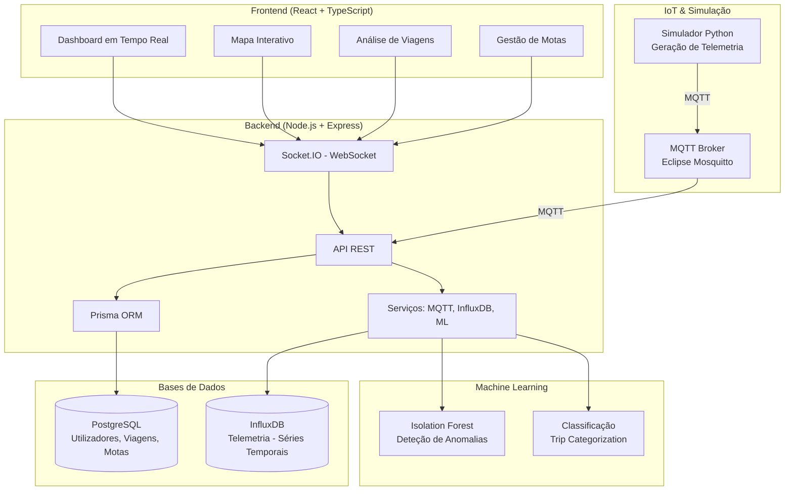

# 🏍️ MotoGuard IoT — Sistema de Monitorização Inteligente para Motociclos

> **Uma solução completa de IoT para monitorização em tempo real de motociclos, deteção de anomalias e análise de condução com Machine Learning.**

---

## 📋 Índice

- [Sobre o Projeto](#sobre-o-projeto)
- [Demonstração](#demonstração)
- [Arquitetura do Sistema](#arquitetura-do-sistema)
- [Funcionalidades](#funcionalidades)
- [Tecnologias Utilizadas](#tecnologias-utilizadas)
- [Estrutura do Projeto](#estrutura-do-projeto)
- [Instalação e Configuração](#instalação-e-configuração)
- [Utilização](#utilização)
- [API Documentation](#api-documentation)
- [Simulador de Telemetria](#simulador-de-telemetria)
- [Machine Learning](#machine-learning)
- [Contribuição](#contribuição)
- [Licença](#licença)

---

## 🎯 Sobre o Projeto

O **MotoGuard IoT** é um sistema avançado de monitorização para motociclos que permite:

- **Monitorização em tempo real** de telemetria (velocidade, RPM, temperatura, inclinação, etc.)
- **Deteção automática de eventos críticos** (quedas, travagens bruscas, sobreaquecimento, falhas de alternador)
- **Análise pós-viagem** com classificação automática e scoring ML
- **Visualização interativa** com mapas, gráficos e heatmaps
- **Simulação realista** com 8 perfis de motociclos diferentes
- **Importação de ficheiros GPX** para análise de rotas reais
- **Modo Demo** para apresentações sem dependências externas

Este projeto foi desenvolvido no âmbito da **Proposta de Licenciatura 2025/2026** orientada por **Cristiano Pendão** e **Arsénio Reis (UTAD)**.

---

## 🎬 Demonstração

### Vídeo Demo
<!-- Adicionar link para vídeo de demonstração quando disponível -->

---

## 🏗️ Arquitetura do Sistema



### Fluxos de Dados

1. **Telemetria em Tempo Real:**
   ```
   Simulador Python → MQTT (Mosquitto) → Backend (MQTT Client) → InfluxDB + Socket.IO → Frontend
   ```

2. **Armazenamento de Viagens:**
   ```
   Backend → Prisma ORM → PostgreSQL
   ```

3. **Análise ML:**
   ```
   Dados da Viagem → Pipeline ML → Isolation Forest → Score de Anomalia + Classificação
   ```

---

## ✨ Funcionalidades

### 🔴 Monitorização em Tempo Real
- ✅ Dashboard com gauges interativos (velocidade, RPM, temperatura, voltagem)
- ✅ Visualização de inclinação (roll/pitch) em tempo real
- ✅ Mapa com posição GPS atualizada
- ✅ Deteção automática de eventos críticos
- ✅ Alertas visuais e sonoros

### 📊 Análise Pós-Viagem
- ✅ Gráficos interativos (velocidade, RPM, temperatura, G-force)
- ✅ Mapa com rota percorrida e eventos marcados
- ✅ Heatmap de densidade de eventos
- ✅ Classificação automática (Commute, Weekend Ride, Track Day, Off-Road)
- ✅ Scoring ML de segurança (0-100)
- ✅ Exportação para PDF, CSV e GPX

### 🏍️ Gestão de Motas
- ✅ Registo de múltiplas motas por utilizador
- ✅ 8 perfis pré-configurados (Scooter, Naked, Desportiva, Trail, etc.)
- ✅ Associação de dispositivos IoT (device_id)
- ✅ Configuração de thresholds por modelo

### 🎮 Simulador Avançado
- ✅ 8 perfis de motociclos com física realista
- ✅ Simulação de eventos (quedas, falhas, sobreaquecimento)
- ✅ Suporte para rotas GPX reais
- ✅ Modo headless para Docker
- ✅ Integração IRL (In Real Life) com dados de sensores reais

### 🌐 Funcionalidades Extra
- ✅ **Modo Demo** com dados pré-gravados (2 motas, 5 viagens)
- ✅ **Internacionalização** (PT/EN) com ~200 chaves traduzidas
- ✅ **Modo Noturno** automático
- ✅ **Alertas por Email** (integração Resend)
- ✅ **Onboarding** para novos utilizadores

---

## 🛠️ Tecnologias Utilizadas

### Frontend
| Tecnologia | Versão | Propósito |
|-----------|--------|-----------|
| React | 19.x | Framework UI |
| TypeScript | 5.6.x | Tipagem estática |
| Vite | 6.x | Build tool |
| Tailwind CSS | 3.x | Framework CSS |
| Socket.IO Client | 4.x | WebSocket em tempo real |
| Leaflet | 1.9.x | Mapas interativos |
| Recharts | 3.x | Gráficos |
| i18next | - | Internacionalização |
| Redux Toolkit | 2.9.x | Estado global |

### Backend
| Tecnologia | Versão | Propósito |
|-----------|--------|-----------|
| Node.js | 20.x | Runtime JavaScript |
| TypeScript | 5.6.x | Tipagem estática |
| Express | 4.21.x | Framework web |
| Prisma | 7.4.x | ORM |
| Socket.IO | 4.x | WebSocket server |
| MQTT.js | 5.x | Cliente MQTT |
| JWT (jsonwebtoken) | 9.x | Autenticação |

### Bases de Dados
| Tecnologia | Versão | Propósito |
|-----------|--------|-----------|
| PostgreSQL | 16.x | Dados relacionais |
| InfluxDB | 2.x | Séries temporais (telemetria) |

### IoT & Simulação
| Tecnologia | Versão | Propósito |
|-----------|--------|-----------|
| Python | 3.12.x | Simulador |
| Paho MQTT | 2.x | Cliente MQTT |
| Eclipse Mosquitto | 2.x | Broker MQTT |

### Machine Learning
| Tecnologia | Versão | Propósito |
|-----------|--------|-----------|
| Python | 3.11.x | Scripts ML |
| Scikit-learn | 1.5.x | Isolation Forest |
| Pandas | 2.x | Manipulação de dados |
| NumPy | - | Computação numérica |

### Infraestrutura
| Tecnologia | Versão | Propósito |
|-----------|--------|-----------|
| Docker | 24.x | Contentorização |
| Docker Compose | 2.x | Orquestração |

---

## 📁 Estrutura do Projeto

```
Moto-Guard-IoT/
├── app/                          # Aplicação principal
│   ├── backend/                  # API Node.js + TypeScript
│   │   ├── src/
│   │   │   ├── controllers/      # 8 controladores
│   │   │   ├── routes/           # 14 rotas
│   │   │   ├── services/         # 15 serviços
│   │   │   ├── middleware/       # 3 middlewares
│   │   │   ├── utils/           # Utilitários
│   │   │   ├── models/           # Interfaces TypeScript
│   │   │   ├── generated/        # Prisma generated (NÃO COMMITAR)
│   │   │   └── tests/           # Testes
│   │   ├── dist/                 # Output compilado
│   │   ├── tsconfig.json         # Config TypeScript
│   │   └── package.json
│   │
│   ├── frontend/                 # App React + TypeScript
│   │   ├── src/
│   │   │   ├── pages/            # 17 páginas
│   │   │   ├── components/       # 24+ componentes
│   │   │   ├── hooks/            # 3 custom hooks
│   │   │   ├── i18n/             # Internacionalização
│   │   │   ├── demo/             # Modo demo
│   │   │   ├── services/         # API client
│   │   │   ├── types/            # Tipos
│   │   │   └── utils/            # Utilitários
│   │   ├── dist/                 # Build output
│   │   ├── package.json
│   │   ├── vite.config.ts
│   │   ├── tailwind.config.js
│   │   └── tsconfig.json
│   │
│   ├── prisma/
│   │   ├── schema.prisma         # Schema BD
│   │   ├── migrations/           # Migrations
│   │   └── seed.ts               # Seed perfis
│   │
│   ├── Dockerfile                # Multi-stage build
│   ├── docker-entrypoint.sh      # Entrypoint Docker
│   ├── vitest.config.ts          # Config testes
│   └── .env                      # Variáveis ambiente
│
├── simulador/                    # Simulador Python
│   ├── headless_simulator.py     # Simulador principal
│   ├── config.py                 # Configuração + perfis
│   ├── moto_physics.py           # Física mota
│   ├── routes.py                 # Rotas GPX + OSRM
│   ├── requirements.txt
│   └── odometer_state.json
│
├── simulador_irl/                # Simulador IRL (dados reais)
│   ├── enhanced_simulator.py
│   ├── gpx_simulator.py
│   └── motorcycle_profiles.json
│
├── ml/                           # Machine Learning
│   ├── infer.py                 # Inferência
│   ├── train.py                  # Treino
│   ├── features.py              # Features telemetria (24)
│   ├── features_gpx.py         # Features GPX (10)
│   ├── clustering.py            # K-means clustering
│   ├── online_detector.py       # Z-score detetor tempo real
│   └── models/                  # Modelos treinados
│       ├── isolation_forest.pkl
│       └── gpx_model.pkl
│
├── docker/                       # Dockerfiles adicionais
│   └── mosquitto/               # Broker MQTT
│       ├── Dockerfile
│       ├── mosquitto.conf
│       └── acl.conf
│
├── gpx_files/                   # 16 ficheiros GPX de teste
├── IRL_DATA/                    # Dados sensores reais
├── imagens/                     # Imagens categorias motas
├── docker-compose.yml           # Orquestração principal
├── docker-compose.infra.yml     # Infraestrutura isolada
├── package.json                 # Scripts root
├── setup.bat / setup.sh         # Scripts setup
├── .env.example                 # Template env
├── README.md                    # Este ficheiro
└── PROJECT_REPORT.md            # Relatório técnico
```

---

## 🚀 Instalação e Configuração

### Pré-requisitos

- **Docker** e **Docker Compose** instalados
- **Node.js** 20.x ou superior (para desenvolvimento local)
- **Python** 3.12.x (para simulador e ML)
- **Git** para clonar o repositório

### Setup Rápido (Desenvolvimento Local)

```bash
# Windows:
setup.bat

# Linux / macOS:
chmod +x setup.sh && ./setup.sh
```

O script copia o `.env.example`, instala dependências, gera o Prisma client e faz seed.

### Configuração Manual

#### 1. Clonar o Repositório
```bash
git clone https://github.com/PedroSousa-dev13/Moto-Guard-IoT.git
cd Moto-Guard-IoT
```

#### 2. Configurar Variáveis de Ambiente
```bash
cp .env.example .env
```

Editar o `.env` com as configurações pretendidas.

#### 3. Iniciar com Docker Compose

```bash
# Todos os serviços (inclui simulador)
docker compose up -d --build

# Apenas infraestrutura (postgres, influxdb, mosquitto)
docker compose -f docker-compose.infra.yml up -d

# Com perfil ML
docker compose --profile ml up -d

# Verificar estado
docker compose ps

# Ver logs
docker compose logs -f backend
```

#### 4. Aceder à Aplicação

| Serviço | URL |
|---------|-----|
| Frontend (dev) | http://localhost:5173 |
| Backend API | http://localhost:3000 |
| Swagger UI | http://localhost:3000/api-docs |
| InfluxDB UI | http://localhost:8086 |
| MQTT Broker | localhost:1883 (WS: 9001) |

---

## 💡 Utilização

### Registo e Login

1. Aceder ao frontend em http://localhost:5173
2. Criar uma conta ou fazer login
3. Adicionar uma mota na secção "Garagem"
4. Associar um device_id (ex: `MOTOGUARD-SIM-NAKED`)

### Iniciar Simulação

#### Via Interface Web:
1. Ir para "Gpx Simulator" ou "Real Simulator" no menu
2. Selecionar o modelo de mota
3. Escolher uma rota GPX ou usar simulação
4. Clicar em "Iniciar Viagem"

#### Via MQTT (Manual):
```bash
# Definir modelo
mosquitto_pub -h localhost -t motoguard/comando \
  -m '{"acao":"definir_modelo","modelo":"Naked"}'

# Iniciar viagem
mosquitto_pub -h localhost -t motoguard/comando \
  -m '{"acao":"start_trip"}'

# Simular queda
mosquitto_pub -h localhost -t motoguard/comando \
  -m '{"acao":"evento","tipo":"queda"}'

# Parar
mosquitto_pub -h localhost -t motoguard/comando \
  -m '{"acao":"parar"}'
```

### Importar Ficheiro GPX

1. Ir para "Mapa" no menu
2. Clicar em "Importar GPX"
3. Selecionar ficheiro (ex: de `gpx_files/`)
4. Escolher mota associada
5. Visualizar rota e telemetria

### Visualizar Analytics

1. Ir para "Analytics" no menu
2. Ver estatísticas agregadas
3. Consultar heatmap de eventos
4. Analisar padrões de condução

---

## 🔌 API Documentation

A documentação interativa está disponível via **Swagger UI** em [`/api-docs`](http://localhost:3000/api-docs) quando o backend estiver a correr.

Esquema OpenAPI também disponível em `/api-docs.json`.

### Endpoints Principais

#### Autenticação
```http
POST /api/auth/register    # Registo de utilizador
POST /api/auth/login       # Login (retorna JWT)
GET  /api/auth/me          # Dados do utilizador autenticado
POST /api/auth/forgot-password     # Recuperação password
POST /api/auth/reset-password      # Definir nova password
```

#### Motas
```http
POST   /api/motorcycles          # Criar mota
GET    /api/motorcycles          # Listar motas do utilizador
GET    /api/motorcycle-profiles  # Listar perfis disponíveis
PUT    /api/motorcycles/:id      # Atualizar mota
DELETE /api/motorcycles/:id      # Eliminar mota
```

#### Viagens
```http
GET    /api/trips              # Listar viagens (paginação)
GET    /api/trips/feed        # Feed com scores
GET    /api/trips/:id          # Detalhes de uma viagem
GET    /api/trips/:id/evaluation  # Avaliação ML
POST   /api/trips/:id/categorize  # Recategorizar viagem
GET    /api/trips/clusters    # Estatísticas clustering
GET    /api/trips/stats       # Estatísticas agregadas
GET    /api/alerts            # Lista de alertas/eventos
```

#### Telemetria
```http
GET    /api/telemetry/latest   # Última telemetria em memória
GET    /api/telemetry/:tripId  # Telemetria histórica (InfluxDB)
```

#### GPX
```http
POST   /api/gpx/import         # Importar ficheiro GPX
POST   /api/gpx/parse          # Analisar GPX sem criar viagem
POST   /api/gpx/simulator      # Guardar dados GPX simulador
GET    /api/gpx/export/:tripId # Exportar viagem como GPX
```

#### Comandos
```http
POST   /api/command            # Enviar comando ao simulador
```

#### Sistema
```http
GET    /api/health            # Health check
GET    /api/ml/status          # Estado do modelo ML
```

### WebSocket Events (Socket.IO)

```javascript
// Eventos recebidos do servidor
'telemetry_update'    // Nova telemetria em tempo real
'trip_started'        // Viagem iniciada
'trip_ended'          // Viagem terminada
'alert'               // Evento detetado
'crash_detected'      // Queda confirmada
'emergency_cancelled' // SOS cancelado pelo utilizador
'realtime_anomaly'   // Anomalia ML detetada

// Eventos enviados para o servidor
'send_command'        // Enviar comando ao simulador
'telemetry_update'   // Telemetria do simulador GPX/IRL
'cancel_emergency'    // Cancelar SOS
```

---

## 🎮 Simulador de Telemetria

O simulador Python gera dados realistas de telemetria para testar o sistema.

### Perfis de Motociclos Suportados

| Modelo | Vel. Máx | RPM Máx | Temp. Motor | Peso | Inclinação Típica |
|--------|----------|---------|-------------|------|-------------------|
| **Scooter** | 120 km/h | 9 000 | 60-90°C | 130 kg | 25° |
| **Naked** | 200 km/h | 12 000 | 70-105°C | 190 kg | 40° |
| **Desportiva** | 299 km/h | 15 000 | 80-110°C | 200 kg | 55° |
| **Trail / Adventure** | 200 km/h | 10 000 | 70-100°C | 230 kg | 35° |
| **Custom / Cruiser** | 180 km/h | 7 000 | 65-95°C | 300 kg | 30° |
| **Motocross / Enduro** | 130 km/h | 13 000 | 80-115°C | 110 kg | 40° |
| **Touring** | 220 km/h | 8 000 | 60-95°C | 350 kg | 30° |
| **Supermotard** | 160 km/h | 11 000 | 75-110°C | 150 kg | 50° |

### Deteção de Queda (Thresholds por Modelo)

| Modelo | Roll Mínimo | G-Force Mínimo | Tempo Confirmação |
|--------|-------------|----------------|-------------------|
| Scooter | ≥55° | ≥2.0G | 2s |
| Naked | ≥70° | ≥2.5G | 2s |
| Desportiva | ≥85° | ≥3.0G | 2s |
| Trail | ≥65° | ≥2.0G | 3s |
| Custom | ≥50° | ≥1.8G | 2s |
| Motocross | ≥75° | ≥3.5G | 3s |
| Touring | ≥45° | ≥1.5G | 2s |
| Supermotard | ≥80° | ≥3.0G | 2s |

### Comandos MQTT

| Comando | Payload | Descrição |
|---------|---------|-----------|
| Definir Modelo | `{"acao":"definir_modelo","modelo":"Naked"}` | Carrega perfil e inicia |
| Arrancar | `{"acao":"arrancar"}` | Inicia geração telemetria |
| Parar | `{"acao":"parar"}` | Para geração |
| Evento Queda | `{"acao":"evento","tipo":"queda"}` | Simula queda |
| Evento Alternador | `{"acao":"evento","tipo":"alternador"}` | Falha alternador |
| Evento Sobreaquecimento | `{"acao":"evento","tipo":"sobreaquecimento"}` | Sobreaquecimento |
| Reset Eventos | `{"acao":"reset_eventos"}` | Limpa eventos ativos |
| Stop Trip | `{"acao":"stop_trip"}` | Força fim de viagem |

### Payload de Telemetria (Exemplo)

```json
{
  "telemetry": {
    "speed_kmh": 85.3,
    "rpm": 4200,
    "gear": 4,
    "throttle_pct": 45,
    "engine_temp_c": 82.3,
    "voltage": 14.2,
    "brake_front_pct": 0,
    "brake_rear_pct": 0,
    "odometer_km": 15234.5,
    "clutch_engaged": false
  },
  "imu": {
    "roll_deg": 15.4,
    "pitch_deg": -2.1,
    "yaw_deg": 0.0,
    "g_force": 0.05,
    "accel_g": 0.98
  },
  "active_safety": {
    "abs_active": false,
    "tc_active": false
  },
  "health": {
    "oil_pressure_bar": 2.5,
    "tire_pressure_front_bar": 2.2,
    "tire_pressure_rear_bar": 2.3
  },
  "location": {
    "latitude": 41.2951,
    "longitude": -7.7463
  },
  "system": {
    "device_id": "MOTOGUARD-SIM-NAKED",
    "moto_model": "Naked",
    "event_status": "NORMAL",
    "tick": 1247,
    "timestamp": "2026-05-15T10:30:00.000Z",
    "source": "SIMULATOR"
  }
}
```

---

## 🤖 Machine Learning

### Pipeline ML

1. **Extração de Features:** Da telemetria da viagem (24 features para telemetria, 10 para GPX)
2. **Isolation Forest:** Deteção de anomalias (score de 0 a 1)
3. **Classificação:** Categorização automática da viagem:
   - `COMMUTE` — Uso diário (curta distância, baixa velocidade)
   - `WEEKEND_RIDE` — Passeios (30+ km, velocidade média)
   - `TRACK_DAY` — Pista (alta velocidade, inclinação, eventos agressivos)
   - `OFF_ROAD` — Todo-o-terreno (baixa velocidade, alta inclinação, vibrações)
4. **Driving Style Clustering:** K-means (AGGRESSIVE, DEFENSIVE, ECONOMY)

### Scoring de Segurança

O sistema atribui um score de 0-100 baseado em:
- Número e gravidade de eventos
- Desvio padrão da velocidade
- G-force máxima registada
- Anomalias detetadas pelo ML

### Retreinar Modelo

```bash
# Executar dentro do container ml-trainer
docker compose --profile ml up ml-trainer

# Ou localmente
cd ml/
pip install -r requirements.txt
python train.py
```

---

## 📊 Estado do Projeto

- **Progresso Global:** 95%+ funcionalidades core completas
- **Testes:** Cobertura ~80% (threshold configurado em vitest.config.ts)
- **Funcionalidades Core:** 100% completas
- **Documentação:** Relatório técnico disponível (PROJECT_REPORT.md)
- **ML Pipeline:** Implementado com fallback heurístico

---

## 🤝 Contribuição

Contribuições são bem-vindas! Por favor:

1. Fazer fork do projeto
2. Criar uma branch para a funcionalidade (`git checkout -b feature/AmazingFeature`)
3. Commitar as alterações (`git commit -m 'Add some AmazingFeature'`)
4. Fazer push para a branch (`git push origin feature/AmazingFeature`)
5. Abrir um Pull Request

### Guidelines

- Seguir o estilo de código existente
- Adicionar testes para novas funcionalidades
- Atualizar documentação quando necessário
- Fazer commits atómicos e bem descritos

---

## 📄 Licença

Este projeto está licenciado sob a **MIT License**. Ver o ficheiro [LICENSE](LICENSE) para mais detalhes.

---

## 👥 Autores e Agradecimentos

### Autores
- **Pedro Sousa** — Desenvolvimento full-stack

### Orientadores
- **Cristiano Pendão** — Orientador (UTAD)
- **Arsénio Reis** — Co-orientador (UTAD)

### Agradecimentos
- Universidade de Trás-os-Montes e Alto Douro (UTAD)
- Todos os contribuidores e testadores

---

## 📞 Contacto

- **GitHub:** https://github.com/PedroSousa-dev13
- **LinkedIn:** https://www.linkedin.com/in/pedro-miguel-sousa-dev/

---

<div align="center">

**⭐ Se este projeto te ajudou, considera dar uma estrela no GitHub! ⭐**

Construído com ❤️ e ☕ em Portugal

</div>